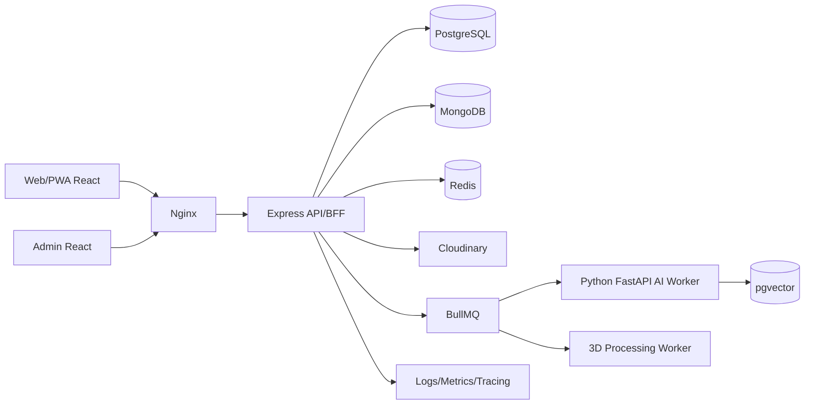

# Kiến trúc tổng thể

## Sơ đồ logic

## Thành phần

- `apps/web`: React + TypeScript, PWA cho khách.
- `apps/admin`: React + TypeScript, CMS quản trị.
- `services/api`: Express + TypeScript, REST API, auth, RBAC và orchestration.
- `services/ai`: Python FastAPI, embedding ảnh/text, nhận diện, RAG, TTS adapter.
- `workers/media`: xử lý ảnh, metadata, thumbnail và job 3D.
- PostgreSQL: nguồn sự thật cho nội dung, user, quyền, tour, khu vực, hiện vật.
- MongoDB: hội thoại AI, event chi tiết, model inference log, dữ liệu schema linh hoạt.
- Redis: cache, session/refresh token state, distributed lock, rate limit, BullMQ.
- Cloudinary: image/video/audio/3D delivery; database chỉ lưu public ID, URL và metadata.
- Nginx: TLS termination, reverse proxy, compression, static caching và load balancing.

## Luồng đọc public

1. Client gọi API qua Nginx.
2. API tạo cache key theo route, locale, version và query chuẩn hóa.
3. Cache hit trả ngay; cache miss đọc PostgreSQL, ghép media/bản dịch.
4. API trả ETag/Cache-Control và ghi cache có TTL.
5. Khi admin publish, hệ thống phát event invalidation đúng namespace.

## Luồng tác vụ nặng

1. API kiểm tra file/quota/quyền rồi tạo `job` trong PostgreSQL.
2. Đẩy message nhỏ chứa ID vào BullMQ; file nằm ở Cloudinary.
3. Worker cập nhật tiến độ, retry có backoff và idempotency key.
4. Client nhận tiến độ qua polling hoặc SSE.
5. Kết quả được kiểm duyệt trước khi publish.

## Ranh giới dịch vụ

MVP giữ API là modular monolith để giảm độ phức tạp. AI/3D tách thành worker vì phụ thuộc Python/GPU và thời gian chạy khác biệt. Chỉ tách thêm microservice khi có số liệu tải hoặc nhu cầu triển khai độc lập.

## Khả năng chịu lỗi

- Nếu AI lỗi, nội dung thư viện và tìm kiếm metadata vẫn hoạt động.
- Nếu 3D không tải, hiển thị ảnh/video/placeholder và text.
- Nếu Redis lỗi, API có thể đọc DB với circuit breaker và giới hạn tải.
- Nếu Cloudinary lỗi, UI dùng thumbnail dự phòng và retry hữu hạn.
