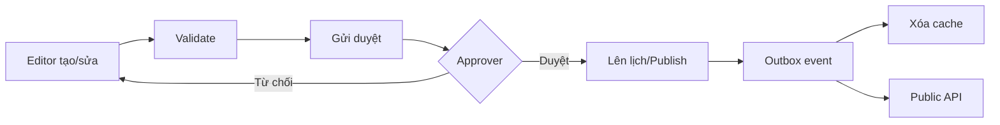

# CMS/Admin động

## Implementation status

| Hạng mục | Trạng thái | Ghi chú |
|---|---|---|
| Đặc tả | IN_PROGRESS | Baseline v0.1, chờ nhóm review |
| UI/API/Data/Tests | PLANNED | Chưa khởi tạo code |

## Mục tiêu

Admin tự thay đổi menu, banner, trang, section, khu vực, tour, hiện vật, media, bản dịch và trạng thái xuất bản mà không sửa frontend hoặc deploy lại.

## Thiết kế

- Page Builder theo block có kiểm soát: Hero, RichText, ArtifactGrid, ExhibitionCarousel, MapPreview, Video, CTA.
- Frontend có registry component theo `section.type`; dữ liệu và thứ tự đến từ API.
- Schema của mỗi block được version hóa và validate ở cả admin lẫn API.
- Preview dùng bản nháp và preview token có thời hạn.
- Media Library quản lý metadata, alt text, focal point, credit và quyền sử dụng.
- Experience Builder cho phép chọn layout variant, theme preset, motion preset, motion intensity, scene 3D, camera path, hotspot và fallback theo breakpoint.
- Navigation Builder cho phép Admin tạo menu nhiều cấp, icon từ registry, CTA và điều kiện hiển thị; không có mảng menu production trong source code.
- Các slot Header, Footer, Home, Search, Artifact Detail, Tour và Empty State đều được cấu hình qua CMS có default an toàn.

## Ranh giới “không hard-code”

Frontend được phép hard-code logic trình bày, component registry, validation schema, design token và accessibility behavior. Frontend không được hard-code dữ liệu bảo tàng hoặc quyết định biên tập như:

- Tên/miêu tả/niên đại hiện vật.
- Menu, banner, CTA, thứ tự section và nội dung hero.
- Danh sách tour, khu vực, hotspot và tuyến được quảng bá.
- URL media/model, bản dịch, audio và nội dung SEO.
- Màu/ảnh chiến dịch cụ thể hoặc thời điểm hiển thị.

Nếu API/CMS chưa có dữ liệu, UI dùng empty state trung tính hoặc seed qua database; không nhúng dữ liệu giả trực tiếp trong component.

## Schema trải nghiệm mẫu

```json
{
  "type": "ImmersiveHero",
  "schemaVersion": 1,
  "contentRef": "uuid",
  "variant": "artifact-orbit",
  "themePreset": "bronze-nocturne",
  "motionPreset": "cinematic-reveal",
  "motionIntensity": "balanced",
  "sceneRef": "uuid",
  "fallbackMediaRef": "uuid"
}
```

Giá trị là tham chiếu minh họa cho schema, không phải dữ liệu production.

## Flow xuất bản



## Thuật toán/quy tắc

- Optimistic concurrency bằng `version`/ETag để tránh ghi đè.
- Cache invalidation theo dependency graph: publish artifact xóa artifact, exhibition liên quan và page section tham chiếu.
- Slug uniqueness có locale và redirect khi đổi.
- Sort bằng fractional indexing hoặc `sortOrder` có tái cân bằng khi cần.

## Ưu và nhược điểm

- Block có kiểm soát an toàn, responsive và đẹp nhất quán; kém tự do hơn trình kéo thả tùy ý.
- JSONB section linh hoạt; cần schema migration khi block thay đổi.
- Workflow duyệt giảm sai sót; làm chậm chỉnh sửa gấp, nên có quyền emergency publish kèm audit.

## Bảo mật

RBAC theo hành động và phạm vi; sanitize rich text; signed upload; chống SVG/script độc hại; audit trước/sau; không cho client tự gửi URL Cloudinary chưa ký.

## Kiểm thử/tiêu chí nghiệm thu

- Đổi banner/menu và publish thấy trên web không deploy.
- Hai editor sửa cùng bản ghi nhận cảnh báo conflict.
- Draft không xuất hiện ở public API.
- Rollback về phiên bản trước và cache được làm mới.
- Section không hợp schema bị từ chối với lỗi rõ ràng.
- Admin đổi layout/theme/motion/scene và preview được trên mobile/desktop mà không deploy.
- Cấu hình animation không hợp lệ hoặc quá budget bị API từ chối/fallback an toàn.

## Tích hợp Dòng thời gian sống

CMS là producer cho journey/node/edge, content/artifact/media refs, publish/version/locale, mode copy/config và presentation preset của `docs/03-features/11-living-timeline.md`. Mode chỉ thuộc allowlist `FREE_EXPLORE | GUIDED_JOURNEY`; direct Scan/Map vẫn free và Start/Continue mới guided. Condition/preset phải đến từ schema/allowlist; Admin không nhập code hoặc DSL tùy ý. Contract implementation chưa accepted và `TASK-TIMELINE-001` còn BLOCKED.

## Decision log

| Ngày | Quyết định | Lý do/Hệ quả |
|---|---|---|
| 2026-07-29 | Dùng page builder theo block có schema thay vì trình kéo thả tự do | Giữ responsive, bảo mật và tính nhất quán; giảm mức tự do của editor |
| 2026-07-29 | CMS điều khiển theme/motion/scene qua preset registry | Không hard-code quyết định biên tập nhưng vẫn ngăn arbitrary code và bảo vệ hiệu năng |

## Feature lifecycle và Contribution ledger

Áp dụng `docs/07-delivery/09-work-session-contribution-ledger.md`. Chưa có implementation session; không suy diễn contributor/timestamp từ plan.

| Mốc | Timestamp | Member/Actor | Evidence |
|---|---|---|---|
| Planned | Baseline docs | Nhóm | Feature plan |
| Claimed/Started/IMPLEMENTED/VERIFIED/Merged/Completed | Chưa có | — | — |

| Session ID | Contributor | Role | Task/Branch | StartedAt | LastActiveAt | EndedAt | Status | Scope/Output | Tests/Evidence | Handoff/Next |
|---|---|---|---|---|---|---|---|---|---|---|
| Chưa có | — | — | — | — | — | — | PLANNED | — | NOT RUN | Chờ task READY |

## Change history

| Ngày | Loại | Thay đổi | Test/Bằng chứng |
|---|---|---|---|
| 2026-07-29 | ADDED | Tạo baseline đặc tả CMS động | Review tài liệu, chưa có code |
| 2026-07-29 | CHANGED | Mở rộng CMS thành Experience Builder quản trị layout, theme, motion và 3D scene | Review schema/acceptance criteria, chưa có code |
| 2026-08-02 | CHANGED | Ghi producer boundary cho Dòng thời gian sống; chi tiết thuộc feature owner mới | `IDEA-002`, `PLAN-0009`; code/test NOT RUN |
| 2026-08-02 | CHANGED | Bổ sung allowlisted free/guided mode config; CMS không tự đổi direct scan sang guided | `DEC-TIMELINE-MODE-001`, `PLAN-0010`; code/test NOT RUN |
