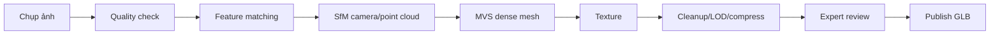

# Digital Twin và pipeline quét 3D

## Implementation status

| Hạng mục | Trạng thái | Ghi chú |
|---|---|---|
| Đặc tả | IN_PROGRESS | Baseline v0.1, chờ nhóm review |
| Capture/Pipeline/Viewer/Tests | PLANNED | Chưa khởi tạo code |

## Mục tiêu

Tạo, quản lý phiên bản và trình bày bản sao số của không gian/hiện vật, giữ rõ nguồn dữ liệu và mức độ chính xác.

## Pipeline photogrammetry

## Thuật toán/công cụ

- SfM: SIFT/feature matching + bundle adjustment để suy camera.
- MVS: dựng point cloud dày và mesh.
- Retopology/decimation tạo LOD; UV unwrap và texture baking.
- Draco/Meshopt nén geometry, KTX2/Basis nén texture.
- Công cụ tham khảo: COLMAP/Meshroom/RealityCapture/Blender; lựa chọn theo giấy phép và máy của nhóm.

## Quy trình chụp

- Ánh sáng đều, nền ít phản chiếu, khóa exposure/focus khi phù hợp.
- Chồng lấp ảnh 70–80%, nhiều vòng và góc cao/thấp.
- Color chart/scale marker nếu cần độ chính xác.
- Hiện vật bóng, trong suốt hoặc quá tối cần kỹ thuật riêng; có thể không phù hợp photogrammetry.

## Metadata phiên bản

Nguồn ảnh, thiết bị, ngày quét, người xử lý, phần mềm/phiên bản, scale, polygon/texture count, checksum, license, độ chính xác, trạng thái review và quan hệ với artifact.

## Ưu/nhược điểm

Photogrammetry chi phí thấp và texture thật; yếu với bề mặt bóng/trong suốt, tốn thời gian xử lý. LiDAR tốt cho hình học không gian nhưng chi phí cao và texture cần bổ sung. Mức phù hợp: photogrammetry cho hiện vật chọn lọc, LiDAR/scan thiết bị cho kiến trúc nếu có nguồn lực.

## Job và kiểm duyệt

Upload ảnh -> job queue -> processing -> technical QA -> curator QA -> publish. Job retry theo bước; không retry vô hạn. Kết quả chưa duyệt nằm private.

## Nghiệm thu

- Model có provenance, version và checksum.
- Có budget polygon/texture theo mobile.
- So sánh kích thước với vật chuẩn và ghi sai số.
- Viewer fallback khi GPU/mạng yếu.

## Decision log

| Ngày | Quyết định | Lý do/Hệ quả |
|---|---|---|
| 2026-07-29 | Ưu tiên photogrammetry cho hiện vật chọn lọc và LOD GLB cho web | Chi phí phù hợp đồ án; vật bóng/trong suốt cần fallback |

## Change history

| Ngày | Loại | Thay đổi | Test/Bằng chứng |
|---|---|---|---|
| 2026-07-29 | ADDED | Tạo baseline Digital Twin và pipeline quét | Review tài liệu, chưa có code |
