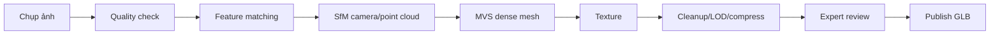

# Digital Twin và pipeline quét 3D

## Implementation status

| Hạng mục | Trạng thái | Ghi chú |
|---|---|---|
| Đặc tả | IN_PROGRESS | Baseline v0.1, chờ nhóm review |
| Capture/Pipeline/Viewer/Tests | PLANNED | Chưa khởi tạo code |

## Mục tiêu

Tạo, quản lý phiên bản và trình bày bản sao số của không gian/hiện vật, giữ rõ nguồn dữ liệu và mức độ chính xác.

## Admin Management & Content Invariant

- **Quyền Quản Lý Tuyệt Đối Của Admin (Admin Content Management Invariant)**: Toàn bộ hình ảnh, thông tin chi tiết, miêu tả lịch sử và ảnh chụp lồng kính mặt trước của hiện vật **DO ADMIN TỰ THÊM VÀ TẢI LÊN** thông qua Admin Portal. Frontend và Public Web không bao giờ hard-code dữ liệu hiện vật.
- **Quy trình Admin thêm di sản & sinh 3D**:
  1. Admin mở Admin Portal (`/admin`), chọn "Thêm Di Sản Mới".
  2. Admin nhập Thông tin, Niên đại, Miêu tả và Tải lên Ảnh Chụp Lồng Kính Mặt Trước.
  3. Hệ thống lưu Media Asset và tự động gọi AI 3D Reconstruction Worker tạo mô hình 3D (.glb / Depth Map).
  4. Admin xem trước 3D Live Preview trong Admin Portal, duyệt chất lượng (Chống mô hình đơ/méo) trước khi bấm "Xuất Bản" ra cho Người Dùng Public xem.

## Pipeline photogrammetry

## Thuật toán/công cụ

- SfM: SIFT/feature matching + bundle adjustment để suy camera.
- MVS: dựng point cloud dày và mesh.
- Retopology/decimation tạo LOD; UV unwrap và texture baking.
- Draco/Meshopt nén geometry, KTX2/Basis nén texture.
- Công cụ tham khảo: COLMAP/Meshroom/RealityCapture/Blender; lựa chọn theo giấy phép và máy của nhóm.

## Quy trình chụp

- Ánh sáng đều, nền ít phản chiếu, khóa exposure/focus khi phù hợp.
- Chồng lấp ảnh 70–80%, nhiều vòng và góc cao/thấp.
- Color chart/scale marker nếu cần độ chính xác.
- Hiện vật bóng, trong suốt hoặc quá tối cần kỹ thuật riêng; có thể không phù hợp photogrammetry.

## Metadata phiên bản

Nguồn ảnh, thiết bị, ngày quét, người xử lý, phần mềm/phiên bản, scale, polygon/texture count, checksum, license, độ chính xác, trạng thái review và quan hệ với artifact.

## Ưu/nhược điểm

Photogrammetry chi phí thấp và texture thật; yếu với bề mặt bóng/trong suốt, tốn thời gian xử lý. LiDAR tốt cho hình học không gian nhưng chi phí cao và texture cần bổ sung. Mức phù hợp: photogrammetry cho hiện vật chọn lọc, LiDAR/scan thiết bị cho kiến trúc nếu có nguồn lực.

## Job và kiểm duyệt

Upload ảnh -> job queue -> processing -> technical QA -> curator QA -> publish. Job retry theo bước; không retry vô hạn. Kết quả chưa duyệt nằm private.

## Nghiệm thu

- Model có provenance, version và checksum.
- Có budget polygon/texture theo mobile.
- So sánh kích thước với vật chuẩn và ghi sai số.
- Viewer fallback khi GPU/mạng yếu.

## Decision log

| Ngày | Quyết định | Lý do/Hệ quả |
|---|---|---|
| 2026-07-29 | Ưu tiên photogrammetry cho hiện vật chọn lọc và LOD GLB cho web | Chi phí phù hợp đồ án; vật bóng/trong suốt cần fallback |

## Feature lifecycle và Contribution ledger

Áp dụng `docs/07-delivery/09-work-session-contribution-ledger.md`. Chưa có implementation session; không suy diễn contributor/timestamp từ plan.

| Mốc | Timestamp | Member/Actor | Evidence |
|---|---|---|---|
| Planned | Baseline docs | Nhóm | Feature plan |
| Claimed/Started/IMPLEMENTED/VERIFIED/Merged/Completed | Chưa có | — | — |

| Session ID | Contributor | Role | Task/Branch | StartedAt | LastActiveAt | EndedAt | Status | Scope/Output | Tests/Evidence | Handoff/Next |
|---|---|---|---|---|---|---|---|---|---|---|
| Chưa có | — | — | — | — | — | — | PLANNED | — | NOT RUN | Chờ task READY |

## Change history

| Ngày | Loại | Thay đổi | Test/Bằng chứng |
|---|---|---|---|
| 2026-07-29 | ADDED | Tạo baseline Digital Twin và pipeline quét | Review tài liệu, chưa có code |
