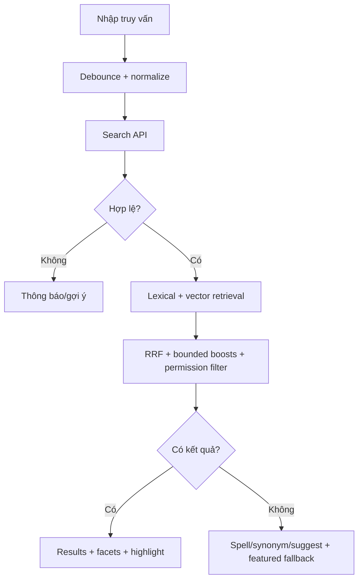
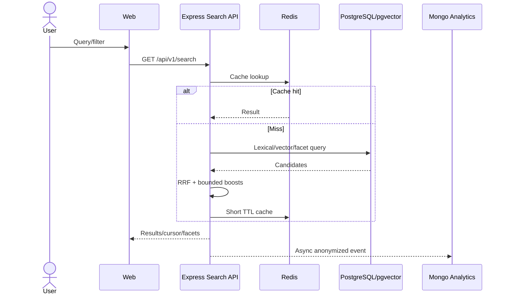
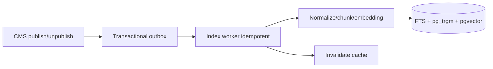
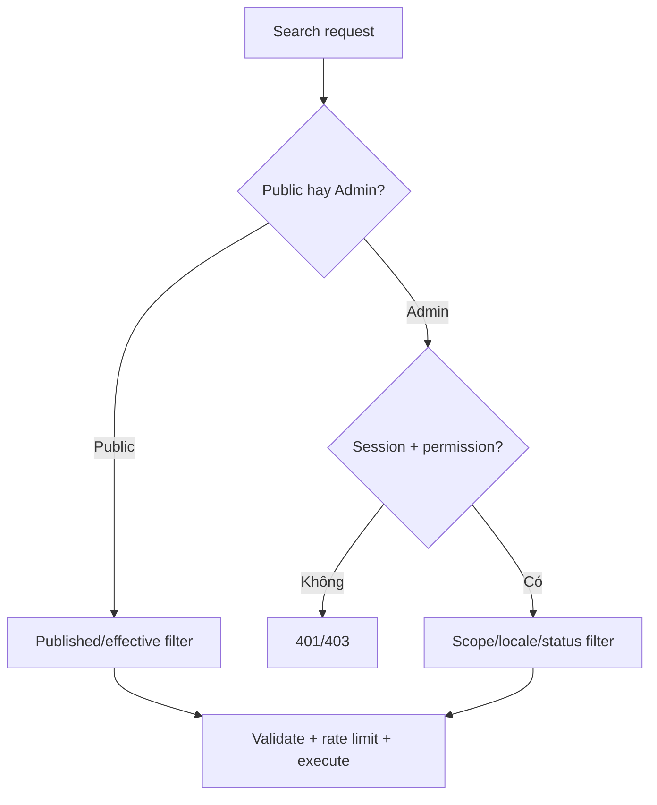

# Tìm kiếm và khám phá nội dung

## Metadata và trạng thái

- Feature ID: FEAT-SEARCH-001
- Trạng thái: PLANNED
- Owner: Chưa có
- Priority: HIGH sau CMS/data foundation
- Last updated: 2026-07-29

| Hạng mục | Trạng thái | Ghi chú |
|---|---|---|
| Đặc tả | IN_PROGRESS | Chờ nhóm review |
| Contract/index/API/UI | PLANNED | Chưa có source/dataset |
| Evaluation/load/security | PLANNED | Chưa triển khai |

## Mục tiêu và phạm vi

Giúp khách và Admin tìm hiện vật, triển lãm, khu vực, tour và nội dung đa ngôn ngữ; hỗ trợ tên riêng, dấu tiếng Việt, lỗi gõ, synonym và semantic meaning. Kết quả phải đúng quyền và trạng thái publish.

MVP gồm global search, Admin search, full-text, typo/prefix, filter/facet, hybrid lexical/vector, autocomplete, highlight và analytics. Cá nhân hóa sâu, voice search và dedicated search cluster để sau.

## User Flow



### Giải thích

1. Client debounce và hủy request cũ.
2. API chuẩn hóa locale, Unicode và giới hạn query.
3. Lexical giữ tên/mã chính xác; vector hiểu mô tả.
4. Publish/permission filter không để frontend tự xử lý.
5. RRF hợp nhất thứ hạng; boost được config/version hóa.
6. Zero result dùng suggestion/fallback, không trả trang trống.

## System Sequence



## Indexing và State Flow



PostgreSQL là nguồn sự thật. Public index chỉ nhận nội dung đã publish; Admin search áp dụng scope quyền. Consumer dùng event ID/content version chống lặp.

## Authentication/Authorization



Cache key tách public/admin, locale, filter và permission scope. Không cache private result dùng chung. Query có timeout, limit và expensive-query budget.

## Thuật toán baseline

- PostgreSQL Full-Text Search: lexical relevance.
- `pg_trgm`: typo/prefix/fuzzy name.
- Unicode/unaccent normalization có kiểm thử tiếng Việt.
- `pgvector` cosine similarity: semantic candidates.
- Reciprocal Rank Fusion:

```text
score(document) = Σ 1 / (k + rank_i(document))
```

Bounded boost sau RRF:

```text
final = rrf + exactTitleBoost + currentZoneBoost + curatedBoost - stalePenalty
```

```text
search(query, filters, locale, actor):
  normalized = validate_and_normalize(query)
  scope = resolve_publish_and_permission_scope(actor)
  lexical = lexical_retrieve(normalized, filters, scope)
  semantic = vector_retrieve(embed(normalized), filters, scope)
  candidates = reciprocal_rank_fusion(lexical, semantic)
  return paginate_highlight_facets(apply_bounded_boosts(candidates))
```

Complexity phụ thuộc index; không cho full scan. Dùng GIN/trigram và cân nhắc HNSW/IVFFlat sau benchmark.

## Phương án, ưu nhược điểm

| Phương án | Ưu điểm | Nhược điểm | Phù hợp |
|---|---|---|---|
| PostgreSQL FTS + pg_trgm + pgvector | Ít hạ tầng, gần source data | Facet/analyzer kém engine chuyên dụng | HIGH cho MVP |
| OpenSearch/Elasticsearch | Search/facet/analyzer mạnh | RAM và vận hành/sync phức tạp | MEDIUM khi scale |
| Algolia/Meilisearch | Typo search và DX tốt | Chi phí/vendor hoặc thêm service | MEDIUM |
| MongoDB/Atlas Search | Tích hợp nếu dùng Atlas | Không nên biến Mongo thành content source | LOW/MEDIUM |

Khuyến nghị baseline PostgreSQL hybrid. Hybrid phù hợp tên/mã và semantic discovery; đổi lại cần embedding pipeline, evaluation dataset và tuning. Không dùng vector-only hoặc lexical-only.

## CMS/Admin và API

Admin quản lý synonym, curated boost, searchable fields, locale và featured fallback qua schema/version/audit; không sửa ranking code trực tiếp.

- `GET /api/v1/search?q=&types=&locale=&cursor=&filters=`
- `GET /api/v1/search/suggest?q=&locale=`
- `/api/v1/admin/search/*` theo permission.

Response typed items, highlight, facets, cursor, correction/suggestion; score explanation chỉ debug/admin.

## Performance, scale và bảo mật

- Debounce 200–350 ms theo UX test; Redis cache TTL ngắn + jitter.
- Async indexing bằng outbox; cursor pagination và query timeout.
- SLO: autocomplete p95 < 200 ms cache hit; search p95 < 500 ms dataset MVP.
- Load test 300–500 concurrent mix; theo dõi zero-result, DB CPU/index hit.
- Khi PostgreSQL contention: read/search replica hoặc dedicated engine.
- Parameterized query, filter allowlist, rate limit và private-leakage test.
- Analytics pseudonymized, retention/consent; chống enumeration Admin.

## Metrics

Precision@k, Recall@k, MRR/NDCG, zero-result, reformulation, click-through, latency p50/p95/p99 và search-to-content conversion. Golden query set tiếng Việt/Anh do curator review.

## Estimate

| Phạm vi | Optimistic | Expected | Pessimistic | Confidence |
|---|---:|---:|---:|---|
| Contract/index/API MVP | 3 ngày | 5 ngày | 8 ngày | MEDIUM |
| Public UI/autocomplete/filter | 2 ngày | 4 ngày | 6 ngày | MEDIUM |
| Hybrid/vector/evaluation | 3 ngày | 6 ngày | 10 ngày | LOW trước dataset |
| Admin config/analytics | 2 ngày | 4 ngày | 7 ngày | LOW |

Person-day; giả định foundation/CMS/artifact data đã có. Actual chỉ ghi sau xác nhận.

## Testing và nghiệm thu

- Unit normalization, RRF, boost, permission.
- Integration index/outbox/cache invalidation.
- E2E search/filter/empty/error/locale.
- Security injection/private leakage/rate limit.
- Load 300–500 và relevance regression.
- Public không trả draft/private; có/không dấu và typo hợp lý hoạt động.
- Admin thay synonym/boost không deploy; cache không trộn locale/permission.

## Decision và history

| ID | Ngày | Trạng thái | Quyết định | Lý do |
|---|---|---|---|---|
| DEC-SEARCH-001 | 2026-07-29 | DESIGN_OPTIONS | PostgreSQL hybrid là baseline đề xuất | Chờ Option Review với dataset |

| Ngày | Loại | Thay đổi | Bằng chứng |
|---|---|---|---|
| 2026-07-29 | ADDED | Tạo baseline Search/Discovery | Chưa có code |
