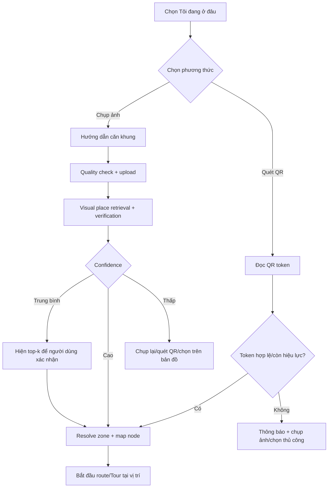
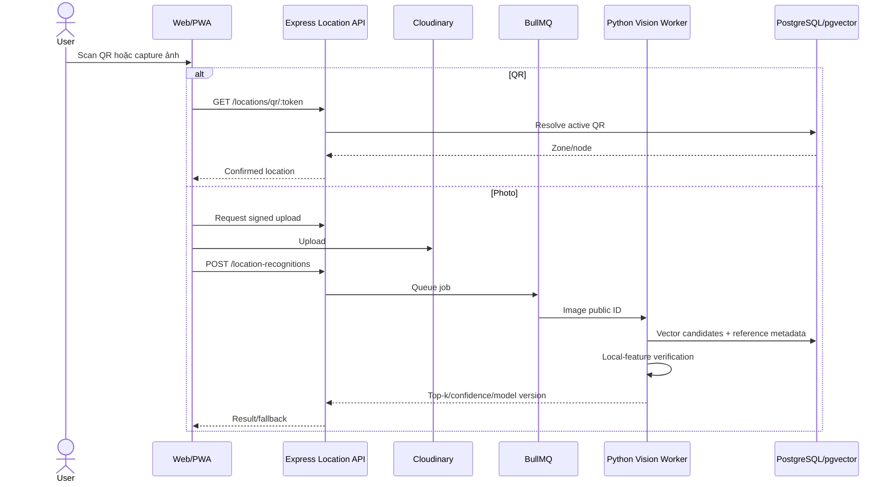
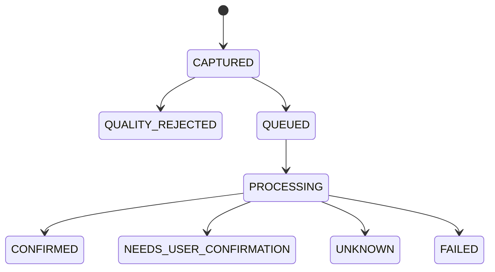
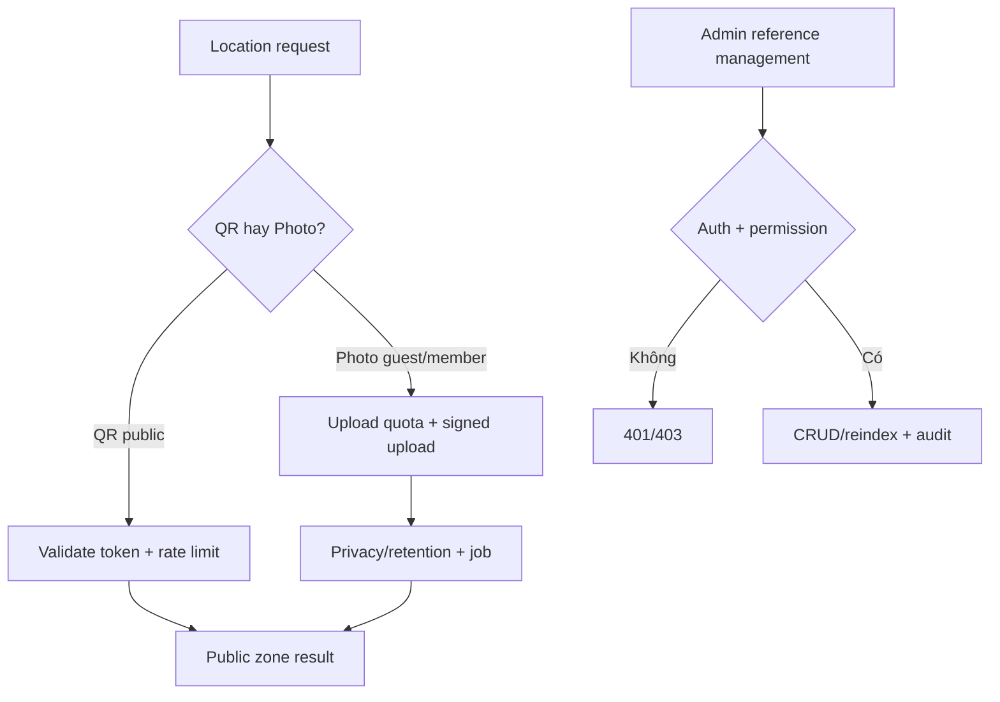

# Xác định vị trí trong bảo tàng bằng QR và ảnh

## Metadata và trạng thái

- Feature ID: FEAT-LOCATION-001
- Trạng thái: PLANNED
- Owner: Chưa có
- Priority: HIGH trước trải nghiệm dẫn đường hoàn chỉnh
- Last updated: 2026-07-29
- Liên quan: Web 3D/Map, QR Tour, Recognition, CMS, Analytics

| Hạng mục | Trạng thái | Ghi chú |
|---|---|---|
| Đặc tả | IN_PROGRESS | Chờ nhóm review |
| QR location | PLANNED | Chưa có code/QR dataset |
| Visual place recognition | PLANNED | Chưa có ảnh tham chiếu |
| Map integration/tests | PLANNED | Chưa triển khai |

## Mục tiêu

Cho phép khách xác định “tôi đang ở đâu?” trong bảo tàng bằng:

1. Quét QR gắn tại khu vực/điểm mốc.
2. Chụp ảnh không gian xung quanh để AI đề xuất tầng, phòng hoặc zone.

Kết quả vị trí trở thành node/zone bắt đầu cho bản đồ, dẫn đường và Tour Guide. Hệ thống không khẳng định vị trí khi confidence thấp.

## Trong/ngoài phạm vi

### MVP

- QR token ánh xạ chính xác tới zone/map node/tour stop.
- Chụp một hoặc vài ảnh không gian để visual place recognition.
- Trả top-k zone, confidence và yêu cầu xác nhận.
- Kết nối điểm bắt đầu vào A* navigation.
- Admin quản lý QR, ảnh tham chiếu, zone và model/index version.

### Ngoài MVP

- Theo dõi vị trí liên tục từng mét.
- UWB/BLE beacon deployment.
- Visual-inertial SLAM/AR navigation thời gian thực.
- Nhận diện khuôn mặt hoặc theo dõi con người.

## User Flow



### Giải thích

1. QR là phương án chính xác/rẻ nhất khi bảng mã còn nguyên.
2. Ảnh dùng khi không thấy QR hoặc muốn trải nghiệm tự nhiên hơn.
3. Client kiểm tra blur/độ sáng trước upload.
4. AI retrieval tìm zone ứng viên rồi geometric verification giảm false positive.
5. Confidence trung bình không tự định vị; người dùng chọn top-k.
6. Confidence thấp luôn có QR/manual fallback.

## System Sequence



## Data/State Flow



PostgreSQL lưu floors/zones/map nodes/QR/status/reference image metadata/job/result. pgvector lưu embedding. MongoDB giữ inference/interaction event linh hoạt. Ảnh nằm Cloudinary và có retention.

## Authentication và Authorization



Không bắt đăng nhập cho trải nghiệm cơ bản. Admin cần permission. QR dùng token ngẫu nhiên, không chứa dữ liệu nhạy cảm. Ảnh người dùng không được dùng train nếu chưa consent.

## Thuật toán

### QR resolution

`token -> active QR record -> zoneId/mapNodeId/tourStopId`

Ưu điểm: chính xác, nhanh, offline cache được. Nhược điểm: cần bảng vật lý, có thể bị hỏng/đổi chỗ/sao chép. Token cần rotate/revoke và admin audit.

### Visual place recognition baseline

1. Quality gate: blur, exposure, resolution.
2. Global embedding retrieval bằng DINOv2/CLIP/SigLIP hoặc model được đánh giá.
3. Vector search top-k ảnh tham chiếu.
4. Gom điểm theo zone.
5. Local-feature geometric verification bằng ORB hoặc SuperPoint + LightGlue cho ứng viên đầu.
6. Kết hợp score, calibration và trả confirmed/top-k/unknown.

```text
score(zone) =
  0.55 * globalSimilarity
  + 0.30 * geometricVerification
  + 0.10 * floorPrior
  + 0.05 * recentQrOrTourContext
```

Trọng số chỉ là baseline để thử nghiệm, phải hiệu chỉnh bằng validation set.

```text
locate(image, context):
  if quality(image) < threshold:
    return RETAKE
  candidates = vector_search(embed(image), top_k)
  zones = aggregate_by_zone(candidates)
  verified = geometric_verify(image, top_zones)
  ranked = calibrate_and_rerank(zones, verified, context)
  if ranked.top1 >= high_threshold:
    return CONFIRMED
  if ranked.top1 >= medium_threshold:
    return NEEDS_USER_CONFIRMATION(top_k)
  return UNKNOWN_WITH_QR_OR_MANUAL_FALLBACK
```

### Độ phức tạp

Vector retrieval phụ thuộc ANN index; verification chỉ chạy top-k để giới hạn CPU/GPU. Reference index được version hóa và rebuild bất đồng bộ.

## Phương án so sánh

| Phương án | Ưu điểm | Nhược điểm | Phù hợp |
|---|---|---|---|
| QR | Chính xác, rẻ, nhanh | Phụ thuộc bảng mã/vị trí vật lý | VERY HIGH cho MVP |
| Image retrieval + verification | Tự nhiên, không cần thấy QR | Cần dataset nhiều góc/ánh sáng, có unknown | HIGH bổ trợ |
| BLE beacon | Tự động hơn | Hardware/calibration/bảo trì | MEDIUM giai đoạn sau |
| Wi-Fi fingerprint | Tận dụng hạ tầng | Tín hiệu thay đổi, cần survey | LOW/MEDIUM |
| Visual SLAM/AR | Liên tục/chính xác tương đối | Phức tạp, pin/GPU, mapping | LOW cho MVP |

Khuyến nghị: QR là ground-truth anchor; ảnh là phương án bổ trợ. Không chỉ dùng ảnh cho nghiệp vụ dẫn đường an toàn.

## CMS/Admin

Admin quản lý floor, zone, map node, QR token/status/placement, ảnh tham chiếu, góc chụp, lighting condition, model/index version, confidence threshold và reindex job. Frontend không hard-code vị trí.

## API baseline

- `GET /api/v1/locations/qr/:token`
- `POST /api/v1/location-recognitions`
- `GET /api/v1/jobs/:id`
- `/api/v1/admin/locations/*`
- `/api/v1/admin/location-reference-images/*`

Result gồm `method`, `zoneId`, `mapNodeId`, `topK`, `confidence`, `modelVersion`, `requiresConfirmation` và fallback.

## Performance và scale

- QR API cache Redis; p95 mục tiêu < 200 ms.
- Ảnh upload trực tiếp Cloudinary; AI qua queue/backpressure.
- Giới hạn concurrent jobs/quota; reuse embedding/index trong memory worker.
- Target inference p95 được chốt sau benchmark thiết bị/worker; UI hiển thị progress.
- Không để AI job làm nghẽn content/navigation API.

## Security và privacy

- Signed upload, magic-byte, size limit, EXIF stripping và retention.
- Không nhận diện người/khuôn mặt; làm mờ hoặc tránh lưu người lọt khung khi khả thi.
- Rate limit QR enumeration và photo jobs.
- Reference image/model chỉ publish sau review.
- Audit QR relocation/revoke, threshold/model/index changes.

## Metrics

- QR resolution success/invalid/relocation issue.
- Top-1/Top-3 zone accuracy, unknown rejection, false-confirmation rate.
- Calibration curve và confidence reliability.
- Latency p50/p95, queue time, retake rate.
- Route-start success sau định vị.
- Đánh giá theo tầng/zone/ánh sáng/crowd và thiết bị.

## Estimate

| Phạm vi | Optimistic | Expected | Pessimistic | Confidence |
|---|---:|---:|---:|---|
| QR location + Admin mapping | 2 ngày | 4 ngày | 6 ngày | MEDIUM |
| Capture/quality/upload/job flow | 2 ngày | 4 ngày | 7 ngày | MEDIUM |
| Visual retrieval baseline | 4 ngày | 8 ngày | 14 ngày | LOW trước dataset |
| Verification/evaluation/map integration | 4 ngày | 8 ngày | 15 ngày | LOW |

Person-day; phụ thuộc map graph, CMS, media upload, AI worker và ảnh khảo sát bảo tàng.

## Testing và nghiệm thu

- QR đúng/sai/hết hiệu lực/chuyển vị trí.
- Ảnh blur/tối/sáng/crowd/góc khác và zone unknown.
- Top-k/confidence calibration, không tự confirm dưới ngưỡng.
- Permission/private reference, upload abuse và rate limit.
- Map nhận đúng start node và A* tính route.
- Không có AI/QR vẫn chọn vị trí thủ công.

## Decision log

| ID | Ngày | Trạng thái | Quyết định | Lý do |
|---|---|---|---|---|
| DEC-LOC-001 | 2026-07-29 | PLAN_LOCKED | Hỗ trợ QR và chụp ảnh; QR là anchor, ảnh là bổ trợ có confidence | Người dùng yêu cầu cả hai, giữ fallback đáng tin cậy |

## Change history

| Ngày | Loại | Thay đổi | Bằng chứng |
|---|---|---|---|
| 2026-07-29 | ADDED | Tạo baseline indoor location bằng QR/ảnh | Chưa có code/dataset |
