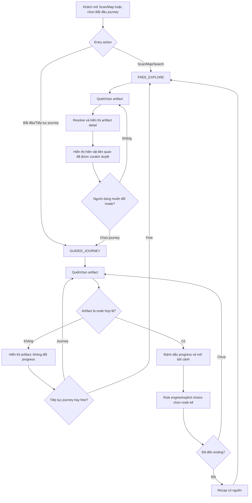
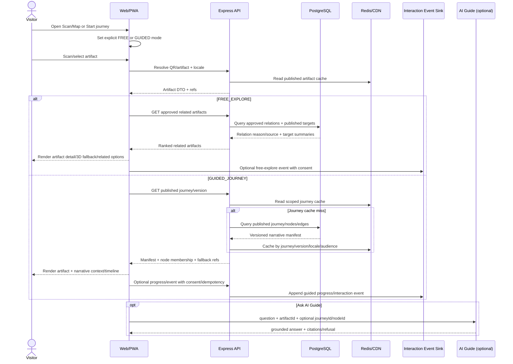
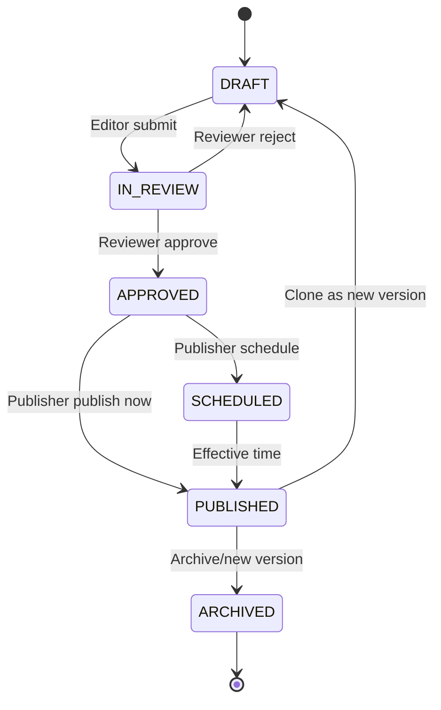
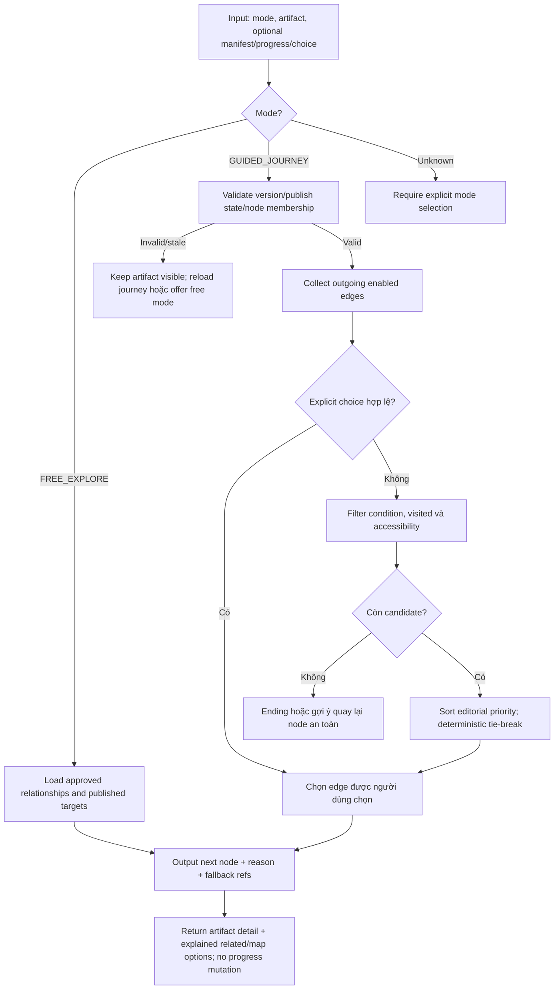
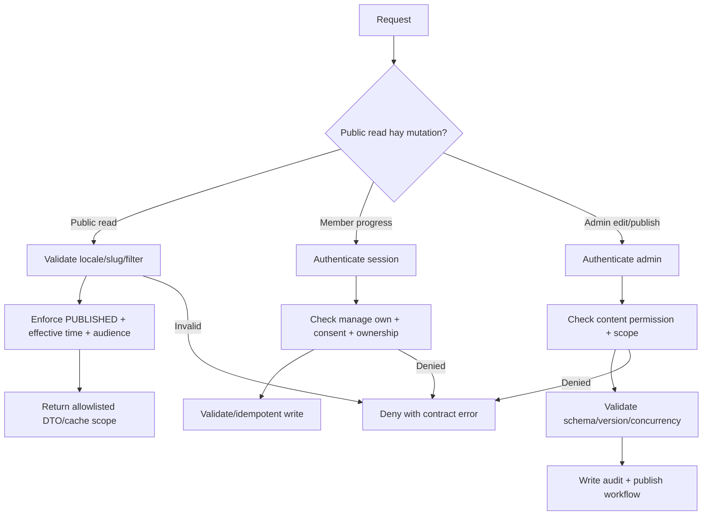

# FEAT-TIMELINE-001 — Dòng thời gian sống

Sau khi feature đi vào implementation, file này phải tiếp tục được đồng bộ với code và đáp ứng `docs/templates/feature-report-standard.md`.

## Metadata

- Trạng thái: PLAN_LOCKED ở mức concept; implementation PLANNED/BLOCKED.
- Owner implementation: Chưa claim.
- Người xác nhận concept: `thanh` (Trịnh Vĩ Thành).
- Priority: Sau project foundation và CMS/Tour/Artifact contract baseline.
- Last updated: 2026-08-02.
- Liên quan: CMS/Admin, Artifact, QR Tour/AI Guide, Web 3D/Map, Voice, Analytics.
- Feature owner document: file hiện tại.
- Idea/Concept IDs: `IDEA-002`, `DEC-TIMELINE-CONCEPT-001`, `DEC-TIMELINE-MODE-001`, `DEC-TIMELINE-RELATION-001`.

## Implementation status

| Hạng mục | Trạng thái | Bằng chứng/Ghi chú |
|---|---|---|
| Spec/Creative Concept | CODE_CONFIRMED | Concept đã `PLAN_LOCKED`; `ExplorationMode` (FREE_EXPLORE/GUIDED_JOURNEY) và Related Artifact Cards |
| UI | CODE_CONFIRMED | `renderLivingTimeline2D`, `renderModeSwitcher`, `renderRelatedArtifactCard` và `renderLivingTimelinePage` |
| API | CODE_CONFIRMED | REST API endpoints `/api/v1/timeline/journeys`, `/api/v1/timeline/journeys/:id`, `/api/v1/timeline/artifacts/:code/related` |
| Data/migration | CODE_CONFIRMED | Sample Narrative Journeys, Nodes và Related Artifact links |
| AI/3D integration | DEFERRED | Chỉ làm sau MVP 2D và contract nền ổn định |
| Security | CODE_CONFIRMED | Chรอง lọc chỉ trả về journey đã PUBLISHED, anonymous local-first progress |
| Tests | CODE_CONFIRMED | 28/28 unit & integration tests PASS across packages |

## Feature lifecycle

| Mốc | Timestamp | Member/Actor | Evidence |
|---|---|---|---|
| Planned/Concept selected | 2026-08-02T13:29:34+07:00 | `thanh` | Người dùng chọn Concept A; `IDEA-002`, `DEC-TIMELINE-CONCEPT-001` |
| Claimed | 2026-08-03T21:53:41+07:00 | `thanh` | `TASK-TIMELINE-001` claimed |
| Implementation started | 2026-08-03T21:53:41+07:00 | `thanh` | Nhánh `feature/TASK-TIMELINE-001` |
| First IMPLEMENTED | 2026-08-03T21:57:20+07:00 | `thanh` | Code + 28/28 tests PASS |
| VERIFIED | 2026-08-03T21:57:20+07:00 | `thanh` | Người dùng xác nhận và yêu cầu merge |
| Merged to develop | 2026-08-03 | `thanh` | Merge commit `92c7caa` |
| Completed | 2026-08-03 | `thanh` | Merge Memory Sync PASS |

## Contribution ledger

Áp dụng `docs/07-delivery/09-work-session-contribution-ledger.md`. Lần cập nhật này là plan intake trên `develop`, chưa claim task và chưa phải implementation session.

| Session ID | Contributor | Role | Task/Branch | StartedAt | LastActiveAt | EndedAt | Status | Scope/Output | Tests/Evidence | Handoff/Next |
|---|---|---|---|---|---|---|---|---|---|---|
| Chưa có | — | — | — | — | — | — | PLANNED | Chưa mở implementation session | NOT RUN | Chờ foundation/contracts và task claim |

## Mục tiêu và giá trị

Biến các hiện vật rời rạc thành hành trình kể chuyện theo thời kỳ, nhân vật hoặc sự kiện. Khách chọn một chủ đề, khám phá các narrative node liên kết với hiện vật thật, rồi nhận bối cảnh, audio, AI Guide có nguồn và chuyển cảnh 2D/3D phù hợp thiết bị.

Giá trị mong muốn:

- Giúp khách hiểu quan hệ lịch sử giữa các hiện vật thay vì chỉ đọc từng trang độc lập.
- Tạo một “xương sống trải nghiệm” nối CMS, QR Tour, Artifact, AI Guide và 3D.
- Cho phép curator biên tập câu chuyện và nhánh lựa chọn mà không deploy.
- Đo được mức hoàn thành, điểm bỏ cuộc, mức hiểu nội dung và khó chịu do motion.

## Trong/ngoài phạm vi

### MVP trong phạm vi

- Danh sách hành trình đã publish theo locale/chủ đề/thời kỳ.
- Hai mode tường minh: `FREE_EXPLORE` để khám phá tự do và `GUIDED_JOURNEY` để đi theo narrative graph.
- Cùng một QR resolver/artifact detail pipeline; mode chỉ quyết định lớp trải nghiệm sau khi resolve hiện vật.
- Người dùng tự chuyển mode; hệ thống không âm thầm đoán hoặc đổi mode và không làm mất progress journey.
- Hiện vật liên quan dùng taxonomy/edge do curator phê duyệt; hỗ trợ cùng triều đại, thời kỳ, văn hóa, nhân vật, sự kiện, chủ đề và chức năng.
- QR/recognition chỉ mở Digital Twin/3D đã duyệt; không tạo model 3D mới trong request tham quan.
- Timeline 2D với node hiện vật, node bối cảnh, lựa chọn nhánh và kết thúc.
- Curator tạo journey/node/edge qua CMS schema có validate, preview và workflow duyệt.
- QR hoặc chọn thủ công đánh dấu node hiện tại; không bắt buộc đăng nhập.
- Rule engine xác định node tiếp theo từ graph do curator duyệt.
- Progress local-first cho khách ẩn danh; interaction event chỉ ghi khi phù hợp consent.
- Audio/text và static media fallback đầy đủ.

### Sau MVP

- Scene/camera transition 3D theo quality tier.
- AI Guide nhận `journeyId/nodeId` làm bối cảnh retrieval, nhưng vẫn chỉ dùng nguồn đã duyệt.
- Gợi ý hành trình theo sở thích hoặc vị trí với ranking được đánh giá.
- Đồng bộ progress đa thiết bị cho member có consent.

### Ngoài phạm vi hiện tại

- AI tự viết hoặc tự publish narrative lịch sử.
- Generative 3D, AR bắt buộc hoặc theo dõi vị trí liên tục.
- Gamification cạnh tranh, leaderboard hoặc social feed.
- Tạo Digital Twin mới; feature chỉ tham chiếu asset đã được duyệt.

## Delivery estimate

| Trường | Giá trị |
|---|---|
| Phạm vi được tính | MVP 2D end-to-end: CMS journey/relation editor cơ bản, public journey/related API, mode gate, graph/ranking rules, public timeline/related UI, QR/manual progress, analytics tối thiểu và test |
| Không bao gồm | Foundation, auth/CMS/artifact/tour baseline, sản xuất nội dung lịch sử, model 3D, voice provider và AI/3D nâng cao |
| Giả định | Một vertical slice, dữ liệu demo đã được curator cung cấp, dùng stack baseline và shared contracts |
| Dependency/Blocker | `TASK-FOUND-001`; CMS/API/data/artifact/tour/relation contract; content và relation mẫu đã duyệt |
| Optimistic | 9 person-days (baseline/modes 7 + relationship revision 2) |
| Expected | 18 person-days (baseline/modes 14 + relationship revision 4) |
| Pessimistic | 36 person-days (baseline/modes 29 + relationship revision 7) |
| Mức tin cậy | LOW — source/contracts/content chưa tồn tại |
| Planned start/review/completion | Chưa có; nhóm chưa cung cấp lịch |
| Actual effort/completion | Chưa có; chỉ ghi sau khi nhóm xác nhận |

Estimate này là planning aid, cần revision sau khi foundation và contract skeleton được merge.

Estimate revision ngày 2026-08-02 giữ baseline cũ `6/12/25` và cộng `1/2/4` person-days cho mode switch, state persistence, contract/event field và E2E chuyển mode.

Estimate revision tiếp theo giữ mốc `7/14/29` và cộng `2/4/7` person-days cho artifact relationship entity/workflow, CMS editor, API ranking/cache, UI explanation và contract/security/E2E tests; tổng mới `9/18/36`.

## Creative Concept Review — IDEA-002

### Context và tiêu chí

- Persona/use case: khách tham quan cá nhân, gia đình và học sinh muốn hiểu mạch lịch sử giữa nhiều hiện vật.
- Giá trị: tăng mức hiểu, khám phá và hoàn thành tour; không chỉ tăng thời gian nhìn hiệu ứng.
- Invariants: `INV-CONTENT-001/002`, `INV-AI-001/003`, `INV-3D-001`, `INV-UX-001/002`.

| Tiêu chí | Trọng số | Cách kiểm chứng |
|---|---:|---|
| Storytelling và giá trị bảo tàng | 25 | Curator review, comprehension test |
| Khả năng nối các capability hiện có | 20 | Contract/integration review |
| Mobile performance và fallback | 15 | LCP/INP/FPS/asset profile theo tier |
| CMS configurability | 15 | Admin acceptance, publish không deploy |
| Accessibility/privacy | 10 | Reduced-motion, keyboard/screen reader, consent test |
| Effort/risk cho nhóm nhỏ | 10 | Spike và estimate revision |
| Bản sắc/originality | 5 | Design/team/user review |

### Concept A — Dòng thời gian sống — SELECTED

Signature interaction: khi khách mở hoặc quét một hiện vật, timeline không chỉ đánh dấu tiến độ mà “mở” lớp bối cảnh của thời kỳ; các node liên quan xuất hiện theo mạch kể chuyện. Cinematic tier có camera/scene transition; Balanced giữ chiều sâu nhẹ; Lite/reduced-motion dùng card, đường nối, ảnh và audio.

Flow: chọn chủ đề → tải journey manifest đã publish → bắt đầu ở entry node → xem/quét hiện vật → rule engine xác nhận node và đề xuất nhánh → khách chọn → tiếp tục đến ending → hiển thị recap có nguồn.

Điểm riêng: graph lịch sử do curator duyệt, liên kết trực tiếp hiện vật thật và không gian bảo tàng; tránh timeline cuộn ngang kiểu template bằng nhịp kể chuyện, kiến trúc thị giác và artifact-first transition.

### Concept B — Nhiệm vụ mật sử — DEFERRED

Mạnh về hoạt động nhóm và học sinh, nhưng tăng rủi ro trò chơi hóa lịch sử, crowding tại checkpoint và scope state/group code. Có thể xem xét sau khi narrative graph của Concept A ổn định.

### Concept C — Hộ chiếu di sản — DEFERRED

Mạnh về lưu giữ và quay lại sau chuyến tham quan, nhưng phụ thuộc history/auth/privacy và không giải quyết trực tiếp mục tiêu nối mạch lịch sử trong chuyến đi. Có thể trở thành output/extension của Dòng thời gian sống.

### Concept D — Tour không mất kết nối — DEFERRED AS SEPARATE CONCEPT

Giá trị vận hành cao nhưng là capability offline cross-cutting, không thay thế concept kể chuyện. Offline/error fallback cơ bản vẫn là yêu cầu bắt buộc của Concept A; tour pack đầy đủ cần review riêng sau PWA foundation.

### So sánh và quyết định

| Concept | Điểm riêng | Trade-off chính | Confidence | O/E/P | Kết quả |
|---|---|---|---|---|---|
| A — Dòng thời gian sống | Kết nối CMS, hiện vật, tour, AI và 3D bằng narrative graph | Phụ thuộc chất lượng biên tập/contract | MEDIUM về UX, LOW về schedule | 6/12/25 ngày | `PLAN_LOCKED` |
| B — Nhiệm vụ mật sử | Khám phá cộng tác theo checkpoint | Crowd/gamification/state phức tạp | LOW | 5/10/18 ngày | `DEFERRED` |
| C — Hộ chiếu di sản | Recap cá nhân sau tour | Privacy/auth và giá trị trong-tour thấp hơn | LOW | 4/8/14 ngày | `DEFERRED` |
| D — Tour không mất kết nối | Resilience trong bảo tàng | Cache/version/storage phức tạp | MEDIUM | 3/7/12 ngày | `DEFERRED` riêng |

Người dùng `thanh` chọn Concept A ngày 2026-08-02. Các concept khác được giữ trong lịch sử, không bị xóa.

## Vai trò và quyền

- Visitor: đọc journey đã publish, chọn node, quét QR, dùng progress local-first; không cần login.
- Member: tùy chọn đồng bộ progress/history của chính mình sau consent.
- Editor: tạo/sửa narrative draft trong phạm vi được cấp.
- Reviewer: duyệt nội dung, nguồn, liên kết hiện vật và fallback.
- Publisher/Admin: publish/schedule/rollback và cấu hình registry; backend enforce permission.
- AI/worker: không có quyền publish; chỉ sinh draft/job output hoặc trả lời grounded.

## Hai chế độ khám phá đã khóa

| Mode | Entry mặc định | Hành vi sau khi quét QR | Progress/đề xuất |
|---|---|---|---|
| `FREE_EXPLORE` | Người dùng mở Scan/Map/Search trực tiếp | Hiển thị artifact detail, 3D đã duyệt/fallback, audio/AI và top hiện vật liên quan có lý do/nguồn | Không mutate narrative progress; người dùng tự chọn điểm tiếp theo |
| `GUIDED_JOURNEY` | Người dùng bấm “Bắt đầu/Tiếp tục hành trình” | Resolve artifact rồi kiểm tra node trong journey/version hiện tại | Node hợp lệ mới cập nhật progress và đề xuất node kế theo curator graph |

Quy tắc chuyển mode:

1. Người dùng luôn thấy mode hiện tại và chủ động chuyển; hệ thống không tự suy luận ý định.
2. `FREE_EXPLORE -> GUIDED_JOURNEY`: chọn journey mới hoặc tiếp tục progress cũ; không tự gán artifact đang xem làm node nếu không thuộc graph.
3. `GUIDED_JOURNEY -> FREE_EXPLORE`: giữ progress cục bộ/server-side theo consent, dừng auto-suggestion của narrative nhưng vẫn xem được mọi artifact.
4. Quét artifact ngoài journey: hiển thị artifact bình thường, không mutate progress; cho ba lựa chọn “Tiếp tục journey”, “Xem journey liên quan” hoặc “Khám phá tự do”.
5. QR lỗi/không resolve được: không đổi mode; cho quét lại, tìm thủ công hoặc mở map.
6. AI Guide nhận context theo mode: artifact-only trong free mode; artifact + `journeyId/nodeId` trong guided mode. AI không được tự đổi mode hoặc tạo narrative edge.

## User/Business Flow



Giải thích: Scan/Map/Search đi vào free mode; chỉ hành động “Bắt đầu/Tiếp tục journey” đi vào guided mode. Cả hai resolve cùng artifact/public content. Chỉ guided mode với node hợp lệ mới ghi narrative progress. Artifact ngoài graph vẫn xem được và người dùng quyết định tiếp tục hay chuyển mode. Output là artifact detail tự do hoặc ending/recap có progress theo consent.

## UI/UX và signature interaction

- Mobile: timeline dạng đường kể chuyện dọc, thao tác một tay, CTA Scan/Nghe/Tiếp tục cố định nhưng không che nội dung.
- Mode switch phải có nhãn chữ/icon rõ, hiển thị mode hiện tại và xác nhận tác động; không dùng màu làm tín hiệu duy nhất.
- Free mode không hiện “node hoàn thành” giả; guided mode luôn hiển thị journey title, progress và CTA trở lại node kế.
- Related card phải ghi loại/lý do quan hệ như “Cùng triều Nguyễn” hoặc “Cùng sự kiện”, không chỉ ghi chung “Có thể bạn thích”.
- Guided mode ưu tiên narrative next node; related artifacts chỉ là lựa chọn phụ và không tự thay đổi progress.
- Chuyển sang free mode không xóa progress; tiếp tục journey phục hồi đúng journey/version/node gần nhất còn hợp lệ.
- Desktop: timeline và artifact/story panel song song; 3D chỉ lazy-load khi người dùng mở.
- Cinematic: camera/scene transition theo era/node; hiệu ứng có thể skip.
- Balanced: layered image/depth, selective transition, model LOD thấp hơn.
- Lite: card + đường nối + ảnh/audio/text; không bắt buộc WebGL.
- Reduced motion: đổi trạng thái tức thời/fade ngắn, không camera flight/parallax; giữ toàn bộ quan hệ node và nội dung.
- Loading/empty/error/offline: skeleton đúng layout; journey không khả dụng có thông báo và tour tĩnh fallback; progress local không bị mất khi request ghi event thất bại.
- Accessibility: keyboard/focus order, screen-reader label cho quan hệ node, contrast WCAG AA, transcript cho audio và không truyền thông tin chỉ bằng màu/motion.

Performance budget dự kiến, đều mang nhãn `TO_VALIDATE`: 3D/AI không nằm trong initial route; journey manifest mục tiêu ≤150 KB gzip; Cinematic scene initial transfer ≤12 MB, Balanced ≤6 MB, Lite ≤2 MB/static; Cinematic hướng tới 45–60 FPS desktop, Balanced ≥30 FPS mobile. Prototype phải đo trước khi khóa budget implementation.

## System Sequence



Giải thích: QR/artifact resolve là pipeline chung. Free mode dừng ở artifact detail và không ghi narrative progress. Guided mode mới tải journey manifest và kiểm tra node membership. Public read không yêu cầu login; progress ẩn danh ưu tiên local, event server tùy consent/idempotency. AI Guide là optional và context được giới hạn theo mode.

## Data/State Flow



Giải thích: PostgreSQL là nguồn sự thật cho journey, node, edge, version và publish state. Publish tạo outbox/cache invalidation sau transaction thành công. Interaction event linh hoạt đi vào event store/MongoDB; không tạo foreign key xuyên database. Rollback tạo version/audit mới, không xóa lịch sử.

### Entity dự kiến

- `NarrativeJourney`: UUID, slug, locale, title/summary refs, theme/motion preset, status, version, availability, created/updated actor.
- `NarrativeNode`: UUID, journey UUID, type (`ENTRY`, `ARTIFACT`, `CONTEXT`, `CHOICE`, `ENDING`), content/artifact/media/scene refs, era metadata, accessibility/fallback config.
- `NarrativeEdge`: UUID, journey UUID, from/to node, condition type/config, editorial priority, enabled.
- `JourneyProgress`: gồm journey/version/current/completed nodes và mode gần nhất; chỉ server-side khi member đồng ý đồng bộ, anonymous progress mặc định local-first.
- `ExploreMode`: enum `FREE_EXPLORE | GUIDED_JOURNEY`; là session/client preference có validation, không phải quyền và không được dùng để bỏ qua publish/authorization checks.
- `ArtifactRelationship`: source/target artifact UUID, allowlisted type, direction/bidirectional flag, localized reason content ref, citation/source refs, editorial priority, curator approval/publish state, version và audit metadata.
- `JourneyInteractionEvent`: versioned event, anonymous session/member ref theo consent, journey/node/action/timestamp; retention và redaction theo privacy policy.

Index chỉ được chốt sau query-plan evidence. Query shape dự kiến cần unique `(journey_id, node_id)`, published lookup theo `(slug, locale, status, effective_at)`, edge traversal theo `(journey_id, from_node_id, enabled)` và relation lookup theo `(source_artifact_id, status, relation_type)`; bidirectional relation phải được normalize hoặc query qua contract thống nhất, không nối OR tùy tiện.

## API và event dự kiến

- `GET /api/v1/journeys`: danh sách journey đã publish, cursor/filter allowlist.
- `GET /api/v1/journeys/:slug`: versioned manifest theo locale/audience, ETag và fallback metadata.
- `GET /api/v1/qr/:token`: resolver dùng chung trả artifact/tour-stop đã publish; không tự chọn mode.
- `GET /api/v1/artifacts/:id/related`: tối đa 6 kết quả mặc định, 12 tối đa; chỉ relation đã duyệt và target đang publish, trả `relationType`, localized reason, source refs và deterministic rank reason.
- `POST /api/v1/journey-progress`: chỉ khi cần server sync; idempotency key và ownership bắt buộc.
- Admin endpoints nằm dưới `/api/v1/admin/content/journeys/*`, dùng shared publish/version workflow.
- Event dự kiến: `narrative.journey.published.v1`, `narrative.journey.invalidated.v1`, `narrative.node.completed.v1`.

Request/event liên quan phải dùng allowlisted `mode`; unknown mode trả contract error hoặc fallback an toàn về explicit user choice, không âm thầm chuyển guided. Tên/field trên là planning contract, chưa accepted. Khi contract skeleton được tạo, producer/consumer phải dùng một schema nguồn và cập nhật Integration Map/Contract Catalog trước code hai phía.

## Algorithm Flow



### Rule engine đã khóa ở mức concept

MVP dùng mode gate tường minh trước directed graph. Free mode không chạy narrative traversal. Guided mode dùng graph do curator duyệt và deterministic rule engine. LLM/embedding không được tự chọn mode, tạo edge hoặc quyết định sự thật lịch sử. Ranking cá nhân hóa chỉ là extension sau MVP và phải mở Option Review riêng.

Pseudocode:

```text
if mode == FREE_EXPLORE: return artifactDetail + recommendApprovedRelations(artifact)
if mode != GUIDED_JOURNEY: return requireExplicitModeSelection
assert manifest.isPublished && currentNode belongsTo manifest
candidates = outgoingEdges(currentNode)
candidates = candidates.filter(conditionSatisfied && accessibilityAllowed)
if validExplicitChoice: return chosenEdge.to
if candidates.isEmpty: return safeEndingOrManualChoice
return stableSort(candidates, editorialPriority, edgeId).first.to
```

Complexity của traversal một bước là `O(outDegree log outDegree)` với sort; có thể giảm về `O(outDegree)` nếu priority được chuẩn hóa/lưu sẵn. Metric: traversal validity 100% trên graph fixture, không có dead-end ngoài ending được khai báo, deterministic output cùng input/version.

### Artifact Relationship và recommendation đã khóa

| Relation type | Ý nghĩa | Ví dụ |
|---|---|---|
| `SAME_DYNASTY` | Cùng triều đại đã được curator xác nhận | Hai hiện vật thuộc triều Nguyễn |
| `SAME_PERIOD` | Cùng giai đoạn lịch sử nhưng không nhất thiết cùng triều đại | Hai hiện vật thế kỷ XIX |
| `SAME_CULTURE` | Cùng nền văn hóa/cộng đồng | Hai hiện vật Champa hoặc Óc Eo |
| `SAME_PERSON` | Cùng nhân vật lịch sử | Hiện vật cùng liên quan một vua/nhân vật |
| `SAME_EVENT` | Cùng sự kiện có nguồn | Hiện vật cùng một cuộc cải cách/trận đánh |
| `SAME_THEME` | Cùng chủ đề trưng bày | Giao thương, tín ngưỡng, đời sống |
| `SAME_FUNCTION` | Cùng công năng/loại hình | Tiền tệ, ấn tín, đồ ngự dụng |
| `CURATOR_RELATED` | Liên kết chuyên môn khác có giải thích và nguồn | Ảnh hưởng/giao lưu giữa hai nhóm hiện vật |

Recommendation không suy ra sự thật chỉ từ chuỗi metadata. CMS/AI có thể gợi ý candidate ở trạng thái draft, nhưng public API chỉ dùng relation đã được curator duyệt và target artifact đang publish.

Thứ tự deterministic cho free mode:

1. `editorialPriority` của relation đã duyệt.
2. Nhóm mạnh: `SAME_PERSON`, `SAME_EVENT`, `CURATOR_RELATED`.
3. Nhóm chủ đề: `SAME_THEME`, `SAME_FUNCTION`, `SAME_CULTURE`.
4. Nhóm rộng: `SAME_DYNASTY`, `SAME_PERIOD`.
5. Khoảng cách/POI đang mở chỉ là tie-break; không biến “ở gần” thành bằng chứng lịch sử.
6. Tie cuối dùng UUID/ID ổn định để cùng input/version luôn ra cùng thứ tự.

Trong guided mode, explicit narrative edge luôn đứng trước recommendation. Related artifacts có thể hiển thị phụ nhưng không được tự thay next node. Nếu không có relation đạt điều kiện, UI không bịa đề xuất; hiển thị tìm kiếm/map hoặc tiếp tục journey.

Ví dụ triều Nguyễn:

```text
QR resolve artifact A thuộc triều Nguyễn
→ mở 3D đã duyệt hoặc media/text fallback
→ query relation APPROVED từ A
→ lọc target đang PUBLISHED
→ xếp hạng relation có lý do/nguồn
→ hiển thị tối đa 6 hiện vật liên quan
```

## Authentication & Authorization Flow



Giải thích: public journey chỉ trả content đã publish. Member chỉ quản lý progress của chính mình. Admin mutation kiểm tra permission ở backend, ETag/version và audit before/after. Cache hit không được bỏ qua publish/audience/locale boundary.

## CMS-driven fields/presets

- Journey: slug, locale, title, summary, era, featured state, effective window, audience và fallback tour.
- Mode UX: `availableModes`, label/copy cho Start/Continue/Explore freely và policy giữ progress; direct Scan/Map mặc định free, Start/Continue mặc định guided.
- Graph: node/edge, entry/ending, condition allowlist, editorial priority và validation rule.
- Presentation: `themePreset`, `motionPreset`, `motionIntensity`, `sceneRef`, `cameraPathRef`, `hotspotSetRef`, desktop/mobile/static fallback.
- Content: artifact/content/audio/media refs, citations, transcript, alt text và curator note.
- Artifact relation: source/target, relation type, localized reason, citation refs, editorial priority, direction, status/version và curator approval; có batch suggestion nhưng không auto-publish.
- Preview: breakpoint, locale, quality tier, unpublished version và broken-reference/dead-end report.

Admin không nhập JavaScript/CSS/GLSL hoặc condition DSL tùy ý. Condition/preset mới cần schema/registry version được review.

## Bảo mật và quyền riêng tư

- Draft/unapproved/expired journey không public, không vào RAG và không cache chung.
- Slug, filter, sort, node/action input phải validate/allowlist; query parameterized.
- `mode` là enum allowlist; client không được dùng mode để vượt publish, audience, permission hoặc ownership boundary.
- Rich text sanitize; media chỉ dùng public delivery metadata đã duyệt.
- Related API không trả relation draft/rejected/expired hoặc target artifact chưa publish; permission/publish boundary phải đúng ở cache hit và miss.
- Relation reason/citation phải sanitize/allowlist; audit ghi actor, source/target, before/after và quyết định duyệt.
- Public read rate limit theo IP/session; progress/event có idempotency, quota và payload allowlist.
- Không bắt buộc login. Anonymous progress local-first; analytics chỉ thu dữ liệu tối thiểu và theo consent/retention.
- AI Guide chỉ nhận ID/context allowlisted; retrieved content là dữ liệu, không phải instruction; thiếu nguồn phải từ chối.
- Audit admin ghi actor, target, version và before/after phù hợp; secret/provider credential chỉ ở server.

## Hiệu năng và scale

- Cache manifest theo `journeyId/version/locale/audience`; publish event mới invalidation sau commit.
- Manifest trả projection cần thiết, không hydrate toàn bộ media/model; asset tải theo node/viewport.
- Related result giới hạn 6 mặc định/12 tối đa, projection summary, cache theo artifact/relation-version/locale/audience; publish/rollback artifact hoặc relation phải invalidation đúng.
- Rule traversal chủ yếu chạy deterministic ở client trên manifest đã validate; server vẫn là nguồn sự thật cho publish/version.
- API stateless, cache hit hướng tới p95 <200 ms; cache miss phổ biến <500 ms theo baseline, phải load test mới được xác nhận.
- 3D/AI failure không làm timeline 2D mất nội dung; circuit breaker/timeout ở integration tùy chọn.
- 300–500 concurrent public reads được xử lý bằng CDN/Redis/cache-aside; writes/admin/AI tách quota.

## Kiểm thử

- Unit: mode gate, relation taxonomy/approval filter/deterministic ranking, no-progress-mutation trong free mode, graph validation, cycle/dead-end policy, deterministic next-node, locale/fallback và condition allowlist.
- Contract/integration: related endpoint chỉ trả approved/published target, reason/source/rank DTO, limit, ETag/version, cache hit/miss/invalidation, event idempotency và error DTO.
- E2E: direct scan vào free mode; explicit start vào guided mode; chuyển hai chiều không mất progress; artifact ngoài journey; anonymous journey, QR/manual fallback, branch choice, resume local, ending/recap, admin draft/preview/publish/rollback.
- Security: draft leakage, IDOR progress, injection/filter/operator, XSS rich text, rate limit, log/response redaction.
- Accessibility: keyboard/screen reader, focus after node transition, contrast, transcript, reduced motion và no-WebGL.
- Performance: LCP/INP, manifest/asset size, FPS/frame time, memory after route re-entry, 300/500-user load profile.
- Content/UX: curator graph review, comprehension test, completion/skip và motion discomfort.

Hiện chưa có test nào chạy vì application source/tooling chưa được khởi tạo. Không được suy diễn PASS từ review tài liệu.

## Tiêu chí nghiệm thu

- Curator tạo, preview, duyệt và publish một journey có ít nhất 5 node/2 nhánh mà không sửa code/deploy.
- Visitor không login vẫn hoàn thành journey; QR lỗi có manual/static fallback.
- Direct Scan/Map/Search vào `FREE_EXPLORE`; chỉ Start/Continue journey vào `GUIDED_JOURNEY`; UI luôn cho biết mode hiện tại.
- Free mode không mutate narrative progress; chuyển sang free rồi quay lại guided phục hồi đúng progress/version còn hợp lệ.
- Hai mode dùng chung QR/artifact resolver; không có DTO hoặc scanner pipeline song song.
- Artifact ngoài journey vẫn xem được, không bị gán node sai và cho phép người dùng chọn tiếp tục/chuyển mode.
- Quét một artifact triều Nguyễn có relation `SAME_DYNASTY` đã duyệt sẽ hiển thị các target triều Nguyễn đang publish, kèm lý do/nguồn; relation draft hoặc target chưa publish tuyệt đối không xuất hiện.
- QR/recognition không tạo 3D đồng bộ; chỉ mở model version đã duyệt và fallback media/text khi thiếu/lỗi.
- Related list tối đa 6 mặc định, cùng artifact/relation version/locale/audience cho kết quả deterministic; không có relation thì UI dùng map/search/continue journey fallback.
- Cùng manifest/version/input luôn chọn cùng next node; graph không có dead-end không khai báo.
- Draft/expired/wrong-audience journey không xuất hiện ở public API, cache hoặc AI retrieval.
- Lite/reduced-motion/no-WebGL giữ đủ nội dung, quan hệ node và thao tác.
- AI Guide, nếu bật, trả citation từ nội dung đã duyệt hoặc từ chối; không tự tạo narrative fact/edge.
- Admin rollback tạo version/audit mới và invalidation đúng sau publish.
- Prototype chứng minh budget đã khóa trên desktop/mobile đại diện; nếu không đạt phải mở Plan Revision.
- User test đo được completion, comprehension và motion discomfort; ngưỡng chấp nhận cụ thể được khóa trước implementation.

## Migration, rollout và rollback

1. Sau foundation, tạo contract/schema additive và feature flag mặc định off.
2. Seed một journey demo qua CMS/database, không hard-code React.
3. Ra mắt 2D/static cho nhóm review; xác minh content/graph/accessibility.
4. Bật dần audio, AI context và 3D theo từng quality tier sau evidence.
5. Rollback presentation bằng feature flag về tour/static content; dữ liệu/version giữ nguyên và audit không bị xóa.

Không có migration hiện tại vì source/schema chưa tồn tại.

## Câu hỏi mở/rủi ro

- Curator/content owner chưa được chỉ định và chưa có bộ dữ liệu narrative mẫu.
- Schema condition/graph contract chưa accepted; không được tạo DTO song song ở CMS/Web/API.
- Threshold comprehension/completion và asset budget mới là `TO_VALIDATE`.
- Nội dung theo nhiều locale cần policy fallback và review cùng Voice/i18n.
- Nếu ranking cá nhân hóa được đề xuất, phải review privacy, bias, explainability và mở quyết định mới.
- Curator/content owner chưa chốt taxonomy tiếng Việt hiển thị và bộ relation mẫu; không auto-generate quan hệ production từ metadata/AI.

## Decision log

| ID | Ngày | Trạng thái | Quyết định | Lý do và phương án đã loại | Hệ quả/Thay thế |
|---|---|---|---|---|---|
| `DEC-TIMELINE-CONCEPT-001` | 2026-08-02 | PLAN_LOCKED | Chọn Concept A “Dòng thời gian sống”; MVP 2D/CMS-driven dùng curator graph + deterministic rule engine trước AI/3D | B/C/D giữ `DEFERRED`; A nối trực tiếp capability hiện có, có giá trị bảo tàng và fallback rõ | Không code trước foundation/contracts; AI/3D là extension, thay đổi cần Plan Revision |
| `DEC-TIMELINE-MODE-001` | 2026-08-02 | PLAN_LOCKED | Một QR pipeline, hai mode tường minh `FREE_EXPLORE` và `GUIDED_JOURNEY`; người dùng chủ động chuyển và progress được bảo toàn | Guided-only bị loại vì gò bó; auto-detect mode bị loại vì khó đoán ý định và tạo hành vi bất ngờ | Contract/event dùng enum mode; free không mutate narrative; guided mới chạy graph |
| `DEC-TIMELINE-RELATION-001` | 2026-08-02 | PLAN_LOCKED | Related artifacts dùng typed, versioned, curator-approved relationship; deterministic ranking và lý do/nguồn hiển thị | Chỉ match cùng dynasty bị loại vì quá rộng; AI/metadata auto-link production bị loại vì dễ tạo quan hệ sai | Guided next node ưu tiên; free mode related list tối đa 6 mặc định; không relation thì fallback search/map |

## Change history

| Ngày | Loại | Thay đổi hành vi/Root cause | Module/File | Test/Bằng chứng |
|---|---|---|---|---|
| 2026-08-02 | ADDED | Tạo feature owner và khóa Concept A, flow, graph rule, CMS fields, fallback, security, estimate và acceptance | `docs/03-features/11-living-timeline.md` | Người dùng `thanh` chọn; docs review, code/test NOT RUN |
| 2026-08-02 | CHANGED | Bổ sung hai mode tự do/có hướng dẫn dùng chung QR pipeline, mode switch, progress preservation và test/acceptance | `docs/03-features/11-living-timeline.md` | Người dùng `thanh` xác nhận; docs review, code/test NOT RUN |
| 2026-08-02 | CHANGED | Khóa artifact relationship taxonomy, curator approval, recommendation ranking, related API/CMS/data/fallback/test | `docs/03-features/11-living-timeline.md` | Người dùng `thanh` yêu cầu; docs review, code/test NOT RUN |

## Plan revisions

| Ngày | Phần bị đổi | Plan trước | Plan mới | Lý do/Người xác nhận |
|---|---|---|---|---|
| 2026-08-02 | Product experience | Chưa có feature narrative timeline owner | `FEAT-TIMELINE-001`, Concept A PLAN_LOCKED; B/C/D DEFERRED | `thanh` chọn sau Creative Concept Review |
| 2026-08-02 | Exploration modes và estimate | Guided journey là flow chính; free exploration nằm rải rác ở QR/Map | Khóa `FREE_EXPLORE` + `GUIDED_JOURNEY`, shared QR resolver, explicit switch, giữ progress; estimate 6/12/25 → 7/14/29 | `thanh` yêu cầu bổ sung; `DEC-TIMELINE-MODE-001` |
| 2026-08-02 | Related artifacts và estimate | Free mode chỉ có related placeholder; chưa có taxonomy/ranking/approval | Khóa typed curator-approved relations, explained deterministic ranking và 3D-approved-only rule; estimate 7/14/29 → 9/18/36 | `thanh` yêu cầu; `DEC-TIMELINE-RELATION-001` |
