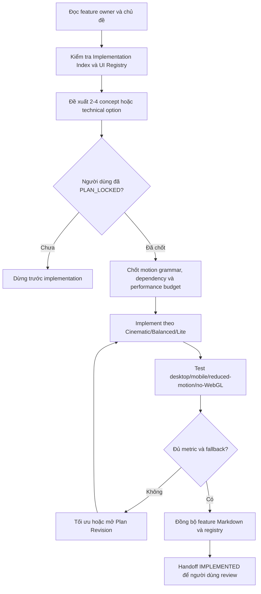

# AI Experience & Documentation Quality Gate

Tài liệu này khóa chuẩn làm việc cho mọi AI và thành viên khi thiết kế hoặc triển khai UI, animation, 3D và interaction. Mục tiêu là cho phép sáng tạo và sử dụng nhiều công nghệ khi có giá trị, đồng thời giữ trải nghiệm mượt trên máy tính, điện thoại và đủ bằng chứng cho báo cáo khóa luận.

## Trạng thái và quyết định

- Idea: `IDEA-001`.
- Decision: `DEC-UX-QUALITY-001`.
- Trạng thái: `PLAN_LOCKED`.
- Người xác nhận: `loc`.
- Ngày xác nhận: 2026-07-30.
- Phương án chọn: Quality Gate bằng Markdown ngay; bổ sung kiểm tra tự động sau project foundation.
- Phương án không chọn:
  - Chỉ thêm vài quy tắc rải rác: `REJECTED` vì dễ bị đọc sót.
  - Cấm hoặc giới hạn cứng số thư viện animation: `REJECTED` vì làm giảm không gian sáng tạo và không phản ánh chi phí thực tế.

## Nguyên tắc đã khóa

1. Không giới hạn số thư viện, ngôn ngữ hoặc kỹ thuật chỉ bằng một con số.
2. Mỗi dependency phải tạo giá trị riêng, có phạm vi sở hữu rõ và không điều khiển trùng cùng behavior/property với dependency khác.
3. Mọi công nghệ thực sự đi vào implementation phải được ghi trong feature Markdown.
4. Không được báo feature `IMPLEMENTED` nếu thiếu inventory công nghệ, performance evidence, fallback hoặc tài liệu hành vi thực tế.
5. Animation phục vụ chủ đề, storytelling, định hướng hoặc phản hồi thao tác; không thêm chỉ để trang trí.
6. Nội dung, theme, scene và motion preset production phải do CMS/API quản lý; frontend chỉ cung cấp registry đã kiểm thử.
7. Trải nghiệm phải dùng được trên desktop, mobile, máy yếu, reduced-motion và khi WebGL không khả dụng.

## Gate bắt buộc



### Giải thích

1. Entry condition: một feature có UI, animation, 3D hoặc interaction mới/sửa đổi.
2. AI đọc owner document và registry để không tạo lại component hoặc motion pattern đã có.
3. Lựa chọn đáng kể phải qua Creative Concept Review hoặc Option Review.
4. Sau `PLAN_LOCKED`, implementation giữ đúng vai trò thư viện, quality tier và budget đã chốt.
5. Kết quả phải được đo trên desktop và mobile đại diện; cảm giác trên máy dev không phải bằng chứng đủ.
6. Khi không đạt, giảm chi phí hoặc xin Plan Revision; không âm thầm thay công nghệ/flow.
7. Output là code, test evidence, feature report và registry đồng bộ; người dùng mới xác nhận `VERIFIED`.

## Technology and dependency inventory

Mỗi công nghệ/ngôn ngữ/thư viện/service được dùng phải ghi tại feature owner:

| Trường bắt buộc | Nội dung |
|---|---|
| Identity | Tên, version/range và license |
| Location | App/module/file sử dụng |
| Responsibility | Behavior hoặc pipeline mà công nghệ sở hữu |
| Rationale | Giá trị tạo ra và lý do baseline không đủ |
| Alternatives | Ít nhất một phương án đã cân nhắc khi lựa chọn có ý nghĩa |
| Trade-off | Ưu, nhược điểm, độ phức tạp và khả năng bảo trì |
| Runtime cost | Bundle, CPU/GPU, memory, network, asset/storage |
| Compatibility | Desktop/mobile/browser và thiết bị mục tiêu |
| Security | Supply-chain, CSP, dữ liệu gửi ra ngoài, license/cost |
| Loading | Code splitting, lazy load, preload và caching |
| Lifecycle | Pause, cleanup/dispose, error boundary và observability |
| Fallback | Lite, reduced-motion, no-WebGL hoặc dependency failure |
| Evidence | Test, benchmark, profiler hoặc visual review |
| Replacement | Boundary và cách gỡ/đổi công nghệ |

Không cài hai thư viện chỉ vì chúng phổ biến. Nếu cùng feature dùng Motion, GSAP, Rive/Lottie và Three.js, tài liệu phải chỉ rõ library nào sở hữu microinteraction, cinematic timeline, vector animation và 3D scene. Hai engine không được đồng thời ghi vào cùng CSS property hoặc scene state nếu chưa có coordinator được chốt.

## Thematic experience gate

Mỗi vertical slice trả lời và lưu trong Creative Concept Review:

- Chủ đề, persona và cảm xúc chính là gì?
- Signature interaction hoặc “wow moment” nào làm trải nghiệm có bản sắc?
- Motion/3D giúp kể chuyện, định hướng hoặc phản hồi thao tác như thế nào?
- Nguy cơ giống template/trend phổ biến và cách tạo điểm riêng?
- Nếu tắt animation, người dùng còn nhận đủ thông tin và hoàn thành tác vụ không?
- CMS cần field/preset/asset nào để thay nội dung mà không deploy?
- Metric nào chứng minh hiệu ứng tạo giá trị thay vì gây chậm hoặc gây rối?

## Performance budget

Budget cụ thể phải được khóa theo từng vertical slice. Nếu chưa benchmark được, dùng budget dự kiến có nhãn `TO_VALIDATE`, không ghi như bằng chứng đã đạt.

| Hạng mục | Yêu cầu baseline |
|---|---|
| Initial load | Không đưa 3D/AI/cinematic library nặng vào initial route khi chưa cần |
| Rendering | Ưu tiên transform/opacity; tránh layout animation liên tục |
| Visibility | Pause animation/render khi offscreen hoặc tab ẩn |
| WebGL | Hạn chế canvas đồng thời; dispose geometry/material/texture/timeline |
| Assets | Responsive image/texture, LOD, compression và CDN/cache |
| Lists | Virtualize danh sách lớn; chỉ reveal item trong viewport |
| Interaction | Animation không chặn đọc, điều hướng hoặc thao tác |
| Evidence | Ghi thiết bị, browser, build mode, dataset/scene và profiler sử dụng |

Các metric tối thiểu cần ghi khi phù hợp:

- LCP, INP và long task.
- FPS/frame time và dropped frames trong cảnh nặng.
- JS initial/async chunk size.
- Texture/model/media transfer size.
- Peak memory hoặc dấu hiệu leak sau navigation/re-entry.
- Thời gian tải scene và thời gian sẵn sàng tương tác.

Không tuyên bố “mượt” nếu không có thiết bị, kịch bản và số đo. Acceptance threshold chi tiết được chốt trong feature vì trang nội dung và scene 3D có workload khác nhau.

## Quality tiers và adaptive degradation

```text
Cinematic -> Balanced -> Lite -> Static/2D fallback
```

- `Cinematic`: thiết bị mạnh; scene, camera choreography và post-processing có giới hạn.
- `Balanced`: desktop/laptop/mobile phổ thông; giữ chuyển động chính, giảm shadow, texture và effect phụ.
- `Lite`: máy yếu/reduced-data; giảm mạnh 3D, particle và ambient motion.
- `Reduced motion`: bỏ chuyển động không thiết yếu nhưng giữ nội dung, trạng thái và thao tác.
- `Static/2D`: ảnh, video, 360, gallery, map 2D hoặc text khi WebGL/asset thất bại.

Capability probe kết hợp preference người dùng và telemetry runtime; không chỉ dựa vào user-agent. Khi giảm chất lượng tự động phải có cooldown/hysteresis để tránh đổi tier liên tục. Thứ tự giảm đề xuất:

1. Post-processing.
2. Shadow/reflection.
3. Particle và ambient animation.
4. Texture/model LOD.
5. Scene 3D sang media/2D fallback.

Người dùng luôn có quyền chọn mức thấp hơn. Tự nâng tier trở lại chỉ thực hiện khi có bằng chứng ổn định và không gây giật.

## Testing and evidence matrix

| Nhóm | Tối thiểu phải kiểm tra |
|---|---|
| Desktop | Keyboard, resize, route transition, scene lifecycle và performance |
| Mobile | Touch, orientation, viewport, memory, thermal/network degradation |
| Accessibility | Focus, contrast, screen reader semantics, reduced motion |
| Fallback | Lite, no-WebGL, asset lỗi, timeout và offline phù hợp |
| Visual | Breakpoint, theme, locale dài, quality tier và visual regression |
| CMS | Đổi content/theme/motion/scene preset không sửa code/deploy |
| Integration | Không xung đột ownership giữa animation libraries |

Evidence gồm build mode, thiết bị/browser, kịch bản, kết quả và limitation. Screenshot/video chỉ chứng minh hình ảnh; không thay performance profile hoặc accessibility test.

## Documentation completion gate

Feature chỉ được ghi `IMPLEMENTED` khi owner Markdown có:

- User/business flow, system sequence, data/state, auth/authz và algorithm/business-rule flow phù hợp.
- Creative Concept/Option decision và `PLAN_LOCKED`.
- Technology inventory đầy đủ cho mọi dependency thực sự dùng.
- Motion/interaction ownership và CMS schema/preset.
- Performance budget, kết quả desktop/mobile và điều kiện đo.
- Cinematic/Balanced/Lite/reduced-motion/no-WebGL behavior.
- Test evidence, known limitation, fallback và next work.
- Implementation status, Decision log và Change history.
- Liên kết traceability, Implementation Index và UI Registry khi merge.

Thiếu bằng chứng thì dùng `IN_PROGRESS` và liệt kê gap; không suy diễn kết quả.

## Automation plan

Sau `TASK-FOUND-001`, triển khai `TASK-DOC-QUALITY-001` để kiểm tra tự động những mục có thể xác minh tĩnh:

- Section bắt buộc và liên kết owner/decision.
- Mermaid block và phần giải thích.
- Technology inventory, fallback, testing/evidence.
- Decision log, Change history và status hợp lệ.
- UI Registry/Implementation Index/Traceability link khi cần.

CI chỉ kiểm tra sự hiện diện/cấu trúc và liên kết; không thể tự chứng minh nội dung đúng, trải nghiệm đẹp hoặc performance đạt. Review con người và benchmark vẫn là gate bắt buộc.

### TASK-DOC-QUALITY-001 implementation cross-link

`DEC-DOC-QUALITY-AUTOMATION-001` khóa Option C: `markdownlint-cli2` xử lý Markdown style, project-specific Node checks xử lý section/link/Mermaid explanation và mọi diagnostic có fixture. Quyết định chính nằm tại `docs/05-quality/04-code-configuration-quality-gate.md`; automation không nâng presence check thành semantic/visual/performance evidence.

## Acceptance criteria

- Mọi AI/người làm dùng cùng flow từ concept đến handoff.
- Không giới hạn sáng tạo bằng số thư viện, nhưng mọi dependency có owner, cost, fallback và evidence.
- Mọi feature animation/3D có desktop/mobile/Lite/reduced-motion/no-WebGL behavior.
- Tuyên bố hiệu năng gắn với số đo và môi trường test.
- Feature thiếu inventory hoặc evidence không được nâng thành `IMPLEMENTED`.
- Kiểm tra tự động được theo dõi như task riêng sau foundation.

## Change history

| Ngày | Loại | Thay đổi | Bằng chứng |
|---|---|---|---|
| 2026-07-30 | ADDED | Khóa Quality Gate hai giai đoạn cho sáng tạo, dependency inventory, adaptive performance và báo cáo | Người dùng `loc` chọn phương án C |
| 2026-08-04 | PLAN_LOCKED | Liên kết Option C automation cho Markdown structure/link/Mermaid evidence, giữ human review/benchmark boundary | `thanh` chọn Option C; PLAN-0028 |
