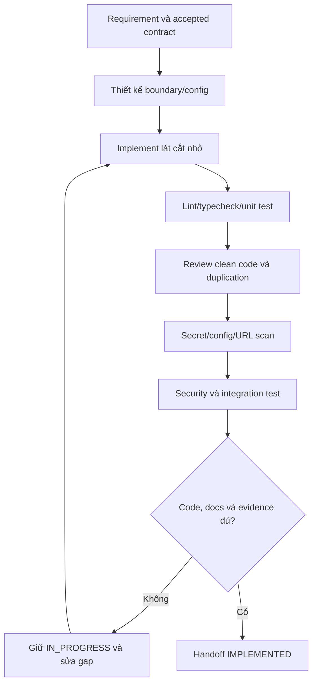

# Code, Secret & Configuration Quality Gate

Chuẩn này áp dụng cho mọi code do AI hoặc thành viên viết. Mục tiêu là code dễ đọc, dễ kiểm thử, không mang dấu vết sinh tự động dư thừa, không rò rỉ secret và không khóa môi trường/provider bằng giá trị hard-code.

## Trạng thái và quyết định

- Decision: `DEC-QUALITY-001`.
- Trạng thái: `PLAN_LOCKED`.
- Người xác nhận: `loc`.
- Ngày: 2026-07-30.
- Phạm vi: mọi application, service, worker, package, script, test và infrastructure config.

## Clean code gate

“Clean” được đánh giá bằng bằng chứng, không bằng việc code trông ngắn hoặc dùng nhiều pattern:

1. Tên module/function/type mô tả nghiệp vụ; không dùng tên chung như `helper2`, `managerNew`, `dataObj`.
2. Function/module có một trách nhiệm chính và dependency đi qua boundary rõ.
3. Không tạo abstraction, wrapper, factory, generic hoặc comment chỉ để làm code có vẻ phức tạp.
4. Không copy-paste flow, DTO, error mapping, config parsing hoặc permission rule.
5. Không tạo nhiều lớp pass-through không thêm validation, policy, observability hoặc khả năng thay thế.
6. Comment giải thích lý do, invariant hoặc trade-off; không diễn giải lại từng dòng code.
7. Không để TODO giả, placeholder production, dead code, unused dependency hoặc mock đi vào runtime path.
8. Error phải có taxonomy/contract, correlation context phù hợp và không nuốt exception.
9. Boundary I/O phải validate; type nội bộ không thay thế runtime validation.
10. Tối ưu chỉ sau khi có workload/evidence; giữ implementation đơn giản nhất đáp ứng contract và SLO.

### Dấu hiệu “AI hóa” phải loại bỏ khi review

- File lớn chứa nhiều chức năng không liên quan.
- Tên biến dài nhưng không phản ánh domain.
- Comment dày đặc mô tả điều hiển nhiên.
- Nhiều fallback im lặng che lỗi cấu hình.
- Interface/generic chỉ có một implementation và không tạo boundary có ích.
- Duplicate utility/DTO/component vì không kiểm tra registry hoặc shared package.
- Test chỉ kiểm tra mock tự dựng mà không chứng minh behavior/contract.
- Catch-all trả thành công hoặc giá trị mặc định khiến lỗi thật bị ẩn.

Không refactor chỉ vì “trông giống AI”. Review phải chỉ ra readability, duplication, coupling, correctness, testability, security hoặc performance impact cụ thể.

## Secret gate

### Tuyệt đối không được xuất hiện

- API key, token, cookie, private key, mật khẩu hoặc connection string thật trong source, test fixture, Markdown, screenshot, log, error response, analytics hoặc Git history.
- Secret trong frontend bundle, biến môi trường public, HTML, source map hoặc client-side storage.
- Secret được “che” bằng base64, obfuscation hoặc tên biến khác.
- Giá trị secret thật trong `.env.example`.

### Cách quản lý

- Local: file environment bị ignore; chỉ lưu placeholder/tên biến trong `.env.example`.
- CI/staging/production: secret manager hoặc runtime secret của platform.
- Frontend chỉ nhận public configuration được allowlist; mọi provider credential nằm ở backend.
- Config loader validate schema khi service khởi động và fail fast với thông báo đã redact.
- Log/error/telemetry dùng allowlist field hoặc redaction; không serialize nguyên request headers/config/process environment.
- Secret rotation có owner và rollout plan; thay key không cần rebuild frontend.

## Configuration gate

### Phải cấu hình theo môi trường

- Public API origin, CDN/media origin và base URL của external provider.
- Database/cache/queue/storage connection.
- Timeout, retry, concurrency, quota, rate limit và feature flag có thể thay đổi theo môi trường.
- Model/provider ID, region, bucket/cloud name và observability endpoint.
- CORS/egress allowlist và callback/redirect origin.

Config được đọc qua một module typed/schema-validated cho mỗi runtime, không gọi `process.env` rải rác trong business logic.

### Không biến mọi literal thành environment variable

- Internal API route và event name phải nằm trong shared typed contract hoặc central client, không rải string qua component.
- Domain constant ổn định nằm trong module owner và có test/documentation.
- UI text/content production đi qua CMS/i18n, không đi qua environment variable.
- CSS token, motion preset và scene preset nằm trong registry/schema versioned.
- Giá trị chỉ thuộc một thuật toán có config owner, default an toàn, range validation và Decision log.

Mục tiêu là thay môi trường/provider mà không sửa business code, không phải tạo hàng trăm biến cấu hình khó hiểu.

## API and URL rules

- Component không ghép URL hoặc gọi provider trực tiếp nếu đã có API client/BFF.
- External URL dùng `URL` builder/validated base URL; không nối chuỗi tùy ý.
- User-supplied URL phải chống SSRF, protocol confusion và internal-network access.
- Redirect/callback dùng allowlist; không open redirect.
- Signed URL có TTL, scope và content restriction phù hợp.
- Không ghi absolute localhost/staging/production URL trong runtime code.
- Test có thể dùng fixture URL rõ ràng trong test scope; không tái sử dụng credential hoặc endpoint production.

## Quality flow

### Giải thích

1. Code bắt đầu từ requirement, invariant và contract đã chấp nhận.
2. Boundary quyết định config nào thuộc runtime, contract nào dùng chung và secret nằm phía server nào.
3. Implementation giữ lát cắt nhỏ, không thêm framework/pattern ngoài nhu cầu.
4. Static check và test chạy trước review thủ công.
5. Review tìm duplication, abstraction thừa, lỗi bị che, dependency không cần và mismatch với registry.
6. Secret/config scan kiểm tra source, generated bundle/artifact và log test.
7. Security/integration test chứng minh validation, authz, failure và redaction.
8. Thiếu evidence hoặc Markdown thì giữ `IN_PROGRESS`; chỉ bàn giao `IMPLEMENTED` khi gate đạt.

## Test matrix

| Nhóm | Kiểm tra tối thiểu |
|---|---|
| Static | Formatter, lint, typecheck, dead/unused import khi tooling hỗ trợ |
| Unit | Domain rule, config parsing/range, error mapping |
| Contract | API/event/schema và generated client nếu có |
| Configuration | Missing, malformed, unsafe default, unknown key quan trọng |
| Secret | Tracked files, history trước release, build artifact và representative logs |
| Security | SSRF/open redirect/CORS, authz, injection và sensitive error |
| Integration | Dev/test config khác nhau mà không sửa business code |
| Review | Complexity, duplication, naming, boundary và dependency necessity |

CI tự động có thể phát hiện cấu trúc và pattern; không thay code review về domain clarity hoặc abstraction suitability.

## Documentation gate

Feature Markdown phải ghi khi liên quan:

- Config inventory: tên biến, runtime owner, required/optional, secret/public, default/range và môi trường.
- External dependency/API: base URL owner, auth method, timeout/retry, rate limit, failure/fallback.
- Secret flow: nơi inject, nơi sử dụng, redaction, rotation và phạm vi không được log.
- Clean-code decision đáng kể: boundary, abstraction, alternative và lý do.
- Test/scan đã chạy, phạm vi, kết quả và phần chưa kiểm tra.

Không ghi secret value vào tài liệu. Chỉ ghi tên biến, mục đích và cách cấp phát.

## Acceptance criteria

- Business logic không đọc environment trực tiếp hoặc chứa environment-specific URL.
- Frontend bundle không chứa credential/server secret.
- External endpoint và runtime tuning có typed config, validation và safe failure.
- Internal route/event/DTO dùng accepted contract thay vì string/object trùng lặp.
- Không có abstraction/dependency/comment dư thừa không giải thích được bằng requirement.
- Secret scan, lint, typecheck và test phù hợp được ghi trong handoff.
- Feature Markdown phản ánh config, provider, security và quyết định thực tế.

## Automation plan

`TASK-DOC-QUALITY-001` sau foundation sẽ bao gồm:

- Markdown/diagram/link gate.
- Formatter, lint, typecheck và test pipeline baseline.
- Secret scan, dependency scan và SAST.
- Rule phát hiện URL môi trường phổ biến trong runtime source.
- Kiểm tra `.env.example` chỉ có placeholder và config schema có coverage.

Các rule chống false positive phải có allowlist theo file/test scope và lý do review được. Automation không tự đánh giá code “đẹp”; nó cung cấp bằng chứng cho human review.

## Change history

| Ngày | Loại | Thay đổi | Bằng chứng |
|---|---|---|---|
| 2026-07-30 | ADDED/SECURITY | Khóa clean-code, secret, typed configuration và API/URL gate | Người dùng `loc` yêu cầu bổ sung |
