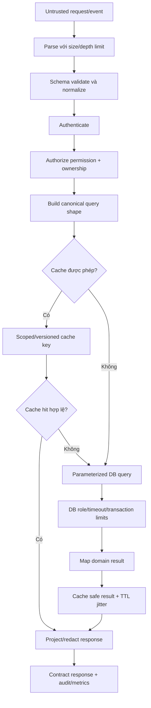

# Database Query, Cache & Input Security Quality Gate

Chuẩn bắt buộc cho mọi request đọc/ghi PostgreSQL, MongoDB, Redis hoặc search/vector store. Mục tiêu là chống injection và rò rỉ dữ liệu từ đầu vào đến response, đồng thời giữ query/cache nhanh bằng bằng chứng thay vì tối ưu cảm tính.

## Trạng thái và quyết định

- Decision: `DEC-DATA-QUALITY-001`.
- Trạng thái: `PLAN_LOCKED`.
- Người xác nhận: `loc`.
- Ngày: 2026-07-30.
- Phạm vi: API, worker, job, admin query, search, report/export và cache.

## Nguyên tắc đã khóa

1. Mọi dữ liệu từ client, header, URL, cookie, webhook, queue, file và provider đều không tin cậy.
2. Client validation chỉ phục vụ UX; server luôn authenticate, authorize, validate và normalize lại.
3. Giá trị query dùng parameter binding/prepared statement hoặc API an toàn của ORM/query builder.
4. Không nối chuỗi SQL, Mongo operator, filter, sort, field, table hoặc Redis command từ input.
5. Identifier/operator động phải đi qua allowlist ánh xạ server-side; parameter binding không bảo vệ identifier.
6. Chỉ select field cần thiết, phân trang có giới hạn và không trả internal/sensitive field.
7. Index xuất phát từ query shape, cardinality và query plan; không “index mọi cột”.
8. Cache không được vượt qua authorization, publish state, ownership hoặc privacy boundary.
9. Tối ưu phải có baseline và evidence; code ngắn nhất không được ưu tiên hơn đúng, rõ, an toàn và dễ kiểm thử.

## End-to-end flow

### Giải thích

1. Entry condition: request, event hoặc job chứa dữ liệu ngoài trust boundary.
2. Parser giới hạn body, array, string, nesting, upload và decompression để chống resource exhaustion.
3. Server schema loại unknown field theo policy, normalize locale/date/ID và giới hạn pagination/filter/sort.
4. Authentication không thay authorization; quyền và ownership được kiểm tra trước truy vấn nhạy cảm hoặc trong cùng transaction thích hợp.
5. Query shape được tạo từ contract/allowlist, không truyền object filter tùy ý từ client vào ORM/Mongo.
6. Cache chỉ dùng khi resource, actor scope, locale, version và publish state cho phép.
7. Cache miss chạy parameterized query dưới DB role tối thiểu, statement timeout và transaction boundary rõ.
8. Response projection/redaction chạy trước khi trả; không serialize nguyên entity/row/error.
9. Metrics ghi query fingerprint, duration, row count/cache state; không ghi raw secret/PII/query parameter.

## Server input validation

- Dùng schema runtime ở route/event boundary; TypeScript type không phải validation.
- ID/UUID, enum, locale, date range, numeric range, cursor và sort direction có allowlist/constraint.
- Pagination có default và maximum; export lớn đi qua job/stream, không dùng limit vô hạn.
- Search/filter có giới hạn chiều dài, số token, số điều kiện và độ sâu.
- Reject unknown/suspicious operator; không merge trực tiếp request object vào `where`, update document hoặc aggregation pipeline.
- Mass assignment bị chặn bằng DTO riêng và field allowlist cho từng action/role.
- Canonicalize trước authorization/cache key để tránh bypass bằng hai biểu diễn tương đương.
- Error validation không trả schema nội bộ, stack trace, SQL, table/column nhạy cảm hoặc dữ liệu người khác.

## Injection prevention

### PostgreSQL/SQL

- Parameterized query/prepared statement bắt buộc cho mọi value.
- Dynamic column/table/order direction chỉ lấy từ enum → server-side mapping.
- Không dùng raw SQL escape thủ công. Raw SQL chỉ khi query builder không đủ, có review, parameter binding và test injection.
- DB account dùng least privilege; migration role tách runtime role.
- Không cho client gửi fragment SQL, expression, function, JSON path hoặc full-text syntax chưa được parser/allowlist.

### MongoDB/document query

- Không truyền object JSON từ client thẳng vào filter/update/aggregation.
- Chặn operator injection như `$where`, `$expr`, `$function` và operator ngoài allowlist.
- Update dùng field allowlist; không chấp nhận arbitrary path/prototype key.
- Aggregation pipeline được server tạo từ query shape đã biết.

### Redis/cache/search

- Key segment được canonicalize/encode và giới hạn độ dài.
- Không cho input chọn raw command, namespace hoặc Lua/script.
- Search syntax/filter/facet/sort được parse theo grammar/allowlist; không nối query DSL trực tiếp.

## Query performance gate

### Query design

- Tránh N+1 bằng join/batch/data-loader theo boundary; không eager-load toàn graph.
- Select/projection đúng field; không `SELECT *` trong production path nếu schema có thể mở rộng hoặc chứa field nhạy cảm.
- Cursor/keyset pagination cho feed lớn; offset chỉ dùng cho bảng admin nhỏ có giới hạn.
- Batch có kích thước tối đa; tránh loop thực hiện từng query/write nếu có safe bulk operation.
- Transaction ngắn, isolation phù hợp, thứ tự lock ổn định; external network call không nằm trong DB transaction.
- Có statement/lock/idle transaction timeout và cancellation.
- Query lặp lại dùng prepared statement khi driver/ORM hỗ trợ an toàn.

### Index discipline

Index chỉ được thêm khi ghi:

- Query shape/endpoint/job owner.
- Predicate, join, sort và projection.
- Cardinality/selectivity và kích thước dữ liệu dự kiến/thực tế.
- `EXPLAIN (ANALYZE, BUFFERS)` hoặc plan tương đương trên dữ liệu an toàn/gần thực tế.
- Read benefit so với write amplification, storage, vacuum/build và migration-lock cost.
- Lý do thứ tự cột trong composite index.
- Điều kiện dùng unique, partial, covering, GIN, HNSW hoặc IVFFlat.
- Duplicate/unused index check và điều kiện xóa.

Không chạy `EXPLAIN ANALYZE` trên production mutation hoặc query có rủi ro cao. Dùng staging/snapshot đã xử lý dữ liệu và chỉ chạy production plan inspection theo runbook được duyệt.

### Anti-pattern bị cấm

- Index mọi cột “để nhanh”.
- Tạo nhiều index trùng prefix hoặc index không gắn query owner.
- Tối ưu query nhỏ bằng cache nhưng bỏ qua query plan/index đúng.
- Load toàn bộ rows rồi filter/sort/paginate trong application.
- Count chính xác trên tập cực lớn cho UI khi estimate/cursor/hasNext đáp ứng nghiệp vụ.
- Bỏ authorization filter rồi lọc kết quả sau khi đã đọc dữ liệu người khác.

## Cache quality and security gate

### Cache eligibility

- Public cache chỉ chứa dữ liệu `PUBLISHED` đúng thời gian hiệu lực và locale/audience.
- Dữ liệu cá nhân/admin/permission-sensitive không dùng shared public key.
- Private cache key gồm actor/tenant/permission/version cần thiết hoặc không cache nếu invalidation khó chứng minh.
- Không cache token, credential, raw private media URL hoặc error chứa dữ liệu nhạy cảm.

### Key và invalidation

- Key có namespace, schema version, resource/version, locale và canonical parameter hash.
- Publish/update/rollback/permission change phải có invalidation owner và event/transaction order rõ.
- Publish thành công mới phát invalidation event; consumer idempotent.
- TTL có jitter; stale-while-revalidate chỉ cho dữ liệu cho phép stale.
- Chống stampede bằng request coalescing/lock ngắn và bounded wait; lock failure có fallback.
- Negative caching chỉ cho lỗi/absence an toàn, TTL ngắn và không che newly authorized/published data.

### Correctness

- Không dùng cache hit để bỏ qua auth/authz khi key không chứng minh scope.
- Response cache variation ghi rõ locale, encoding, auth/audience và content version.
- Cache failure degrade về source có rate/backpressure; không biến Redis outage thành retry storm.
- Metrics theo hit/miss/stale/eviction/latency, không chứa raw PII trong key label.

## Data exposure prevention

- Response DTO/schema là allowlist; không serialize ORM entity/document trực tiếp.
- Field nội bộ như password hash, refresh token, provider ID bí mật, moderation note và audit internals không vào public response.
- Error mapping trả code/correlation ID, không trả SQL, stack, filesystem path, provider payload hoặc secret.
- Log dùng query fingerprint/template thay raw query parameter; PII được redact/hash theo policy.
- Export/report có permission, scope, row/size limit, async job, expiry và audit.
- Backup/snapshot/test dataset phải có access control và masking phù hợp.

## Measurement and acceptance

Mỗi query/cache quan trọng ghi:

| Evidence | Nội dung |
|---|---|
| Workload | Endpoint/job, data size, concurrency, read/write ratio |
| Baseline | p50/p95/p99, rows scanned/returned, DB time, cache state |
| Plan | Index/scan/join/sort/buffer evidence |
| Change | Query/index/cache/batch/projection đã đổi |
| Result | Số đo trước/sau và regression |
| Cost | Write latency, storage, invalidation, consistency |
| Environment | DB version/config, dataset và build/commit |

Target toàn hệ thống vẫn theo `02-performance-scalability.md`; feature có thể đặt budget chặt hơn. Không tuyên bố “đã tối ưu” nếu chưa có query-plan/load evidence phù hợp.

## Testing

- Injection payload cho value, identifier, sort, filter, JSON/operator và search syntax.
- Missing/invalid/oversized/deep input, mass assignment và pagination abuse.
- IDOR/ownership/permission với cache hit và cache miss.
- Public draft/rejected/expired content không lọt qua DB hoặc cache.
- N+1/query-count regression cho flow chính.
- Query plan/index regression trên dataset đại diện.
- Cache stampede, Redis timeout/outage, stale data và invalidation ordering.
- Response/log/error redaction và không lộ internal schema/path.
- Load test cache hit/miss và database pool saturation.

## Documentation gate

Feature owner phải ghi khi liên quan:

- Query shape, projection, pagination, transaction/isolation và authorization predicate.
- Index owner, cột/thứ tự/loại, query-plan evidence và write/storage trade-off.
- Cache eligibility, key schema/version, TTL/jitter, invalidation producer/consumer và degraded mode.
- Input schema/limits/normalization và injection cases.
- Response/error/log redaction.
- Benchmark/load environment, kết quả và limitation.

Thiếu các mục hoặc evidence thì giữ `IN_PROGRESS`; không ghi `IMPLEMENTED`.

## Acceptance criteria

- Không có string-built query/DSL từ untrusted input.
- Mọi boundary validate server-side và authorization/ownership không phụ thuộc frontend.
- Query có giới hạn, projection, pagination và timeout phù hợp.
- Index quan trọng có query owner và plan evidence; không có index dư được biết mà không có xử lý.
- Cache key/invalidation giữ đúng publish, permission, ownership và locale.
- Response/log/error không lộ secret, PII, SQL, schema hoặc internal path.
- Handoff ghi query plan, query-count, cache và security test thực sự đã chạy.

## Automation plan

Sau foundation, `TASK-DOC-QUALITY-001` mở rộng để kiểm tra:

- SAST/query-pattern scan và raw-query review marker.
- Contract/schema validation tests.
- Migration/index lint và duplicate-index checks khi tooling hỗ trợ.
- N+1/query-count budget trong integration tests.
- Cache-key/invalidation contract tests.
- Injection, IDOR và response/log redaction regression.

Automation không tự quyết định index tốt hay query tối ưu; query plan, workload và review vẫn là nguồn bằng chứng.

### TASK-DOC-QUALITY-001 implementation cross-link

`DEC-DOC-QUALITY-AUTOMATION-001` khóa Option C cho static/AST query-policy checks và synthetic validation/redaction regression trong `services/api/test/**`. Baseline API hiện chỉ có repository in-memory, chưa có SQL query adapter hoặc cache runtime; vì vậy query plan, query count, cache-key/invalidation runtime evidence phải ghi `NOT_APPLICABLE` kèm lý do. Task không được tạo production query/cache implementation chỉ để làm gate pass.

Implementation status: `VERIFIED / DONE`. Static/AST fixtures và API synthetic regressions đã merge tại `e0c4139`; API suite 19/19 và integrated hosted run `30841444661` PASS. SQL query-plan, query-count và cache invalidation runtime evidence vẫn `NOT_APPLICABLE` cho đến khi production seams tồn tại.

## Change history

| Ngày | Loại | Thay đổi | Bằng chứng |
|---|---|---|---|
| 2026-07-30 | ADDED/SECURITY/PERFORMANCE | Khóa input, injection, query/index, cache và exposure gate | Người dùng `loc` yêu cầu |
| 2026-08-04 | PLAN_LOCKED | Liên kết Option C static/AST và synthetic regression; khóa N/A boundary khi SQL/cache runtime chưa tồn tại | `thanh` chọn Option C; PLAN-0028 |
| 2026-08-04 | VERIFIED / MERGED | Static query/cache policy và synthetic validation/redaction regressions merge, giữ nguyên N/A runtime boundary | `e0c4139` / PR `#9`; API 19/19; run `30841444661`; PLAN-0030 |
