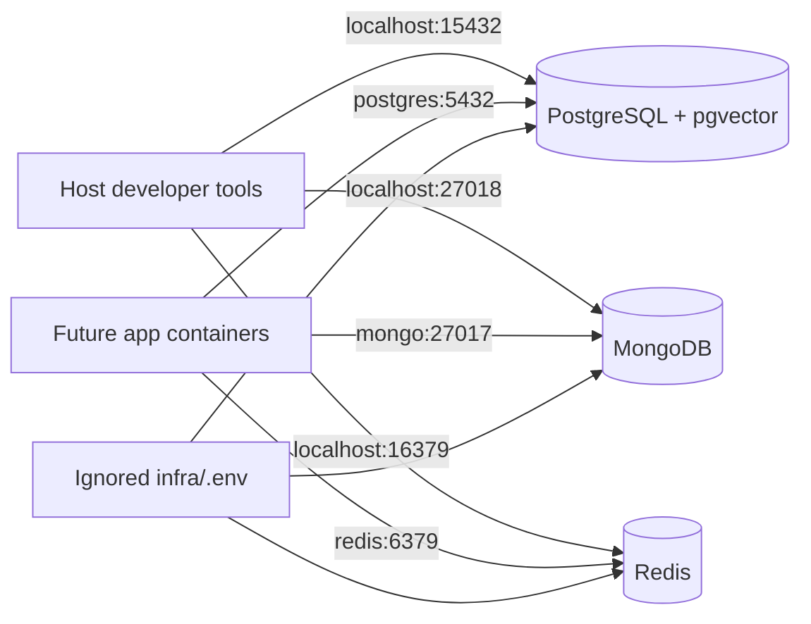
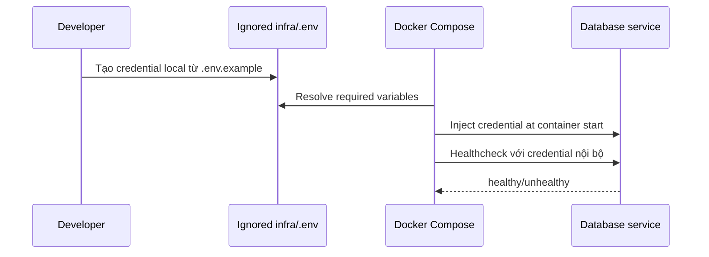

# Docker, môi trường và CI/CD

## Cấu trúc repository dự kiến

```text
apps/web
apps/admin
services/api
services/ai
workers/media
packages/ui
packages/contracts
infra/nginx
infra/docker
docs
```

Monorepo dùng pnpm workspace/Turborepo cho TypeScript; Python quản lý riêng bằng uv/Poetry. Không buộc mọi ngôn ngữ vào cùng package manager.

## Container local

- `web`, `admin`, `api`, `ai-worker`, `media-worker`.
- `postgres`, `mongo`, `redis`, `nginx`.
- Tùy chọn `minio` để mô phỏng object storage khi không muốn dùng Cloudinary local.
- Healthcheck và named volume; migration chạy bằng job riêng, không chạy đồng thời ở mọi API replica.

### Local service contract — PLAN_LOCKED

Compose project dùng tên `hcm-museum`. Port trong container giữ port chuẩn; port publish lên host dùng dải riêng để giảm xung đột với dịch vụ đã cài trên máy phát triển.

| Service | Compose name | Host port | Container port | Trạng thái |
|---|---|---:|---:|---|
| PostgreSQL | `postgres` | `15432` | `5432` | TASK-INFRA-001 |
| MongoDB | `mongo` | `27018` | `27017` | TASK-INFRA-001 |
| Redis | `redis` | `16379` | `6379` | TASK-INFRA-001 |
| API | `api` | `3000` | `3000` | Reserved |
| AI worker/service | `ai-worker` | `8000` | `8000` | Reserved |
| Media worker | `media-worker` | `8001` | `8001` | Reserved |
| Public Web | `web` | `5173` | `5173` | Reserved |
| Admin | `admin` | `5174` | `5174` | Reserved |
| Nginx | `nginx` | `8080` | `80` | Reserved |
| MinIO API | `minio` | `19000` | `9000` | Optional/reserved |
| MinIO Console | `minio` | `19001` | `9001` | Optional/reserved |

Container-to-container connection dùng Compose DNS và container port (`postgres:5432`, `mongo:27017`, `redis:6379`). Process chạy trực tiếp trên host dùng `localhost` và host port tương ứng. Reserved port chưa cho phép TASK-INFRA-001 tạo app container ngoài write scope.

Named volume baseline: `postgres_data`, `mongo_data`, `redis_data`. Database local mặc định là `museum`, PostgreSQL role ứng dụng là `museum_app`; credential thật phải đến từ ignored local environment hoặc Docker secret.

## Biến môi trường

```dotenv
NODE_ENV=
DATABASE_URL=
MONGODB_URI=
REDIS_URL=
JWT_PRIVATE_KEY=
JWT_PUBLIC_KEY=
GOOGLE_CLIENT_ID=
GOOGLE_CLIENT_SECRET=
CLOUDINARY_CLOUD_NAME=
CLOUDINARY_API_KEY=
CLOUDINARY_API_SECRET=
AI_PROVIDER_API_KEY=
PUBLIC_API_ORIGIN=
MEDIA_ORIGIN=
```

File thật là `.env.local`/Docker secret và bị ignore. `.env.example` chỉ để tên và mô tả.

Ví dụ endpoint local không chứa secret thật:

```dotenv
# Dùng từ container trong Compose network
DATABASE_URL=postgresql://museum_app:<local-password>@postgres:5432/museum
MONGODB_URI=mongodb://mongo:27017/museum
REDIS_URL=redis://redis:6379

# Dùng khi runtime chạy trực tiếp trên host
DATABASE_URL_HOST=postgresql://museum_app:<local-password>@localhost:15432/museum
MONGODB_URI_HOST=mongodb://localhost:27018/museum
REDIS_URL_HOST=redis://localhost:16379
```

Tên có hậu tố `_HOST` là tài liệu phân biệt ngữ cảnh, không mặc định yêu cầu runtime hỗ trợ hai bộ biến cùng lúc. Mỗi runtime vẫn nhận đúng một `DATABASE_URL`, `MONGODB_URI` và `REDIS_URL` đã được typed validation.

Mỗi runtime dùng một config module typed/schema-validated và fail fast khi biến bắt buộc thiếu hoặc sai. Business logic không đọc `process.env` trực tiếp. Chỉ biến có nhãn public mới được expose vào frontend; server secret không được dùng prefix/public injection. External origin, callback, provider endpoint, timeout và quota phụ thuộc môi trường không được hard-code trong runtime source. Internal API route/event vẫn thuộc shared contract, không biến thành environment variable.

## Thiết lập theo pha

1. Cài Docker Desktop, Git, Node LTS, pnpm, Python phù hợp.
2. Copy `.env.example`, tạo key local.
3. `docker compose up` hạ tầng.
4. Chạy migration và seed demo qua command có kiểm soát.
5. Chạy web/admin/api/worker hoặc toàn bộ bằng Compose.

## CI

Lint -> typecheck -> unit -> integration -> build -> image scan -> E2E smoke. Migration kiểm tra trên database rỗng và bản snapshot gần production. Deploy staging trước production; production cần approval và rollback image.

## Lưu ý Windows

Dùng LF qua `.gitattributes`, tránh mount quá nhiều file gây chậm, ưu tiên named volume cho database và chạy command thống nhất qua package scripts.

## Delivery estimate

- Optimistic: 1 person-day.
- Expected: 2 person-days.
- Pessimistic: 3 person-days.
- Confidence: MEDIUM.
- Bao gồm: Compose cho PostgreSQL/MongoDB/Redis, health checks, named volumes, `.env.example` liên quan và smoke verification.
- Không bao gồm: app container, migration nghiệp vụ, production deployment, Nginx và MinIO implementation.
- Dependency/risk: cấu trúc root/Compose entrypoint từ `TASK-FOUND-001`; xung đột port trên máy; Docker Desktop/Windows filesystem.

## Implementation status

- `TASK-INFRA-001`: `VERIFIED` bởi `loc` lúc `2026-08-03T12:00:24+07:00` trên `feature/TASK-INFRA-001`; chờ user-owned commit/push/review/merge.
- Local service/port contract: `PLAN_LOCKED` và đã xuất hiện trên remote `develop`.
- Compose, health checks và local runbook: `IMPLEMENTED`.
- Runtime smoke test: PASS trên Docker Engine `28.4.0` / Compose `v2.39.4-desktop.1`.

## Decision log

| Ngày | ID | Trạng thái | Quyết định | Lý do và phương án không chọn |
|---|---|---|---|---|
| 2026-08-03 | `DEC-INFRA-LOCAL-PORTS-001` | PLAN_LOCKED | Giữ port chuẩn trong container, dùng host ports `15432`, `27018`, `16379`; Compose DNS dùng `postgres`, `mongo`, `redis`; reserve dải app/proxy theo bảng trên. | Giảm va chạm với dịch vụ local nhưng vẫn giữ kết nối nội bộ theo convention. Không chọn publish trực tiếp toàn bộ port chuẩn vì dễ collision trên máy phát triển. |
| 2026-08-03 | `DEC-INFRA-IMAGE-001` | PLAN_LOCKED | Pin `pgvector/pgvector:0.8.5-pg17-bookworm`, `mongo:8.0.28-noble`, `redis:8.8.1-alpine`; không dùng `latest`. | Tái lập local ổn định, có pgvector đúng baseline và tránh tag trôi. Version được kiểm tra từ upstream/Docker Official Image trước implementation. |

## Change history

| Ngày | Loại | Thay đổi | Evidence |
|---|---|---|---|
| 2026-08-03 | ADDED | Chuẩn bị đề xuất service naming, host/container ports, volume/database naming và estimate cho `TASK-INFRA-001` trên feature branch. | User `loc` chọn Phương án B; chờ nhóm thống nhất; implementation/test chưa chạy. |
| 2026-08-03 | CHANGED | Bắt đầu implementation Compose độc lập trong `infra/**`; pin image versions và mở contribution session. | Branch `feature/TASK-INFRA-001`; Docker engine chưa chạy nên runtime evidence pending. |
| 2026-08-03 | ADDED | Hoàn thiện Compose, ignored local env template, named volumes, authenticated health checks và runbook cho PostgreSQL/pgvector, MongoDB, Redis. | Static config PASS; cả ba container healthy; pgvector `0.8.5`; Mongo ping `1`; Redis `PONG`. |
| 2026-08-03 | CHANGED | Người dùng xác nhận implementation đạt `VERIFIED`; chưa đánh dấu merged/completed. | `loc` xác nhận sau user-owned `.env` runtime smoke PASS lúc `2026-08-03T12:00:24+07:00`. |

## System flow



Entry condition: Docker Compose đọc `infra/compose.yaml` cùng `infra/.env`. Host dùng published ports; container tương lai dùng Compose DNS. Health checks xác nhận khả năng nhận kết nối có authentication. Dữ liệu được giữ trong named volumes; `docker compose down` không xóa dữ liệu, còn `down --volumes` là thao tác phá hủy phải được người dùng chủ động chọn.

## Authentication and secret path



Không có credential thật trong Compose/Markdown. Compose fail trước khi start nếu biến bắt buộc thiếu. Credential local có thể hiện trong container configuration nên không được tái sử dụng cho staging/production; production phải dùng secret manager/runtime secret.

## Contribution ledger

| Session ID | Contributor | Role | Task/Branch | StartedAt | LastActiveAt | EndedAt | Status | Scope/Output | Tests/Evidence | Handoff/Next |
|---|---|---|---|---|---|---|---|---|---|---|
| `WS-TASK-INFRA-001-20260803-01` | `loc` | implement | `TASK-INFRA-001` / `feature/TASK-INFRA-001` | `2026-08-03T11:50:45+07:00` | `2026-08-03T11:58:28+07:00` | `2026-08-03T11:58:28+07:00` | CLOSED | Compose PostgreSQL/pgvector, MongoDB, Redis, authenticated health checks, ignored env template và runbook trong `infra/**` | Config PASS; validation run and user-owned ignored `.env` run both healthy; pgvector `0.8.5`; Mongo ping `1`; Redis `PONG`; secret-pattern scan no matches | `IMPLEMENTED`; user review, then user-owned feature push/review/merge |

## Verification evidence

| Check | Result |
|---|---|
| `docker compose config --quiet` | PASS |
| Rendered services/images/ports/volumes/healthchecks | PASS: 3 services, pinned images, ports `15432/27018/16379`, named volumes, healthchecks |
| PostgreSQL readiness | PASS: accepting connections |
| pgvector availability | PASS: extension version `0.8.5` available |
| MongoDB readiness | PASS: `db.adminCommand('ping').ok = 1` |
| Redis readiness | PASS: `PONG` with authentication |
| Environment ignore boundary | PASS: `infra/.env` ignored; `infra/.env.example` trackable |
| User-owned `.env` runtime | PASS: three services healthy; credential values not printed/logged |
| Secret-pattern scan in changed scope | PASS: no validation credential/private-key/access-key match |
| Cleanup | PASS: containers/network stopped; smoke-test volumes chứa credential giả đã được xóa trước user verification |

## Known limitations and fallback

- Root scripts and root `.env.example` are intentionally not changed because they belong to `TASK-FOUND-001`.
- Local credentials are passed as container environment variables and can be visible through Docker inspection; they are development-only and must not be reused for staging/production.
- If a host port is occupied, override only the matching `*_HOST_PORT` in ignored `infra/.env`.
- `docker compose down` preserves data; destructive `down --volumes` remains an explicit user action.

## Feature lifecycle

| Mốc | Timestamp | Member/Actor | Evidence |
|---|---|---|---|
| Planned | `2026-08-03T11:15:06+07:00` | `loc` | `DEC-INFRA-LOCAL-PORTS-001` / `PLAN-0012` |
| Claimed | `2026-08-03T11:15:06+07:00` | `loc` + `thanh` | `docs/NEXT_WORK.md` trên remote `develop` |
| Implementation started | `2026-08-03T11:50:45+07:00` | `loc` | `WS-TASK-INFRA-001-20260803-01` |
| First IMPLEMENTED | `2026-08-03T11:54:40+07:00` | Codex + `loc` | Static/runtime smoke evidence trong file này |
| VERIFIED | `2026-08-03T12:00:24+07:00` | `loc` | Người dùng xác nhận sau user-owned `.env` smoke PASS |
| Merged to develop | — | — | Chưa merge |
| Completed | — | — | Chờ merge + Merge Memory Sync PASS |
