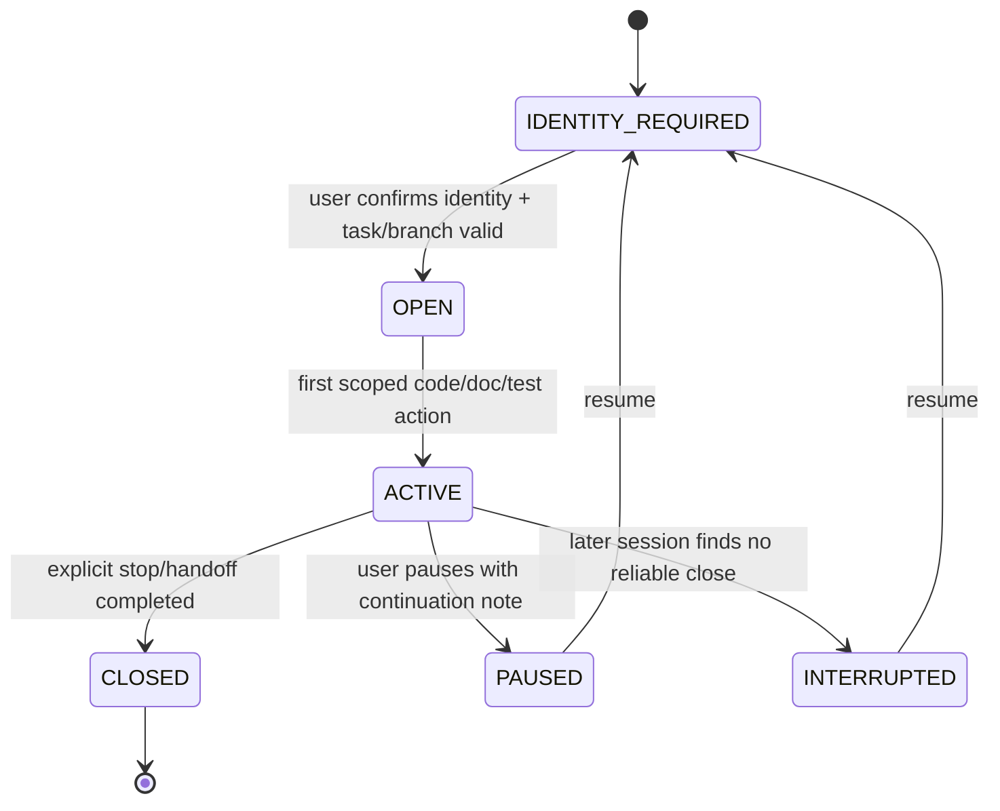
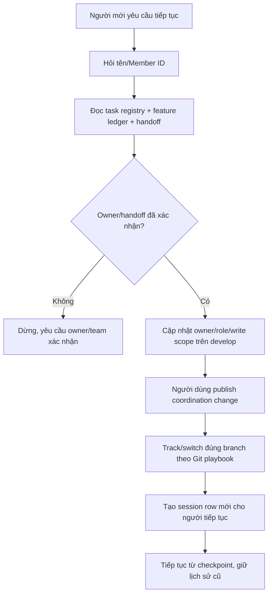

# Work Session & Feature Contribution Ledger

Tài liệu này quy định cách xác nhận người đang code và lưu lịch sử đóng góp cho từng chức năng từ lúc bắt đầu đến khi hoàn tất. Mục tiêu là tiếp tục công việc an toàn sau khi đổi chat/người/nhánh và tạo bằng chứng rõ cho báo cáo.

## Trạng thái và quyết định

- Decision: `DEC-COLLAB-SESSION-001`.
- Trạng thái: `PLAN_LOCKED`.
- Người xác nhận: người dùng.
- Ngày: 2026-07-30.
- Múi giờ mặc định khi hiển thị: `Asia/Ho_Chi_Minh`.
- Timestamp lưu trong Markdown: ISO 8601 có offset, ví dụ `2026-07-30T14:00:00+07:00`.

## Hai lớp lịch sử

### Task registry

`docs/NEXT_WORK.md` cho biết task hiện được claim bởi ai, branch nào và write scope nào. Claim không tự hết hạn khi người làm rời chat.

### Feature Contribution Ledger

Feature owner Markdown lưu lịch sử append-only của từng phiên và từng người:

- Ai bắt đầu/tiếp tục/review/handoff.
- Bắt đầu lúc nào, cập nhật gần nhất lúc nào, kết thúc lúc nào nếu biết.
- Branch, task, write scope và mục tiêu phiên.
- File/behavior/decision/test/docs đã thay đổi.
- Trạng thái dừng và người nhận bàn giao.
- Bằng chứng commit/PR/merge sau khi người dùng thực hiện Git.

`CURRENT_TASK.md` chỉ giữ phiên hiện tại và next checkpoint; durable history phải được chuyển vào feature owner.

## Identity recheck policy

AI phải hỏi lại “Bạn tên gì hoặc muốn dùng Member ID nào?” trước hành động code đầu tiên khi có một trong các điều kiện:

- Chat/conversation mới.
- Chưa có danh tính do chính người dùng xác nhận trong conversation hiện tại.
- Đổi branch, repository, task hoặc feature.
- Người dùng nói họ đang tiếp tục/nhận lại công việc nhưng handoff chưa rõ.
- `LastActiveAt` của phiên gần nhất cách hiện tại từ 4 giờ trở lên.
- Git author/branch/task context mâu thuẫn với câu trả lời hoặc ledger.

Mốc 4 giờ là `identity recheck threshold`, không phải số giờ làm việc và không phải stale-task threshold. Nó có thể được nhóm đổi bằng Plan Revision.

AI không gọi sẵn tên, không liệt kê ứng viên và không suy luận từ Git. Sau câu trả lời, Git author chỉ là consistency check.

## Session lifecycle



### Giải thích

1. Mọi phiên code bắt đầu ở `IDENTITY_REQUIRED`.
2. Chỉ mở phiên sau khi danh tính, task claim, branch và write scope hợp lệ.
3. `StartedAt` được ghi ngay trước hành động implementation đầu tiên, không ghi từ lúc chỉ hỏi/đọc onboarding.
4. `LastActiveAt` cập nhật sau checkpoint có thay đổi hoặc test có ý nghĩa; không cập nhật vì trò chuyện không liên quan.
5. Người dùng dừng/chuyển task thì đóng `CLOSED` hoặc `PAUSED`, ghi `EndedAt`, output và next step.
6. Nếu người dùng rời đi không báo, phiên sau đổi trạng thái cũ thành `INTERRUPTED`; `EndedAt` để `UNKNOWN`, không lấy thời điểm hiện tại làm giờ kết thúc giả.
7. Resume luôn qua identity recheck và tạo một session row mới để lịch sử rõ.

## Session ID và trạng thái

Session ID có dạng:

```text
WS-<TASK-ID>-YYYYMMDD-<NN>
```

Ví dụ: `WS-TASK-API-001-20260730-01`.

Trạng thái:

- `OPEN`: đã xác nhận, chưa có hành động implementation.
- `ACTIVE`: đang thực hiện.
- `PAUSED`: dừng có chủ đích, còn owner/branch/write scope.
- `CLOSED`: đã kết thúc phiên và có handoff/checkpoint.
- `INTERRUPTED`: mất phiên mà không biết thời điểm dừng chính xác.
- `INVALIDATED`: mở nhầm branch/task/identity và dừng trước khi thay đổi; giữ record cùng lý do.

## Feature Contribution Ledger template

Mỗi feature owner có mục sau:

| Session ID | Contributor | Role | Task/Branch | StartedAt | LastActiveAt | EndedAt | Status | Scope/Output | Tests/Evidence | Handoff/Next |
|---|---|---|---|---|---|---|---|---|---|---|
| WS-... | Member ID đã xác nhận | implement/review/support | TASK-ID / branch | ISO-8601 | ISO-8601 | ISO-8601/UNKNOWN | ACTIVE/... | | | |

Quy tắc:

- `Contributor` dùng Member ID/tên đã được người dùng xác nhận; không dùng Git email.
- Một người có nhiều phiên thì có nhiều dòng.
- Người khác tiếp tục tạo dòng mới, không sửa owner/timestamp của người trước.
- `Scope/Output` mô tả behavior/module, không chỉ số dòng code.
- `Tests/Evidence` ghi test thực sự chạy; chưa chạy ghi `NOT RUN`.
- `Handoff/Next` liên kết handoff, blocker, next checkpoint và người nhận nếu đã xác nhận.
- Không xóa hoặc viết lại contribution cũ; correction thêm note/revision có lý do.

## Feature lifecycle summary

Ngoài session rows, feature owner lưu:

| Mốc | Timestamp | Member/Actor | Evidence |
|---|---|---|---|
| Planned | | | Decision/plan |
| Claimed | | | NEXT_WORK coordination change |
| Implementation started | | | First ACTIVE session |
| First IMPLEMENTED | | | Handoff + tests |
| VERIFIED | Chỉ sau người dùng xác nhận | | Review/test evidence |
| Merged to develop | Chỉ sau xác nhận merge | | Commit/PR |
| Completed | Sau merge memory sync PASS | | Registry/index evidence |

Không tự ghi ngày hoàn tất chỉ vì agent dừng code. `Completed` cần merge vào `develop`, verification và Merge Memory Sync.

## Effort accounting

- Wall-clock từ `StartedAt` đến `EndedAt` không mặc nhiên là actual effort vì có thể có thời gian nghỉ/chờ.
- `Active effort` chỉ ghi khi người dùng cung cấp hoặc công cụ/session có bằng chứng đáng tin cậy.
- Phiên `INTERRUPTED` không suy ra duration.
- Có thể tổng hợp số phiên, người đóng góp và calendar span; phải phân biệt với person-hours.
- Estimate cũ được giữ trong history; actual effort chỉ cập nhật sau nhóm xác nhận.

## Người khác tiếp tục công việc



Người tiếp tục không được:

- Tự nhận task chỉ vì phiên cũ quá 4 giờ.
- Ghi đè tên người trước hoặc nhận toàn bộ đóng góp là của mình.
- Tự đặt task stale về `READY`.
- Checkout/đọc branch người khác khi chưa có review/support/handoff.
- Bịa `EndedAt`, effort, completion date hoặc test evidence còn thiếu.

Nếu hai người cùng hỗ trợ trong một phiên, ghi hai session/contribution row hoặc role riêng; mỗi người chỉ nhận scope có bằng chứng.

## Gate trước mỗi implementation session

- [ ] Người dùng đã tự xác nhận tên/Member ID trong conversation hiện tại.
- [ ] Identity confirmation chưa quá 4 giờ theo `LastActiveAt`, hoặc đã hỏi lại.
- [ ] Task/owner/branch/write scope đúng và không xung đột.
- [ ] Phiên cũ đã `CLOSED/PAUSED`, hoặc được đánh dấu `INTERRUPTED` mà không bịa giờ kết thúc.
- [ ] Session ID và `StartedAt` mới đã được chuẩn bị trong feature owner/CURRENT_TASK.
- [ ] Handoff/Decision/Plan Snapshot liên quan đã đọc.
- [ ] Chưa hành động trên branch người khác nếu chưa được phép.

## Gate khi dừng

- [ ] Cập nhật `LastActiveAt`, `EndedAt` nếu biết và status.
- [ ] Ghi behavior/file/decision/docs đã đổi.
- [ ] Ghi test đã chạy/chưa chạy và limitation.
- [ ] Ghi next checkpoint, blocker và handoff receiver nếu có.
- [ ] Chuyển durable history từ `CURRENT_TASK.md` sang feature owner.
- [ ] Cập nhật task registry nếu `PAUSED`, handed off hoặc status thay đổi.
- [ ] Không tự commit/push/merge; đề xuất Git action theo trạng thái.

## Acceptance criteria

- Chat/code session mới luôn hỏi danh tính trước khi sửa.
- Sau 4 giờ không hoạt động được ghi nhận, identity phải được xác nhận lại.
- Mỗi feature có lifecycle và contribution rows từ lúc claim đến completion.
- Người tiếp tục có row riêng, timestamp/scope/handoff riêng và không ghi đè lịch sử.
- Không dùng thời gian nghỉ làm actual effort và không bịa timestamp thiếu.
- `VERIFIED`, merge và completed date chỉ ghi khi có bằng chứng/nhóm xác nhận.

## Change history

| Ngày | Loại | Thay đổi | Bằng chứng |
|---|---|---|---|
| 2026-07-30 | ADDED | Khóa identity recheck 4 giờ, work-session lifecycle, contribution ledger và continuation handoff | Người dùng yêu cầu |
