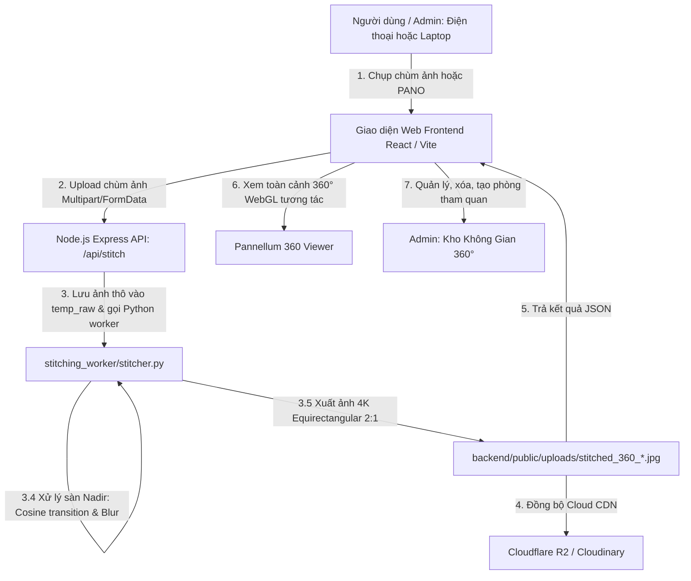

# TÀI LIỆU QUẢN TRỊ & THIẾT KẾ HỆ THỐNG QUÉT & GHÉP ẢNH 360° (360° SCAN & STITCH PIPELINE)

> **Dự án:** Hệ thống Tour 360° Bảo tàng Lịch sử & Số hóa Di sản (Khóa luận Tốt nghiệp 2026)  
> **Trạng thái tính năng:** Đã kiểm thử thực tế thành công xuất sắc, đạt chuẩn hình ảnh phẳng kiến trúc 4K, khử lóa sàn chân đứng và quản trị trực quan.

---

## 1. TỔNG QUAN KIẾN TRÚC LUỒNG DỮ LIỆU (SYSTEM FLOW)

---

## 2. CÁC THÀNH PHẦN CỐT LÕI (CORE COMPONENTS)

### 2.1. Frontend Web App
* **Giao diện chính:** `frontend/src/pages/PocStitchingPage.tsx`
  * Nút chụp bằng Camera gốc điện thoại: `capture="environment"`
  * Nút tải chùm ảnh từ Thư viện/Album điện thoại.
  * Thư viện lịch sử các không gian 360° đã tạo: xem thumbnail, xem 360°, copy link, xóa ảnh.
* **Trang Quản lý Admin:** `frontend/src/pages/admin/AdminRoomsPage.tsx`
  * Tab 1: Gian phòng triển lãm chính thức (MongoDB).
  * Tab 2: Kho không gian 360° đã tạo (quét từ VPS/Cloud), xem 360° pop-up, 1-click tạo gian phòng mới, dọn dẹp ảnh cũ.
* **Trình xem 360 WebGL:** `frontend/src/viewer360/Pannellum360Viewer.tsx`
  * Cấu hình hiển thị phẳng kiến trúc: `hfov: 100`, `minPitch: -58`, `maxPitch: 80`, `autoStartLittlePlanet: true`.

### 2.2. Backend API
* **Đường dẫn:** `backend/src/routes/stitch.ts`
  * `POST /api/stitch`: Nhận chùm ảnh từ client, lưu tạm `public/uploads/temp_raw/job_*`, chạy Python worker `stitcher.py`, upload Cloudflare R2 / Cloudinary, dọn dẹp thư mục tạm.
  * `GET /api/stitch/history`: Quét và trả về danh sách các file `stitched_360_*.jpg` kèm kích thước và ngày giờ tạo.
  * `DELETE /api/stitch/panoramas/:filename`: Xóa vĩnh viễn 1 file ảnh 360° khỏi máy chủ.
  * `POST /api/stitch/panoramas/batch-delete`: Xóa hàng loạt nhiều ảnh theo danh sách filenames.
  * `GET /api/stitch/proxy-image`: Proxy ảnh hỗ trợ CORS header cho Canvas WebGL.

### 2.3. Python OpenCV Worker
* **Đường dẫn:** `stitching_worker/stitcher.py`
  * **Keyframe Selection:** Khi người dùng gửi $>18$ ảnh, thuật toán tự động chọn 18 ảnh cách đều nhau quanh góc 360° để giảm số cặp so khớp từ 703 xuống 153 cặp, tăng tốc độ ghép chỉ còn 15-25 giây.
  * **Cylindrical Warping & Feature Matching:** Sử dụng ORB/SIFT và Affine Best-Pair Matching để tìm điểm liên kết giữa các khung hình liền kề.
  * **Multi-band Blending:** Hòa trộn màu sắc và ánh sáng tại các đường giáp mí, không để lại vết sọc nối.
  * **Rectilinear Flatness (Phối cảnh phẳng):** Đảm bảo góc nhìn tường, cửa và trần nhà thẳng thắn, không bị cong queo hình cầu mắt cá.
  * **Nadir Smoothing (Xử lý chân đứng & sàn):** Vùng sàn phía dưới (chân người đứng) được lọc chuyển tiếp mượt mà bằng hàm cosine kết hợp làm mờ phương ngang, xóa sạch tia lóa và vết xé chân đứng.

---

## 3. LƯU TRỮ VÀ TRIỂN KHAI (STORAGE & DEPLOYMENT)

* **Lưu trữ vật lý VPS:** `/root/KhoaLuanTotNghiep/backend/public/uploads/`
* **Lưu trữ đám mây:** Cloudflare R2 bucket `panoramas_360/` & Cloudinary `museum/panoramas_360/`.
* **Cơ sở dữ liệu:** MongoDB collection `rooms` (trường `panoramaUrl`, `thumbnailUrl`, `hotspots`).
* **CI/CD tự động:** `.github/workflows/deploy.yml` tự động build và triển khai lên máy chủ VPS Ubuntu qua Docker Compose mỗi khi push code lên nhánh `main`.

---

## 4. NGUYÊN TẮC BẢO QUẢN TÍNH NĂNG (MAINTENANCE PRINCIPLES)

1. **Không can thiệp vào các tham số hình học** trong `stitcher.py` (như tỉ lệ FOV, crop ratio, nadir cosine height) vì đã được tinh chỉnh đạt độ thẩm mỹ chuẩn kiến trúc 4K.
2. **Bảo tồn các routes `/api/stitch/*`**: Mọi tính năng phát triển mới về sau sẽ mở rộng trên nhánh riêng, giữ nguyên luồng API cốt lõi này.
3. **Quản lý phiên bản**: Tất cả các cập nhật về Tour, Hotspot điều hướng, Cổ vật 3D sẽ phát triển trên nhánh tính năng mới tách từ `main`.
