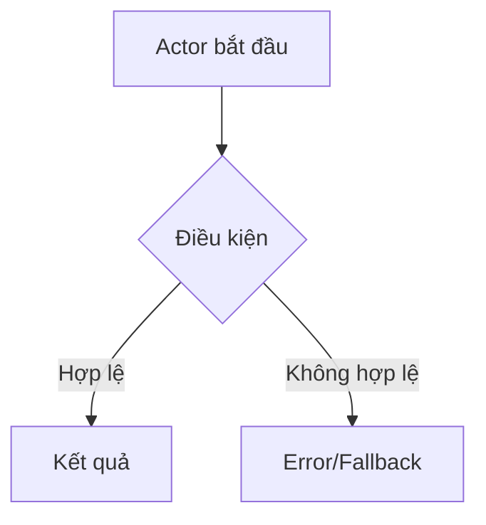
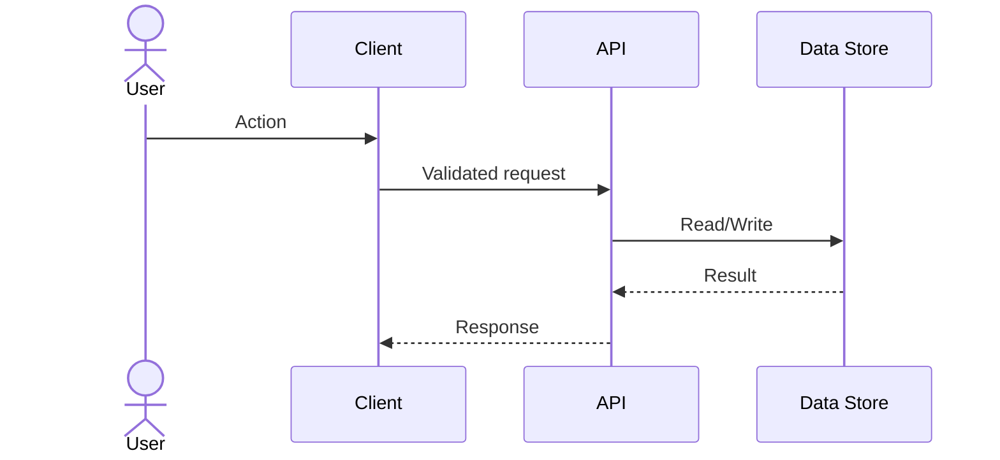
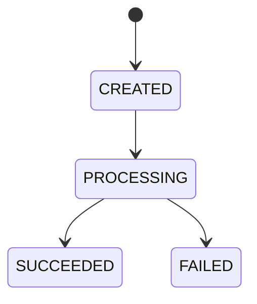
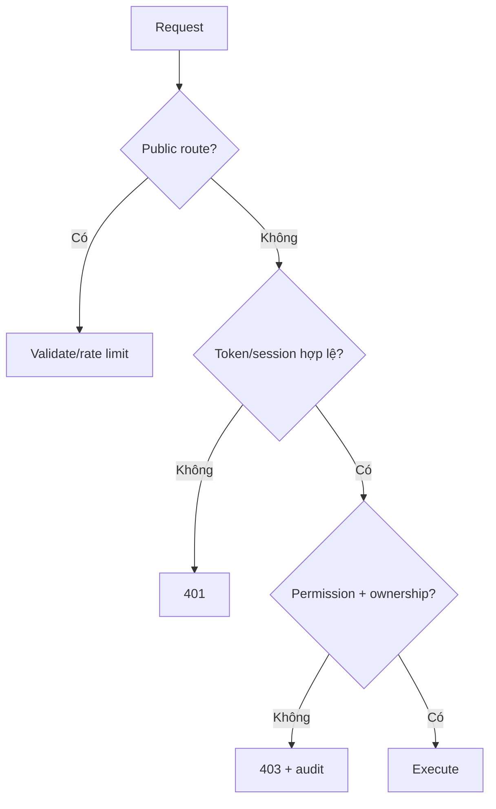
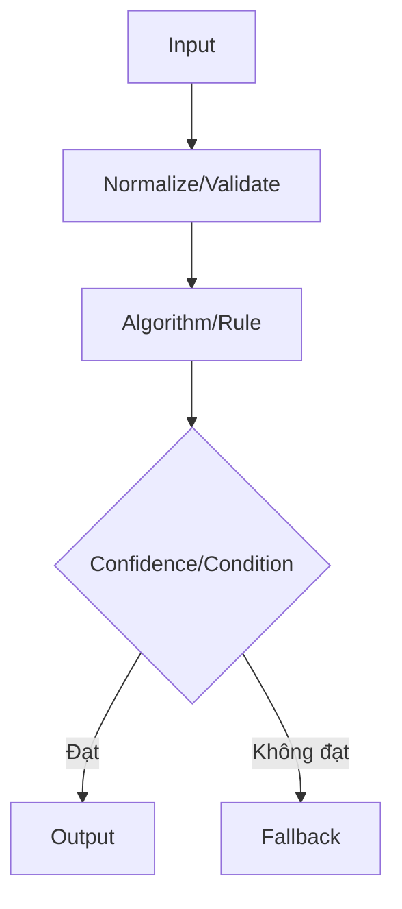

# Feature Report Standard

Checklist bắt buộc cho mọi feature owner Markdown sau khi triển khai.

## 1. Feature summary

- Mục tiêu:
- Actor/persona:
- Giá trị:
- Trong/ngoài scope:
- Status/version:
- Code locations:

## 2. User/Business Flow



### Giải thích

1. Entry condition:
2. Main steps:
3. Decision points:
4. Error/fallback:
5. Output:

## 3. System Sequence



Giải thích request, validation, permission, transaction, cache/queue, timeout/retry và response.

## 4. Data and State Flow



| Dữ liệu | Nguồn | Validate | Nơi lưu | Retention | Consumer |
|---|---|---|---|---|---|
| | | | | | |

### Query, index and cache evidence

| Query/cache owner | Input/authorization | Shape/projection/pagination | Index + plan evidence | Cache key/TTL/invalidation | p50/p95/rows/query count | Security/fallback |
|---|---|---|---|---|---|---|
| | | | | | | |

## 5. Authentication and Authorization Flow



Giải thích auth method, token/session, permission, ownership, audit, CSRF/CORS/rate limit và privacy.

## 6. Algorithm/Business Rule Flow



### Pseudocode

```text
function execute(input):
  validated = validate(input)
  result = algorithm(validated)
  return result or fallback
```

- Input/output:
- Complexity:
- Parameters/threshold:
- Dataset/assumptions:
- Metrics/confidence:
- Failure modes:

## 7. Technology inventory

| Technology | Version/range | Module/location | Vai trò | Lý do chọn | Ưu điểm | Nhược điểm | License/cost/security | Scale/replacement |
|---|---|---|---|---|---|---|---|---|
| | | | | | | | | |

Với UI/motion/3D, mỗi dependency còn phải ghi rõ behavior/property ownership, initial/async bundle cost, loading strategy, lifecycle cleanup, desktop/mobile/browser compatibility, quality-tier fallback, benchmark evidence và replacement boundary. Không bỏ sót thư viện chỉ vì nó là dependency phụ hoặc chỉ dùng cho animation.

### Configuration and secret inventory

| Config/secret name | Runtime owner | Public/server-only | Required/default/range | Validation | Source/injection | Redaction/rotation | Failure/fallback |
|---|---|---|---|---|---|---|---|
| | | | | | | | |

Không ghi giá trị thật. External API còn phải ghi base-origin owner, auth method, timeout/retry, rate limit, egress/redirect allowlist và degraded behavior.

## 8. Alternatives and suitability

| Phương án | Flow/algorithm | Ưu | Nhược | Effort | Scale | Mức phù hợp |
|---|---|---|---|---|---|---|
| Chosen | | | | | | |
| Alternative | | | | | | |

Nêu Decision/ADR và lý do `PLAN_LOCKED`.

## 9. Performance and scalability

- Workload/SLO:
- Cache/index/queue:
- 300–500 concurrent users:
- Backpressure/degraded mode:
- Scale path:
- Benchmark evidence:
- Desktop/mobile test matrix:
- LCP/INP/long task và JS chunk:
- FPS/frame time, dropped frame và scene load khi có animation/3D:
- Asset/texture/model budget và memory/lifecycle evidence:
- Cinematic/Balanced/Lite/reduced-motion/no-WebGL behavior:

## 10. Security and privacy

- Threats:
- Validation/authz/rate limit:
- Secret/upload/SSRF/XSS/CSRF:
- Consent/retention:
- Audit/monitoring:
- Security tests:

## 11. Delivery estimate and actual

| Field | Value |
|---|---|
| Optimistic | |
| Expected | |
| Pessimistic | |
| Assumptions/dependencies | |
| Confidence | |
| Actual effort | Chỉ sau xác nhận |
| Completion date | Chỉ sau xác nhận |

## 12. Testing and evidence

| Type | Scenario | Expected | Result/Evidence |
|---|---|---|---|
| Unit | | | |
| Integration | | | |
| E2E | | | |
| Security | | | |
| Performance/AI/Visual | | | |

## 13. Limitations, fallback and next work

- Known limitations:
- Fallback:
- Technical debt:
- Next task:

## 14. Decision and change history

Liên kết/ghi Decision log, Plan revisions, Change history, merge reference và verified-by.

## Completion checklist

- [ ] Các sơ đồ phản ánh code hiện tại.
- [ ] Mỗi sơ đồ có giải thích.
- [ ] Technology inventory đầy đủ.
- [ ] Thuật toán/rule có pseudocode và metric.
- [ ] Ưu/nhược điểm và phương án so sánh.
- [ ] Auth/authz/security/privacy cụ thể.
- [ ] Estimate và evidence.
- [ ] Test, limitation và fallback.
- [ ] Feature/Integration/UI indexes được cập nhật khi merge.
- [ ] Mọi technology/dependency thực sự dùng đã có inventory, owner, runtime cost và fallback.
- [ ] Animation/3D có evidence trên desktop và mobile; không tuyên bố “mượt” chỉ từ cảm nhận.
- [ ] Quality tiers, reduced motion, no-WebGL và dependency failure đã được kiểm tra.
- [ ] Code review đã kiểm tra abstraction/duplication/comment/dependency thừa và không che lỗi bằng fallback im lặng.
- [ ] Không có environment-specific URL trong business/runtime code; route/event nội bộ dùng accepted contract.
- [ ] Config/secret inventory không chứa giá trị thật và khớp config schema/runtime boundary.
- [ ] Handoff ghi rõ lint/typecheck/secret/config/security check đã chạy hoặc chưa chạy.
- [ ] Server-side input limits, parameter binding/allowlist và injection/IDOR tests đã được ghi.
- [ ] Query/index quan trọng có owner, query-plan/query-count evidence và read/write trade-off.
- [ ] Cache key/version/TTL/invalidation giữ đúng publish/permission/ownership/locale và có outage/stampede fallback.
- [ ] Response/error/log redaction không lộ SQL, schema, internal path hoặc field ngoài contract.
