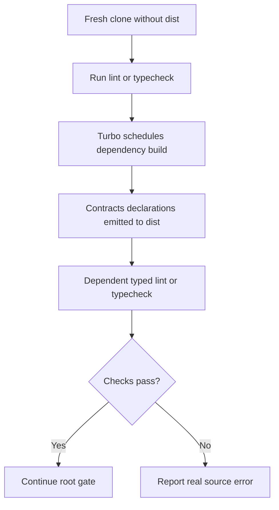

# FIX-CLEAN-GATE-001 — Deterministic Fresh-Clone Quality Gate

## Identity and Git context

- Owner/contributor: `thanh` (TEAM match confirmed in this session).
- Branch: `fix/clean-workspace-quality-gate`.
- Base/shared plan revision: `PLAN-0023`; coordination commit `45f53a5` verified on `origin/develop`.
- Status: `IMPLEMENTED` (integration verification pending).
- `PRE_CODE_PLAN_SYNC: PASS` — branch started from `origin/develop@c630409`; revision R1 was published and verified at `origin/develop@45f53a5`; the expanded Admin form path does not overlap `TASK-CI-001`.

## Objective and write scope

- Objective: make workspace lint/typecheck deterministic on a fresh clone without ignored build artifacts, remove the Admin barrel export that references a symbol with no implementation, and restore accepted validation/live-preview markers in the integrated Admin renderer.
- Owned paths: `turbo.json`, `apps/admin/src/index.ts`, `apps/admin/src/forms/cmsFormBuilder.ts`, `docs/work/FIX-CLEAN-GATE-001.md`.
- Explicitly excluded: `packages/ui/**`, `packages/contracts/**`, `.github/workflows/**`, root `package.json`, shared coordination/status files, and all product behavior/contracts.
- Invariants: no security, data, API, CMS behavior, or runtime dependency change; do not hide typed-lint failures with `any`, disables, or weakened CI.

## Root cause

1. Workspace packages publish TypeScript declarations from ignored `dist/**` paths.
2. `turbo.json` currently makes `lint` depend only on `^lint` and `typecheck` only on `^typecheck`.
3. A warmed local workspace contains `packages/contracts/dist/src/index.d.ts`, so dependent packages resolve types and lint appears green.
4. A clean GitHub runner has no `dist`; `packages/ui` therefore cannot resolve `RelatedArtifact`, producing 32 typed-ESLint errors in hosted run `30829451628`.
5. After declarations exist, the root gate reaches a separate Admin error: `apps/admin/src/index.ts` re-exports `renderLivePreviewPanel`, but `cmsFormBuilder.ts` does not export that symbol.

## DESIGN_OPTIONS — OPTION-CLEAN-GATE-001

### Option A — Model generated declarations in the Turbo task graph

- Flow: dependency `build` completes -> dependent `lint`/`typecheck` starts -> package export declarations resolve -> existing root gate continues unchanged.
- Change: add `^build` to `lint.dependsOn` and `typecheck.dependsOn`; remove the stale Admin re-export.
- Advantages: fresh-clone correctness applies to standalone `lint`, standalone `typecheck`, and the aggregate gate; preserves package export boundaries and the locked CI workflow.
- Disadvantages: lint/typecheck build dependency packages first, increasing clean-run duration.
- Suitability/security/scale: HIGH; no runtime/security/product impact. Cost grows with the workspace dependency graph and uses existing cached `dist/**` outputs.
- Fallback: revert the task-graph entries and reopen project-reference design if measured build cost becomes unacceptable.

### Option B — Build once at the start of the root check

- Flow: root `check` runs all builds before lint/typecheck.
- Advantages: simple aggregate-gate unblock.
- Disadvantages: standalone `pnpm lint` and `pnpm typecheck` remain incorrect on a fresh clone; duplicates task ordering in the root script.
- Suitability: MEDIUM; rejected because it fixes only one entry point.

### Option C — TypeScript project references/source-path resolution

- Flow: consumers resolve workspace sources or composite references instead of package `dist` declarations.
- Advantages: stronger long-term TypeScript graph and potentially more parallel checking.
- Disadvantages: changes every package's compiler boundary and requires a broader migration/ADR.
- Suitability: LOW for this unblock; deferred until repository scale justifies it.

### Decision

- Selected: Option A by `thanh` on 2026-08-03 after requesting the most accurate fix.
- Evidence: hosted run `30829451628`; local warmed-vs-clean artifact comparison; official Turbo documentation states `^` runs a task in direct dependencies before the dependent task.
- Status: `PLAN_LOCKED`.

## PLAN_LOCKED

- `turbo.json`:
  - `lint.dependsOn = ["^build", "^lint"]`.
  - `typecheck.dependsOn = ["^build", "^typecheck"]`.
  - Preserve `build.outputs = ["dist/**"]`, test ordering, and cache semantics.
- `apps/admin/src/index.ts`: remove only the nonexistent `renderLivePreviewPanel` re-export; preserve `renderCmsBlockFormEditor` and `validateBlockData`.
- R1 in `apps/admin/src/forms/cmsFormBuilder.ts`: preserve the integrated editor/preview design; restore the semantic `cms-block-form`, `btn-validate-block`, and `live-preview-container` markers without restoring the obsolete standalone preview export.
- Acceptance criteria:
  - clean generated artifacts before validation;
  - `pnpm lint`, `pnpm typecheck`, and full pinned root `check` PASS;
  - Admin public exports contain no missing symbol;
  - changed paths remain inside the published scope;
  - no lint disable, `any` workaround, workflow change, package export change, or new dependency.
- Estimate: optimistic 0.1, expected 0.25, pessimistic 0.5 person-day; confidence HIGH.
- Risks: clean validation is slower; build artifacts must remain cache-declared; unrelated baseline failures may surface after the two known blockers.

## Plan revision checkpoint

The locked two-file implementation is complete, but clean validation exposed two pre-existing baseline failures outside the published scope:

1. `infra/compose.yaml` on `origin/develop@c630409` is not Prettier-clean. This path is already assigned to `loc` under `TASK-CI-001` as a formatting-only change, so this branch must not edit it.
2. Admin tests expect `btn-validate-block` and `live-preview-container`, while the current integrated form renderer no longer emits those identifiers. Git history shows the regression entered with `FIX-LINT-001`; `TASK-ADMIN-001` still specifies validation and live-preview behavior.

### Revision options

- **R1 (recommended):** preserve the current integrated editor/preview design; expand this task by one owned path, `apps/admin/src/forms/cmsFormBuilder.ts`; restore the validation button and the stable live-preview container identifier. Do not restore the obsolete standalone `renderLivePreviewPanel` export.
- **R2:** restore the older standalone preview renderer, shell wiring, and barrel export. This is broader and would duplicate or revert the integrated preview design.
- **R3:** update tests only. Rejected because it would normalize the missing validation control and diverge from the accepted Admin behavior.

Status: `PLAN_REVISION_APPROVED_AND_PUBLISHED`. `thanh` approved R1; scope revision `PLAN-0023` was committed/pushed as Markdown-only coordination commit `45f53a5` before editing the additional Admin source.

## Execution flow

Entry condition is a clean workspace with dependencies installed but generated declarations absent. Turbo must complete direct dependency builds before it starts a dependent package's typed lint/typecheck. Failure remains visible and is never converted to a warning or ignored result.

## Contribution ledger

| Session ID | Contributor | StartedAt | LastActiveAt | EndedAt | Status | Scope/output | Tests/evidence | Next |
|---|---|---|---|---|---|---|---|---|
| `WS-FIX-CLEAN-GATE-001-20260803-01` | `thanh` | 2026-08-03T23:01:50+07:00 | 2026-08-03T23:19:15+07:00 | 2026-08-03T23:19:15+07:00 | IMPLEMENTED | Published `PLAN-0022` and R1 revision `PLAN-0023`; implemented task graph, Admin export, semantic form/validation/live-preview fixes | Clean forced lint 7/7 PASS; typecheck 7/7 PASS; test 10/10 Turbo tasks PASS; build 5/5 PASS; changed-file Prettier PASS | User review and feature commit/push; combine with Lộc's formatting-only Compose change for the authoritative root/hosted gate |

## Implementation evidence

- Behavior/files:
  - `turbo.json`: `lint` and `typecheck` now schedule direct dependency builds before dependent checks.
  - `apps/admin/src/index.ts`: removed only the unresolved `renderLivePreviewPanel` barrel export.
  - `apps/admin/src/forms/cmsFormBuilder.ts`: retained the integrated two-panel renderer while restoring the semantic form wrapper, validation control, submit behavior, and stable live-preview container.
- Tests/evidence:
  - `corepack pnpm --version`: PASS, `11.18.0`.
  - `corepack pnpm clean`: PASS; confirmed `dist/**` is ignored and removed.
  - clean `corepack pnpm lint`: PASS, 7/7 Turbo tasks; log shows Contracts build before UI lint.
  - clean `corepack pnpm typecheck`: PASS, 7/7 Turbo tasks; all five packages typecheck.
  - forced Turbo lint: PASS, 7/7; root config/scripts ESLint: PASS.
  - forced Turbo typecheck: PASS, 7/7.
  - forced Turbo build: PASS, 5/5.
  - changed implementation files Prettier check: PASS; whole-repository Prettier check is blocked only by unchanged `infra/compose.yaml`, which belongs to Lộc's active formatting-only `TASK-CI-001` scope and already passes in hosted run `30829724233`.
  - targeted Admin build: PASS; targeted Admin test: 7/7 PASS.
  - clean forced Turbo test: 10/10 tasks PASS — Contracts 5, UI 12, API 17, Web 7, Admin 7 tests PASS.
  - Python check is not runnable locally because the locked `uv` 0.11.x toolchain is not installed; hosted CI remains the authoritative Python environment.
- Security/invariants: no lint disable, `any`, dependency, workflow, package export mapping, secret, data, or runtime security change.
- Known limitations/fallback: hosted PASS requires both this fix and Lộc's formatting-only `infra/compose.yaml` change to reach the CI branch; local validation cannot itself produce a GitHub required-check status.

## Change history

| Date | Change | Reason/evidence |
|---|---|---|
| 2026-08-03 | Implemented `OPTION-CLEAN-GATE-001/A` within the published two-file scope | Clean lint/typecheck now pass without pre-existing declarations |
| 2026-08-03 | Opened revision checkpoint R1/R2/R3 without editing additional source | Full validation exposed an Admin regression and a separately owned Compose formatting blocker |
| 2026-08-03 | Published `PLAN-0023` and implemented R1 in the integrated Admin renderer | Restored accepted form/validation/live-preview semantics; full workspace tests pass |

## Handoff

- Verification status: UNVERIFIED; implementation checks pass, but the authoritative root/hosted gate requires Lộc's separately owned `infra/compose.yaml` formatting change in the same integration candidate.
- Feature commit/PR: none.
- Merge status: NOT_MERGED.
- Merge Memory Sync checklist: not applicable before merge.
