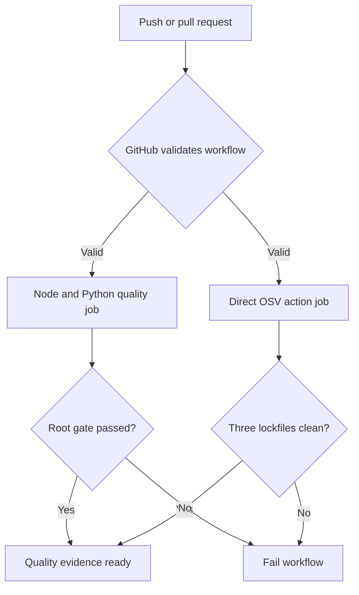
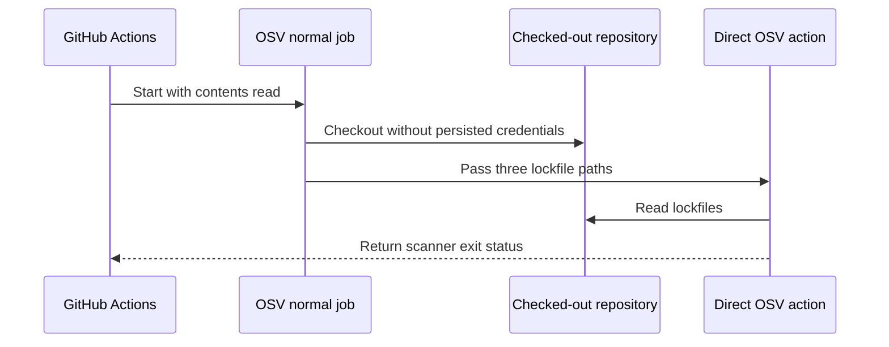

# FIX-DOC-QUALITY-CI-001 — Hosted OSV workflow startup fix

## Identity and Git context

- Owner/contributor: `thanh`, confirmed against `docs/TEAM.md` in this session.
- Branch: `fix/FIX-DOC-QUALITY-CI-001`.
- Base: `origin/develop@99dc9db`; shared revision `PLAN-0029`.
- Status: `IMPLEMENTED / AWAITING USER VERIFICATION`; hosted evidence pending.
- `PRE_CODE_PLAN_SYNC: PASS` — the Markdown-only claim, decision, dependency and write scope were pushed to and verified on remote `develop@99dc9db`; the branch was then created from that exact commit with a clean tree.

## Objective

Repair the GitHub Actions startup failure introduced by the hosted OSV extension without changing the deterministic Node/Python quality job, dependency inventory, application runtime or security policy.

## Scope

- Owned paths: `.github/workflows/quality.yml` and `docs/work/FIX-DOC-QUALITY-CI-001.md`.
- Excluded: quality scripts, manifests and lockfiles, runtime source/tests, migrations/contracts/catalogs, shared coordination/status files and real `.env` files.
- Dependency state: `TASK-DOC-QUALITY-001` implementation is merged at `e0c4139` / PR `#9`, but remains unverified until this fix produces exact-commit hosted PASS evidence.
- Invariants: preserve read-only checkout, immutable action pins, the same three lockfile targets and fail-closed vulnerability detection; do not grant unused write permission.

## Root cause and testing evidence

- GitHub Actions runs `30838513724` and `30838613737` both ended with `startup_failure` before any job ran.
- GitHub's workflow annotation identifies the reusable OSV call at `.github/workflows/quality.yml:52`: the called workflow requests `actions: read` and `security-events: write`, while its caller can only pass the declared read-only permissions.
- Because a called reusable workflow cannot elevate the caller's permission ceiling, GitHub rejects the complete workflow during validation.
- Local source inspection confirms the direct action exists at the same immutable OSV commit and accepts `scan-args`; hosted execution remains the required final verification because local checks cannot reproduce GitHub's server-side workflow admission.

## PLAN_LOCKED

- Decision: `DEC-DOC-QUALITY-OSV-STARTUP-FIX-001`, option B selected by `thanh` on 2026-08-04.
- Replace the reusable-workflow job with a normal `ubuntu-24.04` job.
- Checkout with the existing immutable `actions/checkout` SHA, `fetch-depth: 1` and `persist-credentials: false`.
- Invoke `google/osv-scanner-action/osv-scanner-action@9a498708959aeaef5ef730655706c5a1df1edbc2` and pass the existing three `--lockfile` arguments.
- Grant only `contents: read`; do not upload SARIF and do not grant `security-events: write`.
- Preserve scanner failure behavior so a vulnerability or scanner error is not converted into a silent PASS.
- Option A, granting all permissions requested by the reusable workflow, is rejected because it adds unused write authority. If the direct action proves incompatible on GitHub, stop and open a Plan Revision instead of removing the scan.

## Workflow flow

Flow explanation: GitHub first admits the workflow, then runs the deterministic root gate and the independent direct OSV job. Both must pass. A source failure, scanner error or vulnerability remains a failing status and blocks verification.

## Permission sequence

Sequence explanation: the job only needs repository read access. Checkout does not retain a credential, the direct action reads the committed lockfiles, and its exit status becomes the job result. There is no SARIF upload or security-events write path.

## Acceptance criteria and estimate

- GitHub accepts the workflow and creates both named jobs.
- Root `pnpm check` remains locally green and the hosted Node/Python job passes.
- Hosted OSV job scans `pnpm-lock.yaml`, `services/ai/uv.lock` and `workers/media/uv.lock` and passes on the exact fix/merge commit.
- Changed paths remain within the two-path scope and no permission, dependency or application behavior outside the locked plan changes.
- `thanh` must confirm `VERIFIED`; only then may Merge Memory Sync close `TASK-DOC-QUALITY-001` and this fix.
- Estimate: optimistic 0.1, expected 0.25, pessimistic 0.5 person-day; confidence HIGH. Primary risk is upstream direct-action compatibility, with Plan Revision as fallback.

## Contribution ledger

| Session ID | Contributor | StartedAt | LastActiveAt | EndedAt | Status | Scope/output | Tests/evidence | Next |
|---|---|---|---|---|---|---|---|---|
| `WS-FIX-DOC-QUALITY-CI-001-20260804-01` | `thanh` | 2026-08-04T01:20:41+07:00 | 2026-08-04T01:25:26+07:00 | 2026-08-04T01:25:26+07:00 | IMPLEMENTED | Published PLAN-0029; replaced reusable OSV caller with least-privilege direct action job; recorded complete task-local evidence | Remote `develop@99dc9db`; static workflow PASS; root `corepack pnpm check` PASS | User reviews, commits/pushes fix branch and confirms hosted exact-commit results |

## Implementation evidence

- Behavior/files:
  - `.github/workflows/quality.yml` now models `dependency-vulnerability-scan` as a normal `ubuntu-24.04` job with a ten-minute timeout.
  - The job checks out read-only and invokes the direct OSV action at the same immutable v2.3.8 SHA.
  - The original three lockfile arguments remain unchanged; reusable-only `fail-on-vuln` and `upload-sarif` inputs were removed.
- Tests:
  - Prettier check for the workflow and task report: PASS.
  - `node scripts/quality/project-quality.mjs`: PASS, 169 Git-visible files inspected.
  - Static workflow assertions: PASS; no reusable OSV reference, no `security-events`, exact direct-action SHA present and all three lockfiles present.
  - `git diff --check`: PASS.
  - Root `corepack pnpm check`: PASS with Node 22.16.0, pnpm 11.18.0 and uv 0.11.32; quality policy/tests PASS, Turbo lint 7/7, typecheck 7/7, test 10/10, build 5/5, both Ruff suites PASS and both Python pytest suites 1/1 PASS.
- Security/invariants: only `contents: read`; checkout credentials are not persisted; no SARIF/write path, dependency, runtime, contract, data or secret change.
- Known limitation/fallback: GitHub server-side workflow admission and the Docker action itself require a hosted run after the user-owned push. Any direct-action incompatibility triggers Plan Revision rather than permission broadening or scan removal.

## Change history

| Date | Change | Reason/evidence |
|---|---|---|
| 2026-08-04 | Claimed fix and locked option B | PLAN-0029; `thanh` selection; runs `30838513724` and `30838613737` |
| 2026-08-04 | Opened task report and contribution session | PRE_CODE_PLAN_SYNC PASS at `origin/develop@99dc9db` |
| 2026-08-04 | Implemented direct pinned OSV normal job | Local full root gate and static workflow assertions PASS |

## Handoff

- Verification status: `IMPLEMENTED / AWAITING USER VERIFICATION`; all available local checks pass, but hosted workflow evidence is still required.
- Feature commit/PR: user-owned; none yet.
- Merge status: not merged.
- Recommended review: confirm the diff contains only `.github/workflows/quality.yml` and this task report; then commit/push the fix branch and inspect both hosted jobs on the exact pushed commit.
- Stop condition: do not mark VERIFIED or merge if GitHub still reports startup failure, either job fails, or the hosted commit does not equal the reviewed fix commit.
- Merge Memory Sync: blocked until implementation is merged, exact-commit hosted jobs pass and `thanh` confirms VERIFIED.
