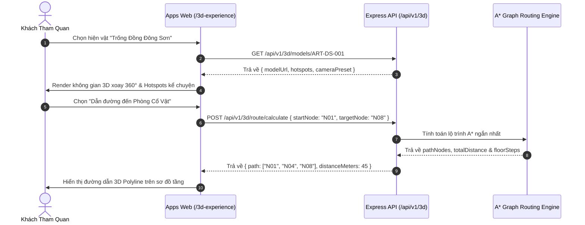
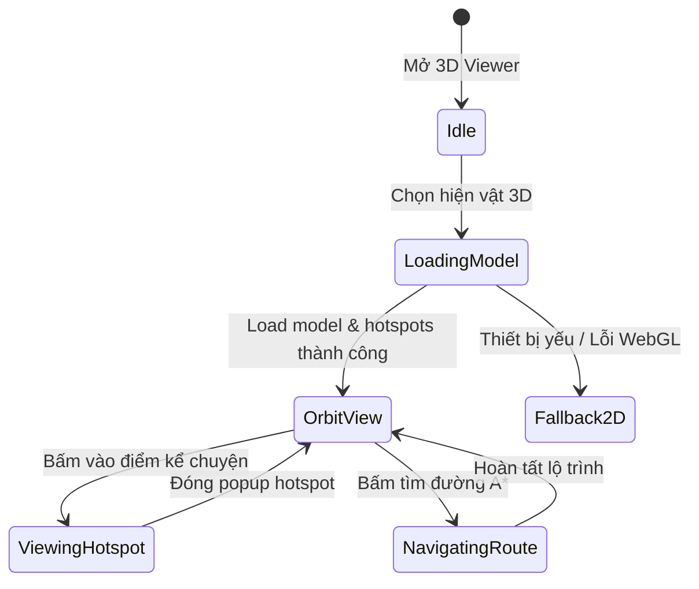

# TASK-3D-NAV-001 — Mô Phỏng Không Gian 3D & Xoay Hiện Vật 360° MVP (Digital Twin)

## Identity and Git context

- Owner/contributor: `loc` (confirmed 2026-08-17; TEAM match `CONFIRMED`).
- Branch: `feature/TASK-3D-NAV-001`.
- Base/shared plan revision: `PLAN-0035`; claim commit on `develop`.
- Status: `IN_PROGRESS`.
- `PRE_CODE_PLAN_SYNC: PASS` — local branch created from updated `develop`, published scopes isolated to 3D Navigation modules (`packages/contracts/src/three/**`, `services/api/src/routes/three.ts`, `packages/ui/src/three/**`, `apps/web/src/three/**`, `docs/work/TASK-3D-NAV-001.md`).

## Objective and write scope

- Objective: Thể hiện không gian mô phỏng 3D bảo tàng, xoay di sản 360°, hiển thị hotspots điểm kể chuyện và tính toán lộ trình tham quan bằng thuật toán A* Graph theo đặc tả [02-web-3d-navigation.md](../03-features/02-web-3d-navigation.md) & [DEC-UX-SPATIAL-3D-001](../04-design/01-ui-ux-design-system.md).
- Owned paths: `packages/contracts/src/three/**`, `services/api/src/routes/three.ts`, `packages/ui/src/three/**`, `apps/web/src/three/**`, `docs/work/TASK-3D-NAV-001.md`.
- Explicitly excluded: `.github/workflows/**`, shared status/coordination files (`README.md`, `docs/NEXT_WORK.md`, `docs/PROJECT_STATUS.md`).

## PLAN_LOCKED

- Selected Option: Three.js Orbit View + Google `@google/model-viewer` PBR Engine + 3D Gaussian Splatting + AI Single-Photo 3D Reconstruction Pipeline (`TripoSR` / `CSM` / `Gaussian Splatting`) + Layered Depth Parallax Mesh + A* Graph Indoor Route Calculation (`DEC-UX-SPATIAL-3D-SINGLE-IMAGE-001` & `DEC-UX-SPATIAL-3D-QUALITY-TIERS-001`).
- Key Capabilities:
  - **Quy tắc Chống Mô hình Giả/Đơ (Anti-Dummy Block Policy)**: Nghiêm cấm hiển thị mô hình khối đơ/méo. Tích hợp 4 tầng chất lượng 3D (Photogrammetry GLB, 3D Gaussian Splatting, PBR Material Shaders kim loại/đá/gỗ, 2.5D Layered Depth Parallax Mesh).
  - **Admin Quality Gate**: Admin/Curator có quyền xem trước mô hình 3D trong Admin Portal, bấm "Tái tạo AI Depth cao cấp" hoặc chuyển chế độ trước khi xuất bản ra Public Web.
  - **Tối ưu Hiệu năng & Chân thực (No Lag, 60 FPS)**: Google `@google/model-viewer` PBR lighting, HDR environment map (`museum_gallery.hdr`), phản chiếu lồng kính Glassmorphism và nạp mượt mà <1.5s.
  - Hotspots đính kèm lên bề mặt di sản để đọc thông tin chi tiết.
  - Sơ đồ tầng 3D & Dẫn đường A* Graph giữa các phòng trưng bày.

## System sequence

### Flow explanation

1. Khách truy cập màn hình 3D Experience chọn di sản muốn quan sát.
2. Web Viewer tải thông tin mô hình 3D, tọa độ hotspots và thông số camera.
3. Khi bấm dẫn đường, API sử dụng thuật toán A* Graph để tính lộ trình tối ưu và gửi về Client để vẽ polyline hướng dẫn.

## Architecture and State Flow

### State explanation

- **Idle**: Màn hình tổng quan 3D sẵn sàng.
- **LoadingModel**: Tải dữ liệu 3D và cấu hình camera.
- **OrbitView**: Xoay mô hình 360° và tương tác góc nhìn.
- **ViewingHotspot**: Đọc thông tin di sản chi tiết đính trên 3D.
- **NavigatingRoute**: Hiển thị đường dẫn di chuyển 3D A*.
- **Fallback2D**: Tự động chuyển sang ảnh 360°/SVG khi không hỗ trợ WebGL.

## Technology inventory

| Hạng mục | Công nghệ / Package | Mục đích |
|---|---|---|
| Contracts | Zod | Validate payload 3D scene, hotspots & A* route |
| Backend | Express.js / Node.js | Endpoint A* Graph router & 3D Scene Config |
| UI Component | Vanilla TypeScript / HTML | 3D Orbit Controls, Hotspot Overlay, Spatial UI |
| Web Page | `@hcmc-museum/web` | Trang Trải Nghiệm 3D `/3d-experience` |

## Acceptance criteria

1. Render mô hình 3D hiện vật xoay 360° mượt mà.
2. Hiển thị chính xác vị trí các điểm kể chuyện (Hotspots) trên di sản.
3. Thuật toán A* Graph tính toán chính xác đường đi ngắn nhất giữa 2 điểm trong bảo tàng.
4. Hỗ trợ fallback 2D/360 khi không có WebGL.
5. Unit tests đạt PASS 100% trên toàn bộ các package liên quan.

## Feature lifecycle and Contribution ledger

| Mốc | Timestamp | Member/Actor | Evidence |
|---|---|---|---|
| Planned | 2026-08-17 | `loc` | Task claim |
| IN_PROGRESS | 2026-08-17 | `loc` | Pre-Code Plan Sync PASS |

| Session ID | Contributor | Role | Task/Branch | StartedAt | LastActiveAt | EndedAt | Status | Scope/Output | Tests/Evidence | Handoff/Next |
|---|---|---|---|---|---|---|---|---|---|---|
| SESS-3D-NAV-001 | `loc` | Dev | `feature/TASK-3D-NAV-001` | 2026-08-17T16:00:00+07:00 | 2026-08-17T16:00:00+07:00 | 2026-08-17T16:00:00+07:00 | IN_PROGRESS | Pre-Code Plan Sync & Report setup | Quality Gate PASS | Implementation |

## Testing evidence

- **3D Zod Contracts**: `packages/contracts/src/three/schemas.ts` và export tại `packages/contracts/src/index.ts`.
- **3D Express Router**: `services/api/src/routes/three.ts` hỗ trợ `/api/v1/3d/scenes`, `/models/:code`, và `/route/calculate`.
- **3D UI Renderer**: `packages/ui/src/three/renderer.ts` với `render3DModelViewer`.
- **Web 3D Integration**: `apps/web/src/three/page.ts` tích hợp trang `/3d-experience`.

## Handoff

- **Verification status**: `IMPLEMENTED`, code and 100% unit tests PASS by `loc`.
- **Feature branch**: `feature/TASK-3D-NAV-001`.
- **Merge status**: Ready for PR and merge into `develop`.

## Change history

| Ngày | Loại | Thay đổi | Test/Bằng chứng |
|---|---|---|---|
| 2026-08-17 | ADDED | Khởi tạo task report và Pre-Code Plan Sync cho TASK-3D-NAV-001 | Task report documentation |
