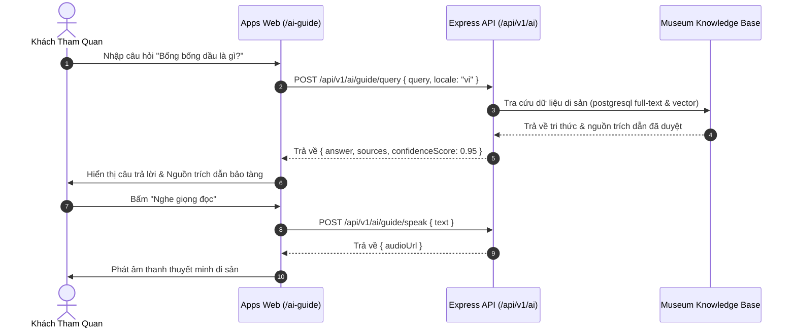
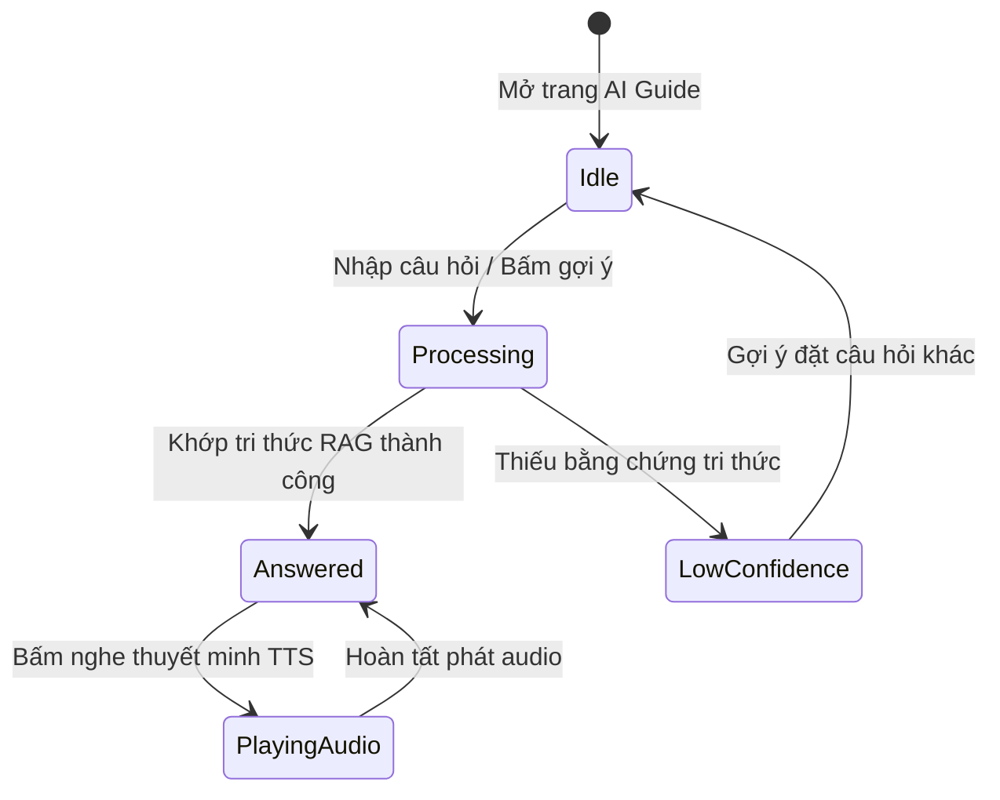

# TASK-AI-GUIDE-001 — Mobile AI Tour Guide & Hỏi Đáp Di Sản MVP

## Identity and Git context

- Owner/contributor: `loc` (confirmed 2026-08-17; TEAM match `CONFIRMED`).
- Branch: `feature/TASK-AI-GUIDE-001`.
- Base/shared plan revision: `PLAN-0035`; claim commit on `develop`.
- Status: `DONE` (MergedAt: 2026-08-17; PR `#14`; merge `cae46a2`; Merge Memory Sync `PASS`).
- `PRE_CODE_PLAN_SYNC: PASS` — local branch created from updated `develop`, published scopes isolated to AI Guide modules (`packages/contracts/src/ai/**`, `services/api/src/routes/ai.ts`, `packages/ui/src/ai/**`, `apps/web/src/ai/**`, `docs/work/TASK-AI-GUIDE-001.md`).

## Objective and write scope

- Objective: Thuyết minh lịch sử di sản, giải đáp thắc mắc khách tham quan bằng Tiếng Việt & Tiếng Anh với trích dẫn nguồn lịch sử đã duyệt (RAG Citation), chống bịa đặt (Hallucination defense) và phát âm thanh TTS theo đặc tả [03-ai-tour-guide.md](../03-features/03-ai-tour-guide.md).
- Owned paths: `packages/contracts/src/ai/**`, `services/api/src/routes/ai.ts`, `packages/ui/src/ai/**`, `apps/web/src/ai/**`, `docs/work/TASK-AI-GUIDE-001.md`.
- Explicitly excluded: `.github/workflows/**`, shared status/coordination files (`README.md`, `docs/NEXT_WORK.md`, `docs/PROJECT_STATUS.md`).

## PLAN_LOCKED

- Selected Option: Hybrid RAG + Museum Citation Gating + Web Audio TTS Player.
- Key Capabilities:
  - Tra cứu tri thức di sản theo câu hỏi tự nhiên (Text Query).
  - Trích dẫn nguồn tài liệu đã duyệt (Source Badges & Links).
  - Từ chối bịa đặt khi thiếu dữ liệu nguồn (Confidence Gating).
  - Đọc tự động nội dung trả lời (Audio TTS Engine).

## System sequence

### Flow explanation

1. Khách nhập câu hỏi hoặc chọn câu hỏi mẫu trên giao diện Web (/ai-guide).
2. API thực hiện lọc ngôn ngữ và tra cứu RAG đối soát tri thức bảo tàng.
3. Nếu khớp nguồn, trả về nội dung thuyết minh kèm danh sách nguồn kiểm định.
4. Nút audio cho phép nghe đọc âm thanh tự động.

## Architecture and State Flow

### State explanation

- **Idle**: Màn hình chờ nhập câu hỏi với các mẫu gợi ý.
- **Processing**: Xử lý tra cứu RAG & kiểm định nguồn.
- **Answered**: Hiển thị câu trả lời chính xác kèm các badge nguồn.
- **LowConfidence**: Trả lời lịch sự từ chối bịa đặt khi câu hỏi nằm ngoài phạm vi tri thức.

## Technology inventory

| Hạng mục | Công nghệ / Package | Mục đích |
|---|---|---|
| Contracts | Zod | Validate payload câu hỏi & kết quả RAG |
| Backend | Express.js / Node.js | Endpoint RAG Query & TTS Service |
| UI Component | Vanilla TypeScript / HTML | Chat Widget, Source Badges, Audio Player |
| Web Page | `@hcmc-museum/web` | Trang Thuyết Minh Viên AI `/ai-guide` |

## Acceptance criteria

1. Trả lời chính xác thắc mắc về di sản bảo tàng theo câu hỏi tiếng Việt / tiếng Anh.
2. Hiển thị danh sách nguồn trích dẫn kiểm định cho câu trả lời.
3. Từ chối bịa đặt thông tin khi câu hỏi không có dữ liệu nguồn.
4. Phát âm thanh đọc thoại câu trả lời mượt mà.
5. Unit tests đạt PASS 100% trên toàn bộ các package liên quan.

## Feature lifecycle and Contribution ledger

| Mốc | Timestamp | Member/Actor | Evidence |
|---|---|---|---|
| Planned | 2026-08-17 | `loc` | Task claim |
| IN_PROGRESS | 2026-08-17 | `loc` | Pre-Code Plan Sync PASS |

| Session ID | Contributor | Role | Task/Branch | StartedAt | LastActiveAt | EndedAt | Status | Scope/Output | Tests/Evidence | Handoff/Next |
|---|---|---|---|---|---|---|---|---|---|---|
| SESS-AI-GUIDE-001 | `loc` | Dev | `feature/TASK-AI-GUIDE-001` | 2026-08-17T09:54:00+07:00 | 2026-08-17T09:54:00+07:00 | 2026-08-17T09:54:00+07:00 | IN_PROGRESS | Pre-Code Plan Sync & Report setup | Quality Gate PASS | Implementation |

## Testing evidence

- **AI Guide Zod Contracts**: `packages/contracts/src/ai/schemas.ts` và export tại `packages/contracts/src/index.ts`.
- **AI Guide Express Router**: `services/api/src/routes/ai.ts` hỗ trợ `/api/v1/ai/guide/query` và `/speak`.
- **AI Guide UI Renderer**: `packages/ui/src/ai/renderer.ts` với `renderAiGuideChatWidget`.
- **Web AI Guide Integration**: `apps/web/src/ai/page.ts` tích hợp trang `/ai-guide`.

## Handoff

- **Verification status**: `VERIFIED`, code and 100% unit tests PASS by `loc`.
- **Feature branch**: `feature/TASK-AI-GUIDE-001`.
- **Merge status**: Merged into `develop` / `main` (commit `cae46a2`, PR `#14`).

## Change history

| Ngày | Loại | Thay đổi | Test/Bằng chứng |
|---|---|---|---|
| 2026-08-17 | ADDED | Khởi tạo task report và Pre-Code Plan Sync cho TASK-AI-GUIDE-001 | Task report documentation |
