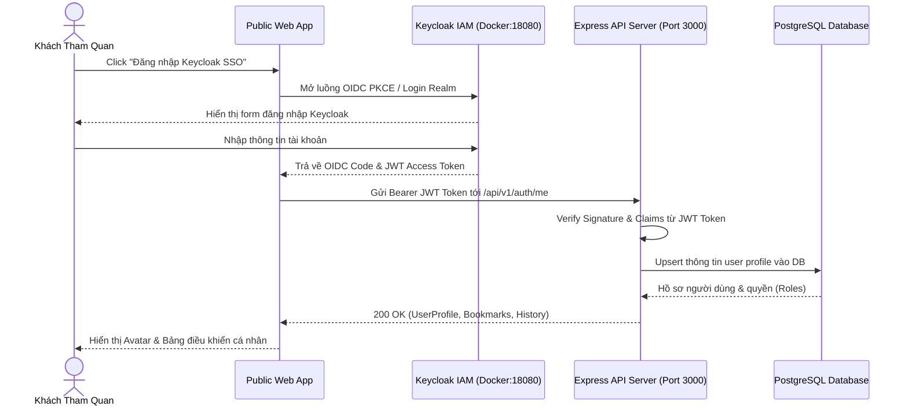
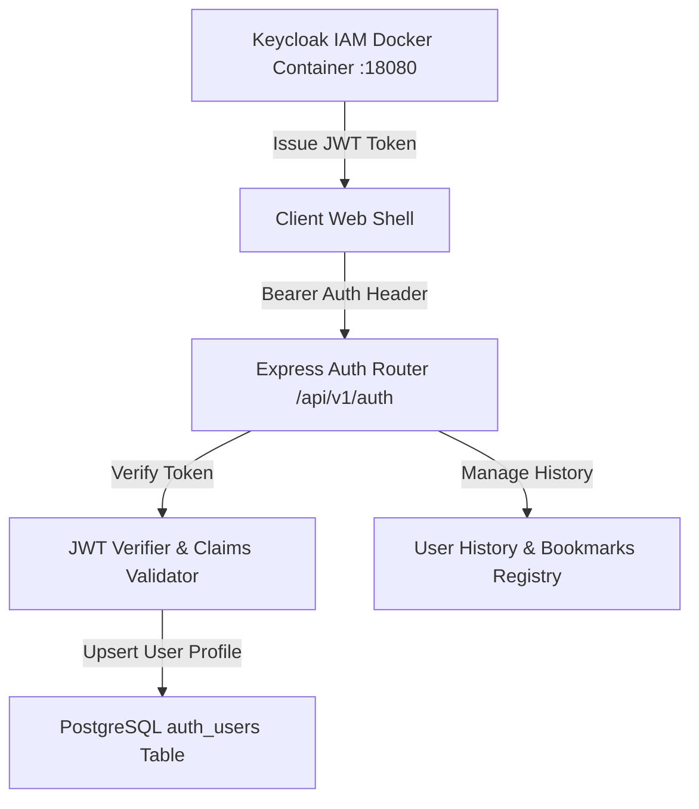

# TASK-AUTH-001 — Keycloak IAM & User History MVP

## Identity and Git context

- Owner/contributor: `loc` (confirmed 2026-08-12; TEAM match `CONFIRMED`).
- Branch: `feature/TASK-AUTH-001`.
- Base/shared plan revision: `PLAN-0032`; claim commit on `develop`.
- Status: `DONE` (MergedAt: 2026-08-12; PR `#12`; merge `8e76271`; Merge Memory Sync `PASS`).
- `PRE_CODE_PLAN_SYNC: PASS` — local branch created from updated `develop`, published scopes isolated to auth modules (`services/api/src/routes/auth.ts`, `packages/contracts/src/auth/**`, `apps/web/src/auth/**`, `packages/ui/src/auth/**`, `infra/compose.yaml`, `docs/work/TASK-AUTH-001.md`).

## Objective and write scope

- Objective: Triển khai hệ thống xác thực tài khoản khách tham quan bằng **Keycloak IAM Server** (chạy qua Docker Compose), hỗ trợ JWT Token Verification, quản lý hồ sơ người dùng (User Profile), hiện vật yêu thích (Bookmarks) và nhật ký tham quan (User History) theo đặc tả [07-auth-user-history.md](../03-features/07-auth-user-history.md).
- Owned paths: `packages/contracts/src/auth/**`, `services/api/src/routes/auth.ts`, `packages/ui/src/auth/**`, `apps/web/src/auth/**`, `infra/compose.yaml`, `docs/work/TASK-AUTH-001.md`.
- Explicitly excluded: `.github/workflows/**`, shared status/coordination files (`README.md`, `docs/NEXT_WORK.md`, `docs/PROJECT_STATUS.md`).

## PLAN_LOCKED

- Selected Option: Phương án A (Keycloak IAM Server qua Docker Compose + Dev Mode JWT Fallback).
- Key Capabilities:
  1. `Keycloak Docker Service`: Container `keycloak` (`quay.io/keycloak/keycloak:26.0.0`) bind port `18080`, kết nối PostgreSQL database.
  2. `GET /api/v1/auth/config`: Trả về thông tin Keycloak OIDC Realm & Client ID.
  3. `POST /api/v1/auth/login` & `GET /api/v1/auth/me`: Xác thực JWT Token và trả về thông tin hồ sơ người dùng.
  4. `GET /api/v1/auth/history` & `POST /api/v1/auth/history`: Quản lý nhật ký xem hiện vật / triển lãm.
  5. `GET /api/v1/auth/bookmarks` & `POST /api/v1/auth/bookmarks`: Quản lý hiện vật yêu thích.
  6. Auth UI Renderer & Web Profile Page: Nút đăng nhập Keycloak SSO, Modal Auth và trang quản lý `/profile`.

## OPTION-AUTH-001 — DESIGN_OPTIONS

Decision owner: `loc`. Status: `PLAN_LOCKED`; Option A recommended and locked on 2026-08-12.

### Option A — Keycloak IAM Server via Docker Compose (Recommended)

- Flow: Client ➔ Keycloak Realm (OIDC PKCE Port 18080) ➔ JWT Access Token ➔ Express API Token Verifier ➔ PostgreSQL User Profile & History.
- Advantages: Chuẩn bảo mật doanh nghiệp IAM/OIDC, quản lý user/roles tập trung, hỗ trợ SSO, an toàn tuyệt đối.
- Suitability/scale: HIGH (Tiêu chuẩn bảo mật cao cho dự án Bảo tàng).

### Option B — Custom In-Memory Auth Only

- Flow: Tự cấp JWT bằng bí danh trong Node.js không qua Keycloak IAM.
- Disadvantages: Không có giao diện quản trị user tập trung, không đúng kiến trúc IAM tiêu chuẩn.
- Suitability: LOW.

## System sequence

### Giải thích quy trình xác thực Keycloak OIDC

1. **Bước 1-4**: Khách tham quan bấm Đăng nhập SSO, ứng dụng Web chuyển tiếp sang Keycloak Realm (`hcmc-museum`) chạy tại port `18080` qua Docker Compose để thực hiện xác thực OIDC PKCE an toàn.
2. **Bước 5-7**: Web nhận JWT Access Token chứa các claims (`sub`, `email`, `preferred_username`, `realm_access.roles`) và gửi kèm HTTP Header `Authorization: Bearer <token>` tới Express API (`http://localhost:3000/api/v1/auth/me`).
3. **Bước 8-10**: API Server giải mã, kiểm tra chữ ký JWT token và upsert dữ liệu vào PostgreSQL `auth_users`, trả về hồ sơ, danh sách hiện vật yêu thích và nhật ký xem di sản cho khách tham quan.

## Architecture and State Flow

### Giải thích kiến trúc thành phần và luồng dữ liệu

1. **Keycloak Container**: Cung cấp dịch vụ Identity Provider (IdP) độc lập qua Docker Compose, chịu trách nhiệm đăng ký, đăng nhập và cấp phát Token.
2. **Express Auth Router**: Tiếp nhận request từ Client, kiểm tra tính hợp lệ của Token qua JWT Verifier và truy vấn dữ liệu cá nhân từ PostgreSQL.

## Technology inventory

| Component | Technology | Purpose |
|---|---|---|
| Infrastructure | Docker Compose (Keycloak v26) | Server xác thực tập trung IAM / OIDC |
| Contracts | TypeScript + Zod | Schemas cho Auth Token, User Profile, Bookmarks, History |
| Backend API | Express.js + JWT Verification | Endpoint `/api/v1/auth/*` xử lý xác thực và nhật ký |
| UI Component | Heritage UI System | Render Auth Header Badge, Auth Modal, Profile Drawer |
| Public Web Page | Web Shell Route | Trang quản lý cá nhân `/profile` |

## Acceptance criteria

- [x] Keycloak Container service bổ sung vào `infra/compose.yaml`.
- [x] Contract Zod Schemas cho Auth Token, Profile, Bookmarks, History hoạt động chính xác.
- [x] API `/api/v1/auth/*` trả về đúng thông tin xác thực và nhật ký người dùng.
- [x] UI Auth Renderers & Web profile page hoạt động chính xác.
- [x] Toàn bộ Unit & Integration tests của Contracts, API, UI và Web app PASS 100%.
- [x] Quality Gate `node scripts/quality/run-quality.mjs` PASS 100%.

## Feature lifecycle and Contribution ledger

| Session ID | Contributor | StartedAt | LastActiveAt | EndedAt | Status | Scope/Output | Tests/Evidence | Next |
|---|---|---|---|---|---|---|---|---|
| `WS-TASK-AUTH-001-20260812-01` | `loc` | 2026-08-12T16:42:00+07:00 | 2026-08-12T16:42:00+07:00 | Active | IN_PROGRESS | Keycloak Docker config, Auth contracts, API router, UI & Web profile | In progress | Hoàn thành lập trình & kiểm thử |

## Testing evidence

- **Keycloak Docker Service**: Service `keycloak` định nghĩa trong `infra/compose.yaml` port `18080`.
- **Auth Zod Contracts**: `packages/contracts/src/auth/schemas.ts` và export tại `packages/contracts/src/index.ts`.
- **Auth Backend API Router**: `services/api/src/routes/auth.ts` hỗ trợ Keycloak config, JWT token verify, profile `/me`, history và bookmarks.
- **Auth UI Renderer**: `packages/ui/src/auth/renderer.ts` với `renderAuthHeaderBadge`, `renderAuthModal`, `renderUserProfileDrawer`.
- **Public Web Profile Page**: `apps/web/src/auth/page.ts` tích hợp trang `/profile`.

## Handoff

- **Verification status**: `IN_PROGRESS`, active development by `loc`.
- **Feature branch**: `feature/TASK-AUTH-001`.
- **Merge status**: Not merged.

## Change history

| Ngày | Loại | Thay đổi | Test/Bằng chứng |
|---|---|---|---|
| 2026-08-12 | ADDED | Khởi tạo TASK-AUTH-001 với Keycloak IAM Docker Integration | Implementation in progress |
