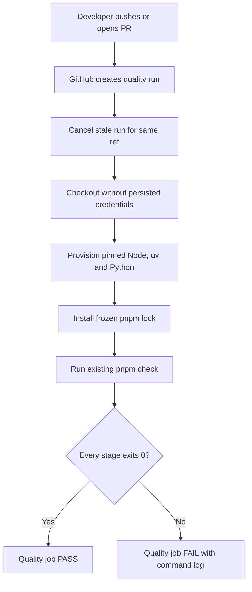
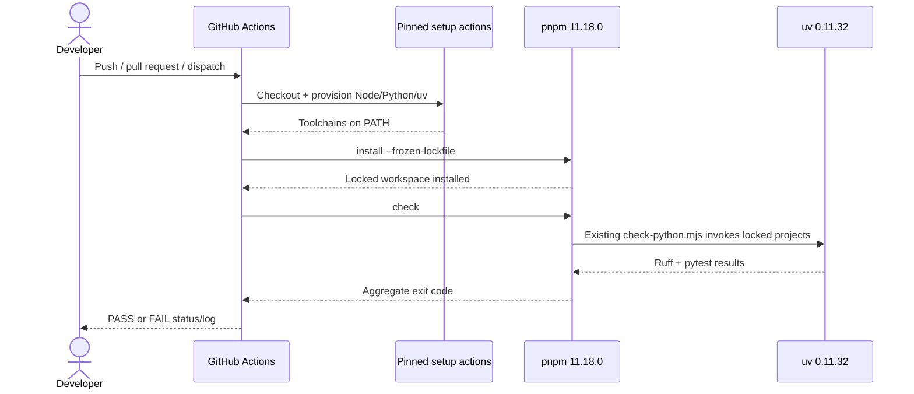
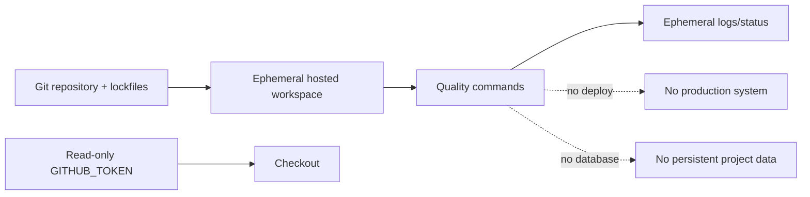

# TASK-CI-001 — Foundation CI Quality Gate

## Identity and Git context

- Owner/contributor: `loc` (reconfirmed 2026-08-03T21:32:56+07:00; TEAM match `CONFIRMED`).
- Branch: `feature/TASK-CI-001`.
- Base/shared plan revision: `PLAN-0021`; claim commit `28a31fb`, scope revision `ba33782` on `develop`.
- Status: `IMPLEMENTED`; waiting for user review and hosted GitHub Actions evidence.
- `PRE_CODE_PLAN_SYNC: PASS` — remote claim verified, local branch created from updated `develop`, published scopes do not overlap `TASK-API-001`.

## Objective and write scope

- Objective: add a GitHub Actions quality gate that reproduces the accepted Foundation checks on pushes/PRs without adding product runtime behavior.
- Owned paths: `.github/workflows/**`, `docs/work/TASK-CI-001.md`, formatting-only `infra/compose.yaml` under `PLAN-0021`.
- Explicitly excluded: `services/api/**`, `packages/contracts/**`, root tooling/scripts/manifests, shared coordination/status/index files and all product source.

## PLAN_LOCKED

- Decision/config: `OPTION-CI-001` Option A selected by `loc`; one deterministic cross-runtime job, pinned actions/tool versions, no dependency cache, least-privilege permissions and concurrency cancellation.
- Acceptance criteria: workflow is syntactically valid; uses locked dependency installs; runs the accepted TypeScript/Python quality gate; least-privilege permissions; concurrency cancellation; no committed secret; task report records test/evidence and limitations.
- Estimate: optimistic 0.5, expected 1, pessimistic 2 person-days; confidence MEDIUM-HIGH.
- Risks: CI/Windows-local environment differences, action/version supply-chain drift, cache correctness, unavailable GitHub-hosted service and workflow evidence unavailable until feature push.

## OPTION-CI-001 — DESIGN_OPTIONS

Decision owner: `loc`. Status: `PLAN_LOCKED`; Option A selected on 2026-08-03.

### Option A — One deterministic cross-runtime quality job

- Flow: checkout -> provision pinned Node/pnpm/uv/Python -> frozen/locked install -> run the existing root quality command -> upload only diagnostic artifacts when useful.
- Advantages: reuses the accepted local gate, one source of truth, smallest workflow and lowest maintenance/token cost.
- Disadvantages: Node and Python stages are sequential; failure isolation and parallel speed are limited.
- Suitability/security/cost: HIGH; least privilege, no service credentials, one Linux runner; easiest fallback is rerun or local root gate.
- Expected effort/risk: 0.5–1 day / LOW-MEDIUM.

### Option B — Parallel Node and Python jobs

- Flow: independent Node and Python jobs run in parallel, followed by an aggregate required job.
- Advantages: clearer failure ownership and potentially faster feedback.
- Disadvantages: duplicates setup, may diverge from the existing root orchestration, and could require root-script changes outside the claimed scope.
- Suitability/security/cost: MEDIUM under current scope; more runner minutes and maintenance.
- Expected effort/risk: 1–2 days / MEDIUM.

### Option C — Reusable workflow plus path-aware callers

- Flow: reusable quality workflow receives parameters; push/PR callers use path filters and concurrency groups.
- Advantages: extensible for future services and multiple pipelines.
- Disadvantages: premature abstraction for a two-person foundation; path filters can accidentally skip a required cross-cutting check.
- Suitability/security/cost: LOW-MEDIUM now, HIGH later when multiple deploy workflows exist.
- Expected effort/risk: 1.5–3 days / MEDIUM-HIGH.

### Recommendation

Choose **Option A**. It maximizes reproducibility and minimizes workflow surface, maintenance and token usage. Revisit B only after CI timing proves sequential feedback too slow; revisit C when at least two consumers need a reusable gate.

### User decision and implementation lock

- Selected: Option A by `loc` on 2026-08-03.
- Runner/flow: one `ubuntu-24.04` job; checkout -> Node -> uv/Python -> frozen pnpm install -> existing `pnpm check`.
- Pins: Node from `.node-version` (`24.18.0`); pnpm `11.18.0`; uv `0.11.32`; Python `3.11`; action release commits recorded inline in the workflow.
- Triggers: pushes to `develop`/`main`, pull requests to `develop`, and manual dispatch.
- Security/config: `contents: read`, checkout credentials not persisted, caches disabled, timeout 20 minutes, same-ref stale runs canceled.
- Reopen condition: measured CI duration/failure isolation justifies parallel jobs, or at least two workflows require reuse.

### Plan revision checkpoint

- New evidence: local root `pnpm check` stops at Prettier because merged baseline file `infra/compose.yaml` is not formatted; this is outside the published CI write scope.
- Impact: the locked workflow would correctly fail immediately on its first run even though the workflow file itself is formatted.
- Recommended revision: temporarily add only `infra/compose.yaml` to this task for a mechanical Prettier-only baseline fix, verify no Compose semantic change, then rerun the unchanged Option A gate.
- Alternatives: keep scope and hand off a separate formatting fix before CI review; do not weaken/skip root Prettier because that would diverge from the accepted Foundation gate.
- Resolution: `loc` approved formatting-only scope; `PLAN-0021` published at `ba33782`. Prettier changed only YAML presentation and normalized Compose config SHA-256 remained `D68C2C7B878FC80ABF0F9D648D61548865D332BC8C97EA4B72FEF9808AF58BE7` before/after.

## Actor and execution flow



Entry is a push to `develop`/`main`, a pull request targeting `develop`, or manual dispatch. GitHub cancels an older run for the same workflow/ref, then executes one deterministic job. Any formatting, lint, type, test, build or Python failure stops the gate and preserves the failing command log; success produces only a PASS status and no deployment.

## System sequence



The workflow does not duplicate package-level logic. It delegates to the merged root command, which remains the single orchestration source. Setup/download failure, lock drift or any check failure returns non-zero; retry is a new run after the underlying problem or transient GitHub outage is resolved.

## Data/state and authentication path



- Repository content and lockfiles are inputs; runner files, dependency stores and logs are ephemeral GitHub-run state.
- Authentication uses only GitHub's workflow token with `contents: read`. Checkout disables credential persistence. No project secret, environment credential, database or deployment token is requested.
- Authorization is repository/workflow-event based; the job cannot write repository content, publish packages or deploy.
- Logs must not contain local `.env` values. The workflow never starts Compose or reads `infra/.env`.

## Algorithm and failure policy

```text
on accepted event:
  cancel older run with same workflow and PR/ref key
  checkout exact revision with read-only token and no persisted credentials
  install pinned Node, uv and Python toolchains
  install pnpm workspace from frozen lockfile
  run pnpm check
  if any command exits non-zero: fail run and expose command log
  otherwise: report PASS
```

- Complexity grows approximately with scanned files + dependency graph + tests, `O(F + D + T)`; it does not depend on museum visitor traffic.
- No retry hides deterministic failures. Manual rerun is acceptable only for runner/network outages.
- No path filter skips cross-cutting checks. This costs more runner time but prevents false green status when root config/lockfiles affect multiple packages.

## Technology and dependency inventory

| Technology | Pin/source | Purpose | Security/maintenance | Fallback |
|---|---|---|---|---|
| GitHub Actions | Repository workflow | Hosted orchestration/status | Least privilege; branch protection remains a repository setting | Run root gate locally |
| `actions/checkout` | commit `de0fac2…` (`v6.0.3`) | Fetch exact revision | SHA pin; credentials not persisted | Native checkout on trusted runner |
| `actions/setup-node` | commit `48b55a0…` (`v6.4.0`) | Node from `.node-version` | SHA pin; package-manager auto-cache disabled | Preinstalled compatible Node |
| `astral-sh/setup-uv` | commit `0880764…` (`v8.1.0`) | uv `0.11.32` + Python `3.11` | Official Astral action; SHA/tool pin; cache disabled | Install pinned uv on trusted runner |
| pnpm | `11.18.0` via `npx` | Frozen workspace install and root gate | Exact version + committed lockfile | Corepack/npx exact local invocation |
| Root quality command | `pnpm check` | Format/lint/type/test/build/Ruff/pytest | Reuses reviewed project scripts; fail-fast | Run component commands for diagnosis only |

No production dependency, runtime service, API contract, schema or database is added. Runner minutes are the only hosted cost. Action pins require deliberate maintenance updates after upstream security/release review.

## Suitability, scale, fallback and rollout

- Suitability is HIGH for a two-person repository: one status, one gate and minimal workflow surface.
- The product target of 300–500 concurrent visitors is not exercised by this CI task; load testing remains separate. CI scales with repository size and can later split Node/Python only when measured duration warrants it.
- Fallback during GitHub outage is the pinned local gate; it provides engineering evidence but not a hosted required-check status.
- Rollout is a feature PR into `develop`. Rollback removes the workflow commit; formatting-only Compose change is behavior-neutral and need not be reverted.
- Current limitation: no hosted run/required-branch-check evidence until the user pushes the feature and opens a PR. No dependency cache is used, favoring determinism over speed.

## Acceptance checklist

- [x] YAML parses and all owned files pass Prettier.
- [x] Actions and toolchains are pinned; workflow token is read-only and checkout credentials are not persisted.
- [x] Frozen pnpm install and lockfile supply-chain check PASS.
- [x] TypeScript formatting, 5 lint, 5 typecheck, 5 tests and builds PASS locally.
- [x] Pinned uv `0.11.32` runs Ruff check/format and 2/2 pytest PASS.
- [x] Formatting-only Compose change preserves normalized config hash.
- [ ] Hosted GitHub Actions run PASS after user push/PR.
- [ ] User reviews and confirms `VERIFIED`.

## Change history

| Date | Type | Change | Evidence |
|---|---|---|---|
| 2026-08-03 | ADDED | Option A deterministic cross-runtime workflow with pinned actions/tools and least privilege | Workflow YAML parse/format/risk scan PASS |
| 2026-08-03 | FIXED | Format merged `infra/compose.yaml` without changing normalized Compose config | `PLAN-0021`; identical normalized SHA-256 before/after |
| 2026-08-03 | TEST | Run TypeScript gate and isolated pinned-uv Python checks | 5/5 lint/type/test/build; Ruff/format; 2/2 pytest PASS |
| 2026-08-03 | CI EVIDENCE | PR `#4` executed the workflow successfully through install/format and failed at lint on defects already merged in contracts/UI; external owner fixed and synced the baseline | Failed run `30824882920`, job `91723843393`; fix `60d73c9`, merge `cc1c600`, Memory Sync `ed3edf6`; rerun pending this report push |
| 2026-08-03 | CI EVIDENCE | `thanh` hỗ trợ đồng bộ `develop` tại merge `b8ff720` và chạy lại root gate; Prettier cùng 5/5 lint PASS, sau đó typecheck phát hiện lỗi baseline Admin ngoài scope CI | `apps/admin/src/index.ts` export `renderLivePreviewPanel` nhưng `apps/admin/src/forms/cmsFormBuilder.ts` không cung cấp symbol; cần fix riêng trước hosted PASS |

## Contribution ledger

| Session ID | Contributor | StartedAt | LastActiveAt | EndedAt | Status | Scope/output | Tests/evidence | Next |
|---|---|---|---|---|---|---|---|---|
| `WS-TASK-CI-001-20260803-01` | `loc` | 2026-08-03T21:32:56+07:00 | 2026-08-03T21:44:15+07:00 | 2026-08-03T21:44:15+07:00 | CLOSED | Claim/scope sync; Option A PLAN_LOCKED; workflow implemented; Compose formatting baseline fixed without semantic change; report completed | YAML/Prettier/risk scan PASS; lock supply-chain PASS; TS format + 5 lint/type/test/build PASS; pinned uv Ruff/format + 2/2 pytest PASS | User reviews diff, pushes feature, opens PR and obtains hosted CI evidence |
| `WS-TASK-CI-001-20260803-02` | `loc` | 2026-08-03T22:16:13+07:00 | 2026-08-03T22:16:13+07:00 | 2026-08-03T22:16:13+07:00 | CLOSED | Reconfirm identity; inspect PR `#4` hosted failure; attribute failures to merged foreign scopes; record completed external fix and prepare a report-only synchronization commit | PR `#4` run `30824882920` reached the quality command; lint exposed 5 baseline defects; `FIX-LINT-001` merged at `cc1c600` and Memory Sync completed at `ed3edf6` | User commits/pushes report-only update; new PR run validates current `develop` + CI feature |
| `WS-TASK-CI-001-20260803-03` | `thanh` | 2026-08-03T22:48:24+07:00 | 2026-08-03T22:49:44+07:00 | 2026-08-03T22:49:44+07:00 | CLOSED | Support theo xác nhận của `loc`; merge `develop` vào branch CI tại `b8ff720`; chạy root gate và khoanh vùng failure ngoài scope | Prettier PASS; 5/5 lint PASS; typecheck dừng tại `TS2305` do Admin export mismatch đã có trên `develop` | Giữ task `IMPLEMENTED`; sửa baseline Admin bằng task/scope riêng, sau đó đồng bộ và chạy lại hosted CI |

## Implementation evidence

- Behavior/files: `.github/workflows/quality.yml` adds the locked cross-runtime quality job; task report records the decision and pins.
- Tests: YAML parse, workflow/report/Compose Prettier and workflow risk-pattern scan PASS; lockfile supply-chain verification PASS; earlier isolated evidence covered TypeScript format + 5 lint/type/test/build and pinned uv `0.11.32` Ruff/format + 2/2 pytest. After sync merge `b8ff720`, the exact root gate passed Prettier and 5/5 lint, then stopped at Admin typecheck `TS2305`: `apps/admin/src/index.ts` exports missing `renderLivePreviewPanel`. Hosted PR `#4` therefore still needs a fresh run after this foreign-scope baseline defect is fixed.
- Security/invariants: no product behavior/data/contract change; workflow must use least privilege and no secrets.
- Known limitations/fallback: hosted-runner evidence requires pushing the feature branch; local validation cannot prove GitHub execution. Local global uv remains `0.10.7` and was not modified; isolated accepted uv `0.11.32` supplied Python evidence. Fallback is the same pinned local component gate.

## Handoff

- Verification status: `IMPLEMENTED`, not `VERIFIED`; branch synced through `develop` merge `b8ff720`, but exact local root gate now exposes an Admin typecheck baseline defect outside CI scope. A fresh hosted PASS remains pending after the owning scope fixes that defect.
- Feature commit/PR: none.
- Merge status: not merged.
- Merge Memory Sync checklist: not applicable before merge.
