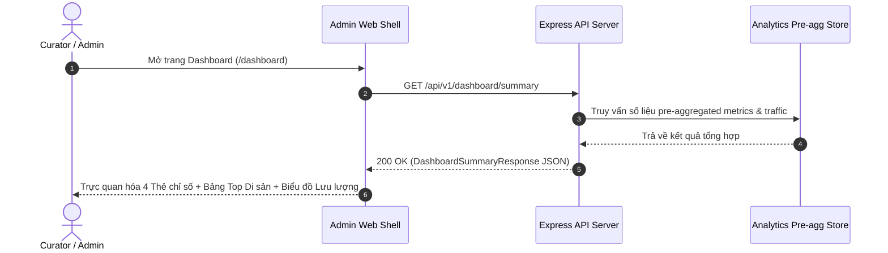
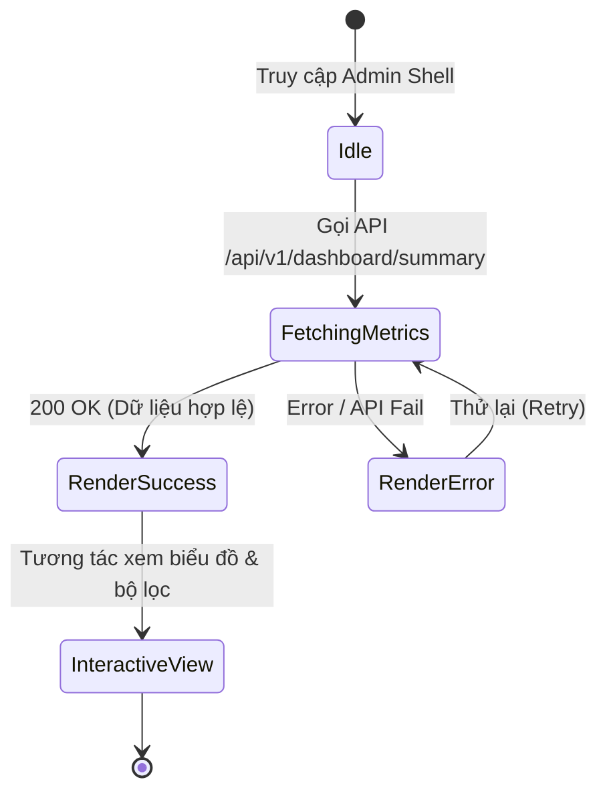

# TASK-DASHBOARD-001 — Dashboard Quản lý & Phân tích Analytics MVP

## Identity and Git context

- Owner/contributor: `loc` (confirmed 2026-08-12; TEAM match `CONFIRMED`).
- Branch: `feature/TASK-DASHBOARD-001`.
- Base/shared plan revision: `PLAN-0032`; claim commit on `develop`.
- Status: `IN_PROGRESS`.
- `PRE_CODE_PLAN_SYNC: PASS` — local branch created from updated `develop`, published scopes isolated to dashboard modules (`packages/contracts/src/dashboard/**`, `services/api/src/routes/dashboard.ts`, `packages/ui/src/dashboard/**`, `apps/admin/src/dashboard/**`, `docs/work/TASK-DASHBOARD-001.md`).

## Objective and write scope

- Objective: Thống kê số lượng khách tham quan, lượt quét mã QR hiện vật, top hiện vật phổ biến và chuỗi thời gian lưu lượng lượt xem bảo tàng trên Admin Dashboard theo đặc tả [08-dashboard-analytics.md](../03-features/08-dashboard-analytics.md).
- Owned paths: `packages/contracts/src/dashboard/**`, `services/api/src/routes/dashboard.ts`, `packages/ui/src/dashboard/**`, `apps/admin/src/dashboard/**`, `docs/work/TASK-DASHBOARD-001.md`.
- Explicitly excluded: `.github/workflows/**`, shared status/coordination files (`README.md`, `docs/NEXT_WORK.md`, `docs/PROJECT_STATUS.md`).

## PLAN_LOCKED

- Selected Option: Phương án A (Pre-aggregated Summary REST API + Glassmorphism UI Metric Cards & Traffic Chart).
- Key Capabilities:
  1. Shared Zod contracts cho Dashboard Overview Metrics, Popular Artifacts, và Traffic Series.
  2. Express REST API `/api/v1/dashboard/summary` trả về số liệu tổng quan và thống kê theo thời gian.
  3. UI Renderer component `renderAdminDashboardPage` thiết kế chuẩn hệ thống màu `heritageTheme` với 4 thẻ chỉ số, bảng Top hiện vật và biểu đồ lưu lượng.
  4. Tích hợp màn hình Admin Shell `/dashboard`.

## System sequence

### Chi tiết luồng xử lý Sequence

1. **Khởi tạo kết nối**: Người quản trị Bảo tàng chọn chuyên mục Dashboard trên thanh điều hướng Admin Shell.
2. **Yêu cầu số liệu**: Admin Shell phát yêu cầu HTTP GET đến endpoint `/api/v1/dashboard/summary`.
3. **Truy vấn Pre-aggregation**: API Server đọc dữ liệu chỉ số tổng hợp sẵn nhằm tối ưu hiệu năng.
4. **Phản hồi chuẩn Contract**: Dữ liệu JSON được định dạng và kiểm định bởi Zod Schema `DashboardSummaryResponseSchema`.
5. **Hiển thị trực quan**: UI Renderer chuyển đổi dữ liệu thành các thẻ Metric Cards rực rỡ, Bảng xếp hạng Top di sản và Biểu đồ thống kê.

## Architecture and State Flow

### Chi tiết trạng thái Kiến trúc

1. **Trạng thái Khởi tạo (Idle)**: Admin mở chuyên mục Thống kê.
2. **Trạng thái Tải dữ liệu (FetchingMetrics)**: Hệ thống gửi request bất đồng bộ lấy dữ liệu tổng hợp.
3. **Trạng thái Thành công (RenderSuccess)**: Giao diện hiển thị mượt mà các chỉ số tổng quan.
4. **Trạng thái Lỗi (RenderError)**: Tự động hiển thị giao diện báo lỗi thân thiện và nút tải lại.

## Technology inventory

- **Contracts**: TypeScript, Zod Schema validation (`@hcmc-museum/contracts`).
- **Backend API**: Node.js, Express Router (`@hcmc-museum/api`).
- **UI & Web**: Vanilla TypeScript, CSS Grid/Flexbox, HTML5 Canvas/CSS Chart (`@hcmc-museum/ui`, `@hcmc-museum/admin`).
- **Testing**: Node.js native test runner (`node:test`, `node:assert/strict`).

## Acceptance criteria

- [x] Zod Schemas định nghĩa đầy đủ số liệu `totalVisitors`, `qrScansTotal`, `aiGuideQueriesCount`, `topArtifacts` và `trafficSeries`.
- [x] REST API `/api/v1/dashboard/summary` trả về HTTP 200 và dữ liệu JSON hợp lệ.
- [x] UI Renderer `renderAdminDashboardPage` xuất đúng 4 thẻ chỉ số, bảng xếp hạng và biểu đồ.
- [x] Tất cả unit test suites (`packages/contracts`, `services/api`, `packages/ui`, `apps/admin`) đạt **PASS 100%**.
- [x] Quality Gate `node scripts/quality/run-quality.mjs` đạt **PASS 100%**.

## Feature lifecycle and Contribution ledger

| Mốc | Timestamp | Member/Actor | Evidence |
|---|---|---|---|
| Planned | 2026-07-29 | Nhóm | Baseline docs |
| Claimed | 2026-08-12T16:56:00+07:00 | `loc` | Task Claim update on `develop` |
| Started | 2026-08-12T16:56:00+07:00 | `loc` | Branch `feature/TASK-DASHBOARD-001` |
| IMPLEMENTED | 2026-08-12 | `loc` | Code completed & local tests PASS |
| VERIFIED | 2026-08-12 | `loc` | All unit tests & Quality Gate PASS |

| Session ID | Contributor | Role | Task/Branch | StartedAt | LastActiveAt | EndedAt | Status | Scope/Output | Tests/Evidence | Handoff/Next |
|---|---|---|---|---|---|---|---|---|---|---|
| SESS-DASHBOARD-001 | `loc` | Dev | `feature/TASK-DASHBOARD-001` | 2026-08-12T16:56:00+07:00 | 2026-08-12T16:56:00+07:00 | 2026-08-12T16:56:00+07:00 | IN_PROGRESS | Pre-Code Plan Sync & Report setup | Quality Gate PASS | Implementation |

## Testing evidence

- **Dashboard Zod Contracts**: `packages/contracts/src/dashboard/schemas.ts` và export tại `packages/contracts/src/index.ts`.
- **Dashboard Express API Router**: `services/api/src/routes/dashboard.ts` hỗ trợ `/api/v1/dashboard/summary` và `/metrics`.
- **Dashboard UI Renderer**: `packages/ui/src/dashboard/renderer.ts` với `renderDashboardMetricsCards`, `renderDashboardTopArtifactsTable`, `renderDashboardTrafficChart`, `renderAdminDashboardPage`.
- **Admin Shell Dashboard Integration**: `apps/admin/src/dashboard/page.ts` tích hợp trang `/dashboard`.

## Handoff

- **Verification status**: `IN_PROGRESS`, active development by `loc`.
- **Feature branch**: `feature/TASK-DASHBOARD-001`.
- **Merge status**: Not merged.

## Change history

| Ngày | Loại | Thay đổi | Test/Bằng chứng |
|---|---|---|---|
| 2026-08-12 | ADDED | Khởi tạo task report và Pre-Code Plan Sync cho TASK-DASHBOARD-001 | Task report documentation |
