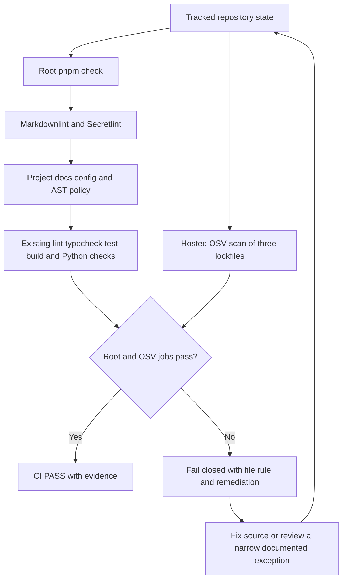
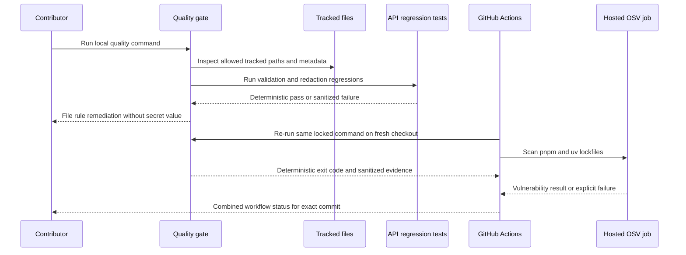

# TASK-DOC-QUALITY-001 — Documentation, Code/Config, Secret & Data-access Quality Gate

## 1. Task identity

| Field | Value |
|---|---|
| Task | `TASK-DOC-QUALITY-001` |
| Status | `IMPLEMENTED / AWAITING USER VERIFICATION` |
| Owner | `thanh` |
| Branch | `feature/TASK-DOC-QUALITY-001` |
| ClaimedAt | `2026-08-04T00:10:24+07:00` |
| Session | `WS-TASK-DOC-QUALITY-001-20260804-01` |
| Shared plan | `PLAN-0028` |
| Claim evidence | `origin/develop` commit `6e46073cb3b534f5360ebc820cd2f238ddd65309` |
| Plan-lock evidence | `origin/develop` commit `188e42a50f15aee515953f6088aca75f2a2fad8d` |

## 2. Objective and value

Mở rộng Foundation quality gate thành một gate có bằng chứng cho bốn nhóm rủi ro:

1. Cấu trúc và liên kết tài liệu bắt buộc.
2. Code/config/secret/dependency policy.
3. Injection, query và cache regression ở data-access boundary.
4. CI chạy deterministic trên fresh clone và báo lỗi có thể xử lý được.

Giá trị chính là ngăn lỗi tài liệu, cấu hình nhạy cảm và data-access regression đi vào `develop` mà không biến static automation thành tuyên bố sai về chất lượng ngữ nghĩa, hiệu năng query hoặc bảo mật tuyệt đối.

## 3. Scope boundary

### In scope

- `scripts/quality/**`.
- `.github/workflows/quality.yml`.
- Root quality manifests/config: `package.json`, `pnpm-lock.yaml`, `eslint.config.mjs` khi phương án được chọn thực sự cần.
- Data-access regression chỉ trong `services/api/test/**`.
- Task-local plan, decision, evidence, session và handoff trong file này.

### Out of scope

- Runtime product behavior và application feature code.
- Migration, database schema, entity hoặc index production.
- Shared contract, integration/catalog/status/index files trên feature branch.
- File `.env` thật, secret thật hoặc giá trị kết nối thật.
- Semantic grading tự động cho chất lượng nội dung, lựa chọn thư viện, query plan hoặc thiết kế cache.
- E2E, dynamic security scan và database integration benchmark nếu không có dependency/runtime riêng được PLAN_LOCKED.

## 4. Dependencies and Definition of Ready

| Gate | Evidence | Result |
|---|---|---|
| Identity | Người dùng xác nhận Member ID `thanh`; khớp `docs/TEAM.md` | PASS |
| Dependencies | TASK-FOUND-001, TASK-API-001, TASK-DATA-001, TASK-CI-001 đều `DONE` | PASS |
| Shared claim | PLAN-0027/NEXT_WORK/README/PROJECT_STATUS tại remote commit `6e46073` | PASS |
| Branch isolation | Branch được tạo trực tiếp từ `origin/develop@6e46073` | PASS |
| Scope collision | Không có task `IN_PROGRESS/REVIEW` khác; không có nhánh local/remote cùng tên trước startup | PASS |
| Owner plans | Ba quality-gate owner documents đã `PLAN_LOCKED` | PASS |
| Business invariants | Đã đọc INV-DATA-004, INV-CACHE-001, INV-SEC-001/003/004 và INV-CONFIG-001 | PASS |
| Architecture/contracts | Đã đọc integration map, contract catalog và ADR-001..004; không đề xuất contract/runtime boundary mới | PASS |
| Design choice | Người dùng chọn Option C; `DEC-DOC-QUALITY-AUTOMATION-001` đã publish | PASS |

### PRE_CODE_PLAN_SYNC

`PRE_CODE_PLAN_SYNC: PASS`

- Remote claim: `origin/develop@6e46073cb3b534f5360ebc820cd2f238ddd65309`.
- README trong exact commit có `PLAN-0027`, owner `thanh`, branch và write scope.
- Local `develop` đã chạy fast-forward-only và báo `Already up to date`.
- Feature branch merge-base khớp exact remote develop commit trên.
- Không có task active khác hoặc write-scope overlap đã công bố.

## 5. Context audit

### Documents read

- `PROJECT_BRAIN.md`, `CURRENT_TASK.md`.
- `docs/00-product/03-business-invariants.md`.
- `docs/01-architecture/03-integration-map.md`.
- `docs/02-data/03-contract-catalog.md`.
- `docs/04-design/03-ai-experience-quality-gate.md`.
- `docs/05-quality/01-security-privacy.md`.
- `docs/05-quality/03-testing-strategy.md`.
- `docs/05-quality/04-code-configuration-quality-gate.md`.
- `docs/05-quality/05-database-query-cache-quality-gate.md`.
- `docs/06-devops/01-local-environment.md`.
- `docs/07-delivery/06-two-person-collaboration.md`.
- `docs/07-delivery/09-work-session-contribution-ledger.md`.
- ADR-001..004, `docs/IMPLEMENTATION_INDEX.md`, UI registry và các template delivery/report liên quan.

### Intentionally not inspected

- Feature code ngoài quality/data-test scope.
- Branch của thành viên khác.
- File ignored, `infra/.env` và mọi secret/local runtime value.
- Unrelated feature specifications.

### Documentation conflict noted

Integration map và contract catalog còn ghi nhiều contract là `PLANNED`, trong khi Implementation Index ghi baseline tương ứng đã merge. Đây là `DOCS_STALE` cần reconciliation riêng; static gate của task này không được giả vờ giải quyết semantic conflict bằng presence check.

## 6. Locked constraints inherited from owner documents

- Static CI chỉ kiểm tra presence/structure/link/pattern; semantic quality và performance evidence vẫn cần review.
- False-positive suppression phải hẹp theo file/rule, có lý do và reviewable; không có blanket ignore.
- Secret scan không đọc/persist giá trị `.env` thật và không in credential vào log.
- Untrusted input không được đi thẳng vào query/filter/operator/identifier; regression phải kiểm chứng validate/authorize/parameterize/allowlist boundary.
- Cache checks phải giữ publish/permission/ownership/locale/audience boundary và có invalidation/fallback evidence.
- Error/response/log không lộ SQL, query parameter, schema, stack, internal path hoặc field ngoài contract.

## 7. DESIGN_OPTIONS

Trạng thái: `PLAN_LOCKED` — Option C, user-confirmed.

### Baseline evidence ảnh hưởng lựa chọn

- Repository có 78 Markdown files và ba lockfiles cần coverage: một `pnpm-lock.yaml`, hai `uv.lock`.
- Foundation workflow hiện có một job chạy root `pnpm check`, permissions chỉ `contents: read`, timeout 20 phút và không cache.
- Root đã có Node 22/24, TypeScript compiler, ESLint, Prettier và deterministic Python runner; chưa có docs/secret/dependency scanner.
- API hiện dùng `DatabaseRepository` in-memory; chưa có SQL client/query adapter hoặc Redis cache implementation. Data gate hiện chỉ có thể cung cấp static/AST policy, validation/error-redaction regression và synthetic fixtures. Query-plan/cache runtime evidence phải chờ owner implementation tương ứng.
- `docs/02-data/03-contract-catalog.md` và integration map có semantic status stale so với Implementation Index. Presence/link automation không được đánh đồng với semantic reconciliation.

### Option A — Repo-native tối thiểu

#### Flow/algorithm

1. Dùng Node built-in APIs và TypeScript compiler đã có để duyệt tracked files.
2. Tự kiểm tra required Markdown sections/local links/Mermaid explanations.
3. Tự kiểm tra `.env.example`, public/server-only naming, hard-coded URL và dangerous query/cache call shapes.
4. Tự dùng curated secret patterns với masked diagnostic.
5. Dùng một OSV-Scanner CI job được pin để quét ba lockfiles.

| Tiêu chí | Đánh giá |
|---|---|
| Ưu điểm | Ít dependency mới; local gate nhanh; toàn quyền diagnostic và false-positive policy |
| Nhược điểm | Secret/docs rules tự viết có coverage thấp hơn tool chuyên dụng; maintenance và regression burden cao |
| Bảo mật | Không gửi source cho SaaS; nhưng custom detector dễ false negative, đặc biệt token format mới |
| Scale | Tuyến tính theo tracked files; phù hợp quy mô hiện tại, cần benchmark khi asset/docs tăng lớn |
| Chi phí | Không license; thêm maintenance nội bộ và một external vulnerability feed |
| Complexity | MEDIUM-HIGH vì tự sở hữu parser/rule suite |
| Fallback | Nếu OSV unavailable, hosted dependency job phải `INCONCLUSIVE/FAIL`, deterministic local policy vẫn chạy; không silent PASS |
| O/E/P | 2.5 / 4 / 6 person-days, MEDIUM-LOW confidence |
| Suitability | Có thể dùng, nhưng không tối ưu cho secret coverage dài hạn |

### Option B — GitHub-native security suite

#### Flow/algorithm

1. Giữ custom check nhỏ cho project-specific docs/data rules.
2. Dùng GitHub CodeQL cho SAST, Dependency Review cho PR và Secret Scanning/Push Protection ở repository settings.
3. Dùng Markdown linter action cho style; foundation gate và platform security jobs chạy song song.

| Tiêu chí | Đánh giá |
|---|---|
| Ưu điểm | Managed rules/SARIF/security UI; giảm số scanner tự bảo trì; PR feedback tốt |
| Nhược điểm | Cần xác minh repository visibility/license/settings/admin; local parity thấp; phụ thuộc GitHub availability |
| Bảo mật | Strong platform coverage, nhưng phải giữ least-privilege permissions và pin third-party actions |
| Scale | Tốt cho repo lớn; Actions minutes và thời gian CodeQL tăng theo source |
| Chi phí | Có thể miễn phí với public repo, nhưng private/org feature có thể cần plan/licensing; cần admin setup |
| Complexity | MEDIUM trong code, HIGH ở platform governance/settings |
| Fallback | Nếu feature/license không khả dụng thì quay về Option C; local gate không được coi là thay thế platform evidence |
| O/E/P | 3 / 5 / 8 person-days, LOW confidence trước khi xác minh settings/license |
| Suitability | Phù hợp nếu nhóm muốn quản trị security tập trung trên GitHub và chấp nhận admin dependency |

### Option C — Hybrid repo-controlled (đề xuất)

#### Flow/algorithm

1. Thêm `markdownlint-cli2` cho Markdown style và `secretlint` preset cho credential patterns; cả hai chạy bằng locked Node dependencies, local và CI cùng command.
2. Viết `scripts/quality/**` chỉ cho quy tắc riêng của dự án: required report sections, local links, Mermaid explanation, config-schema/template coverage, URL boundary và TypeScript AST policy cho dynamic query/operator/cache-key shapes.
3. Thêm positive/negative fixtures; diagnostic chỉ in file/rule/location và luôn mask suspected secret.
4. Thêm API regression test cho validation, redaction và malicious synthetic input trong seam hiện có; ghi `NOT_APPLICABLE` có lý do cho query-plan/cache runtime vì implementation chưa tồn tại.
5. Tách OSV-Scanner thành hosted dependency job pin version/commit để quét `pnpm-lock.yaml` và hai `uv.lock`; root `pnpm check` vẫn deterministic, còn network vulnerability evidence fail/inconclusive riêng.
6. Chỉ thêm CodeQL/Push Protection ở task sau khi repo settings/license được nhóm xác nhận; không làm phình scope hiện tại.

| Tiêu chí | Đánh giá |
|---|---|
| Ưu điểm | Local/CI parity cho docs+secret; tool chuyên dụng xử lý rule phổ biến; custom code chỉ giữ invariant riêng; OSV hỗ trợ cả pnpm và uv lockfiles |
| Nhược điểm | Thêm Node dev dependencies và một hosted external scanner; cần quản lý allowlist/version updates |
| Bảo mật | Secretlint mask mặc định; narrow allowlist; OSV chỉ đọc lockfiles; workflow giữ least privilege và action pinning |
| Scale | Docs/secret/static checks tuyến tính; OSV job tách riêng tránh làm root gate khó chẩn đoán; phù hợp repo hiện tại và mở rộng vừa phải |
| Chi phí | OSS/no license; thêm install size, CI minutes và maintenance có kiểm soát |
| Complexity | MEDIUM; boundary giữa generic tool và project policy rõ ràng |
| Fallback | External feed outage làm dependency job fail/inconclusive và yêu cầu rerun; local deterministic gate vẫn cung cấp evidence còn lại, không hạ lỗi security thành warning |
| O/E/P | 3 / 4.5 / 6 person-days, MEDIUM confidence |
| Suitability | Tốt nhất cho monorepo hiện tại vì cân bằng coverage, local reproducibility và maintenance |

### Official evidence used

- [markdownlint-cli2](https://github.com/DavidAnson/markdownlint-cli2) hỗ trợ config/glob cross-platform và nhiều output formatter.
- [Secretlint](https://github.com/secretlint/secretlint) yêu cầu Node 22+, hỗ trợ CI, `.gitignore`, configurable rules và mask secret mặc định—khớp runtime pin hiện tại.
- [OSV-Scanner lockfile support](https://google.github.io/osv-scanner/supported-languages-and-lockfiles/) liệt kê cả `pnpm-lock.yaml` và `uv.lock`; [GitHub Action](https://google.github.io/osv-scanner/github-action/) hỗ trợ `fail-on-vuln` và SARIF.
- [GitHub Dependency Review](https://docs.github.com/en/code-security/concepts/supply-chain-security/dependency-review) và [CodeQL setup](https://docs.github.com/en/code-security/how-tos/find-and-fix-code-vulnerabilities/configure-code-scanning/configure-code-scanning) là platform alternatives nhưng availability/settings cần được xác minh trước khi khóa Option B.
- [GitHub secret scanning scope](https://docs.github.com/en/code-security/reference/secret-security/secret-scanning-scope) cho biết public repositories được scan tự động; không suy luận repository hiện tại đã bật mọi repository-level protection.

### Recommendation

Đề xuất **Option C**. Option này dùng tool chuyên dụng cho phần dễ lỗi và hay thay đổi, nhưng giữ quy tắc đặc thù của luận văn trong source có test. Nó cũng không tuyên bố query/cache runtime coverage khi baseline chưa có implementation.

Người dùng đã chọn **Option C**. Quyết định được publish trong `PLAN-0028` và `DEC-DOC-QUALITY-AUTOMATION-001`; implementation phải giữ đúng boundary đã mô tả, không tự thêm CodeQL/platform settings hoặc production query/cache code.

## 8. Proposed quality flow

### Flow explanation

1. Entry condition: fresh tracked repository state với locked dependencies.
2. Root `pnpm check` chạy generic Markdown/secret scanners, project policy và toàn bộ foundation checks hiện hữu.
3. OSV chạy ở hosted job riêng vì cần external vulnerability feed; nó chỉ nhận ba committed lockfiles.
4. GitHub Actions chỉ xanh khi cả deterministic root job và OSV job đều xanh.
5. Mọi lỗi project policy phải nêu file/rule/expected remediation nhưng không được in secret value.
6. Chỉ suppression hẹp có lý do mới được chấp nhận; không chuyển lỗi thành warning im lặng.
7. Root job có thể tái chạy local; OSV evidence chỉ được xác nhận từ hosted run trên exact commit.

## 9. Security and data flow

### Sequence explanation

- Deterministic gate không cần network hoặc production credential để kiểm tra project-specific policy.
- Hosted OSV job cần external feed, dùng immutable action commit và chỉ có `contents: read`; outage không được chuyển thành silent PASS.
- Test data dùng synthetic fixture; không đọc production database hoặc local `.env`.
- CI nhận exit code và redacted diagnostic từ root job cùng vulnerability result từ OSV; không persist local secret hoặc production data.

## 10. Delivery estimate

| Field | Value |
|---|---|
| Optimistic | 3 person-days |
| Expected | 4.5 person-days |
| Pessimistic | 6 person-days |
| Confidence | MEDIUM sau khi Option C được PLAN_LOCKED |
| Assumptions | Không sửa runtime/migration/schema; reuse Node/CI baseline; tests dùng synthetic fixtures |
| Dependencies | Existing pnpm/Node/Python gate; GitHub Actions; PLAN_LOCKED owner constraints |
| Risks | False positive, slow CI, external download/supply-chain, stale docs semantics, insufficient data-access seams |
| Included | Tooling, CI integration, tests, task report và handoff evidence |
| Actual effort | Chưa được team xác nhận |
| Completion date | Chưa có |

## 11. Testing and evidence

| Type | Scenario | Expected | Result/Evidence |
|---|---|---|---|
| Baseline | Exact root `pnpm check` with PLAN_LOCKED Node/pnpm/uv toolchain | Existing formatter, lint, typecheck, test, build and Python checks remain green | PASS at `2026-08-04T00:36:53+07:00`; 5 workspace lint/typecheck/build suites, 10 Turbo test tasks and both Python test suites passed |
| Unit | Custom quality-rule positive/negative fixtures | Deterministic diagnostics and exit codes | PASS; 8/8 Node tests |
| Documentation | Generic Markdown style plus required sections, Mermaid explanations and local links | Detect missing/broken structure without semantic overclaim | PASS; Markdownlint plus project policy inspected 168 Git-visible files |
| Security | Secret/config patterns and narrow allowlist | Fail closed; suspected secret values remain masked | PASS locally; Secretlint preset and project config reported no violation; exact exceptions documented in [quality policy](../../scripts/quality/POLICY.md) |
| Dependency | Root pnpm lockfile and two uv lockfiles | Frozen lockfile is consistent; hosted OSV job fails on a reported vulnerability | Frozen lockfile validation PASS with pnpm 11.18.0; OSV is NOT RUN locally and awaits the feature commit's GitHub Actions run |
| Data access | Operator-shaped malicious input and unknown-error redaction | Reject invalid input without reflection; hide internal error detail | PASS; API suite 19/19, including both new synthetic regressions |
| Scope | Changed paths and patch whitespace | Only accepted feature write scope; no malformed patch | PASS; `git diff --check` clean and no shared-file denylist path changed |
| CI | Fresh checkout exact root command plus hosted OSV job | Hosted PASS on exact feature commit | NOT RUN; requires user-owned feature push |

## 12. Feature lifecycle

| Milestone | Timestamp | Member/Actor | Evidence |
|---|---|---|---|
| Planned | 2026-07-30 | Team | PLAN-0004..0006 and quality owner documents |
| Claimed | 2026-08-04T00:10:24+07:00 | `thanh` | PLAN-0027 / remote commit `6e46073` |
| Implementation started | 2026-08-04T00:12:34+07:00 | `thanh` | Task report/session opened; DESIGN_OPTIONS work only |
| First IMPLEMENTED | 2026-08-04T00:36:53+07:00 | `thanh` / Codex | Locked implementation complete; local root gate PASS |
| VERIFIED | — | — | Requires user/team evidence |
| Merged to develop | — | — | Requires user merge evidence |
| Completed | — | — | Requires Merge Memory Sync PASS |

## 13. Feature Contribution Ledger

| Session ID | Contributor | Role | Task/Branch | StartedAt | LastActiveAt | EndedAt | Status | Scope/Output | Tests/Evidence | Handoff/Next |
|---|---|---|---|---|---|---|---|---|---|---|
| `WS-TASK-DOC-QUALITY-001-20260804-01` | `thanh` | implement | `TASK-DOC-QUALITY-001` / `feature/TASK-DOC-QUALITY-001` | 2026-08-04T00:12:34+07:00 | 2026-08-04T00:38:51+07:00 | 2026-08-04T00:38:51+07:00 | HANDOFF | Published Option C; implemented repo quality runner, docs/config/secret/data policy, API regressions and hosted OSV job | `pnpm check` PASS; custom fixtures 8/8; API suite 19/19; frozen lockfile PASS; hosted CI pending | User reviews, commits and pushes feature branch; verify exact GitHub Actions run before `VERIFIED` |

## 14. Implementation, decisions and deviations

- Implementation: complete for the PLAN_LOCKED scope after synchronizing `origin/develop@188e42a`.
- Decision state: `PLAN_LOCKED` — Option C.
- Generic tool layer: pinned `markdownlint-cli2@0.23.2`, `secretlint@13.0.4` and `@secretlint/secretlint-rule-preset-recommend@13.0.4` in the root lockfile.
- Project layer: `run-quality.mjs` orchestrates the exact Node entry points without relying on a nested global pnpm shim; `project-quality.mjs` checks Git-visible Markdown, environment templates/config coverage, environment URLs, TypeScript query/cache patterns and active task reports.
- CI layer: the existing root job runs the same `pnpm check`; a separate least-privilege reusable OSV job scans `pnpm-lock.yaml`, `services/ai/uv.lock` and `workers/media/uv.lock` with action commit `9a498708959aeaef5ef730655706c5a1df1edbc2` (`v2.3.8`).
- Data regression: two synthetic API tests cover operator-shaped input rejection/non-reflection and redaction of unknown internal errors. No runtime source, database schema, migration or cache implementation changed.
- Exception policy: exact style, placeholder, lockfile and legacy Mermaid exceptions are documented in [Repository quality policy](../../scripts/quality/POLICY.md), with compensating controls and a path/ordinal scoping test.
- Applicability: runtime SQL query-plan and cache invalidation evidence remains `NOT_APPLICABLE`; the baseline has no production SQL/query or cache seam, and static AST policy is not reported as runtime evidence.
- Deviations: no PLAN_LOCKED behavior deviation. During local verification, a stale nested pnpm shim was discovered; using direct Node entry points removed that environment coupling without changing the selected tools or policy.
- Shared-plan change after claim: PLAN-0028 / `DEC-DOC-QUALITY-AUTOMATION-001`.

### Technology and dependency inventory

| Component | Version/reference | Role | License/trust boundary | Fallback |
|---|---|---|---|---|
| markdownlint-cli2 | `0.23.2` | Generic Markdown style | MIT; locked Node dev dependency | Project-specific checks still run independently, but missing install fails the deterministic root gate |
| Secretlint + recommended preset | `13.0.4` | Credential-pattern detection with masked diagnostics | MIT; locked Node dev dependencies | Scanner failure is a gate failure; it is not downgraded to a warning |
| TypeScript compiler API | Existing locked `typescript@6.0.3` | AST inspection for query/cache call shapes | Existing root dependency; local source only | Syntax or parser failure fails the project policy instead of silently passing |
| OSV-Scanner reusable workflow | Commit `9a498708959aeaef5ef730655706c5a1df1edbc2` (`v2.3.8`) | Hosted lockfile vulnerability evidence | External GitHub Action, immutable commit, read-only contents permission | Feed/action outage leaves the hosted dependency job failed or inconclusive and requires rerun; local policy does not impersonate OSV evidence |

### Cross-feature consistency review

- Integration map/contracts/entities/permission/error-code production behavior: unchanged.
- Shared UI tokens, motion/3D presets and public CMS content: not touched.
- Cache and database runtime behavior: not touched; applicability limit is explicit.
- Shared coordination/status/index denylist: no feature-branch diff.
- New dependencies are root development-only and represented in the locked `pnpm-lock.yaml`.

## 15. Handoff and stop condition

Current stop condition: implementation is ready for user review, but the task must remain unverified until GitHub Actions passes on the exact user-pushed feature commit and the user/team explicitly confirms `VERIFIED`.

Next checkpoint:

1. User reviews the scoped diff and confirms the documented exceptions are acceptable.
2. User commits and pushes `feature/TASK-DOC-QUALITY-001`; this changes local history and the remote feature branch but not `develop`.
3. Wait for both `Node and Python quality` and `OSV lockfile vulnerability scan` on that exact commit.
4. After explicit `VERIFIED` evidence, follow the single-writer integration-turn gate before any merge decision.

## 16. Change history

| Date | Type | Change | Evidence |
|---|---|---|---|
| 2026-08-04 | ADDED | Opened task-local report, DOR, scope, lifecycle/session and PRE_CODE_PLAN_SYNC PASS | PLAN-0027; remote commit `6e46073` |
| 2026-08-04 | DESIGN_OPTIONS | Added repo-native, GitHub-native and hybrid options; recommended hybrid without selecting for the user | Scoped source/config inspection and official tooling documentation |
| 2026-08-04 | PLAN_LOCKED | User selected Option C; published dependency/flow/fallback/N/A boundary and synchronized feature branch | PLAN-0028; remote commit `188e42a` |
| 2026-08-04 | IMPLEMENTED | Added locked Markdown/secret/project policy, API regression tests and separate hosted OSV lockfile scan; recorded narrow legacy exceptions and N/A runtime boundary | Local `pnpm check` PASS; 8/8 custom tests; API 19/19; hosted CI pending |
