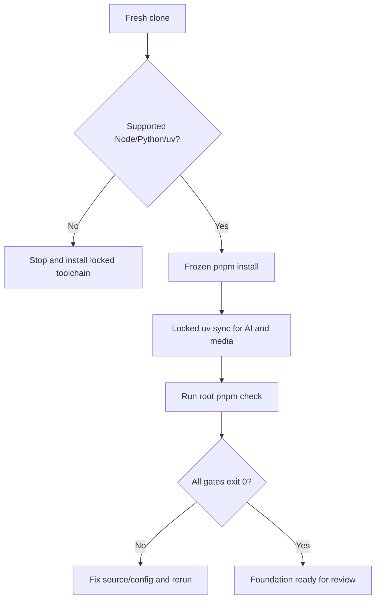
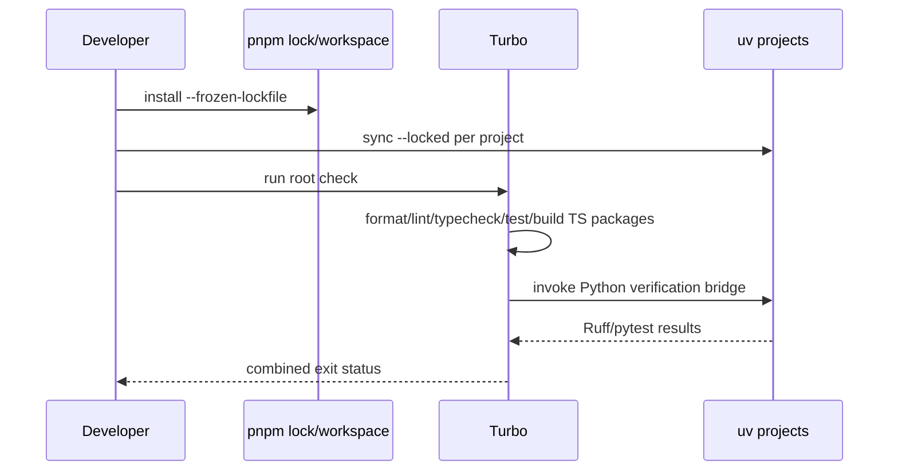
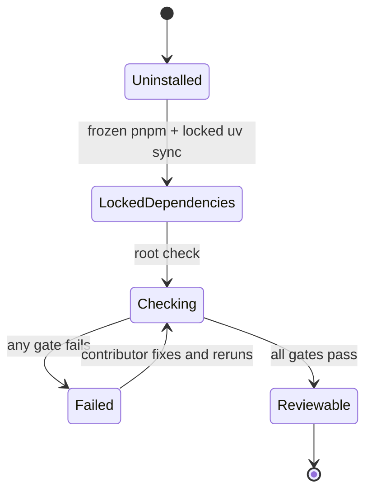
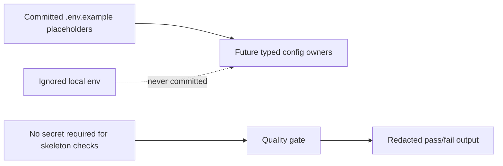

# TASK-FOUND-001 — Monorepo and tooling foundation

## Identity and Git context

- Owner/contributor: `thanh`.
- Support cleanup contributor: `loc` (documentation-boundary migration only; no foundation code attribution).
- Branch: `feature/TASK-FOUND-001`.
- Original implementation commit: `d8de400`.
- Pull request: `#2` into `develop`.
- Base at implementation: `8e90a24`; shared policy after cleanup: `PLAN-0017`.
- Status: `IMPLEMENTED`, awaiting reviewer/user verification; not merged.

## Objective and write scope

- Objective: reproducible pnpm/Turborepo TypeScript monorepo plus two isolated Python/uv projects and a root quality gate.
- Owned code: root workspace/tooling/config; skeletons under `apps/**`, `services/**`, `workers/**`, `packages/**`; root environment catalog.
- Owned task evidence: this report.
- Excluded: `infra/**`, Docker/Compose, migrations, runtime endpoints, UI/business behavior, shared status/index/catalog files.

## PLAN_LOCKED — DEC-FOUND-TOOLING-001

- Node 24 LTS target; Node 22 LTS compatibility range.
- pnpm `11.18.0`, Turborepo `2.10.8`.
- Python `>=3.11 <3.14`, uv `0.11.x`; AI/media have independent `pyproject.toml` and lockfiles.
- Local Turbo cache only; no remote credentials/cache.
- TypeScript and Python keep separate dependency boundaries; root command orchestrates checks.
- Fallback: exact pnpm through `npx`; `pnpm -r` if Turbo orchestration is unavailable; uv locked sync per Python project.

Estimate: 1–2 person-days, MEDIUM. Actual effort remains UNKNOWN; wall-clock session span is not treated as active effort.

## Scope and technology inventory

| Boundary | Technology/location | Purpose |
|---|---|---|
| Root orchestration | pnpm 11.18.0, Turbo 2.10.8, `package.json`, workspace/lock/turbo config | frozen install and task graph |
| TypeScript quality | TypeScript configs, ESLint, Prettier | format/lint/typecheck/build |
| TypeScript skeletons | Web, Admin, API, UI, Contracts | package boundaries only; no business runtime |
| Python skeletons | AI service, media worker; uv/Ruff/pytest | independent Python runtime boundaries |
| Repository hygiene | editorconfig, attributes, gitignore, env example | LF/Windows, generated output and secret boundary |

Alternatives considered: npm workspaces, Yarn/Berry and Nx. pnpm + Turbo was selected for strict dependency layout, workspace speed and lower operational complexity for a two-person team. Nx provides stronger generators/graph tooling but adds governance overhead; npm is simpler but weaker for the chosen workspace/cache workflow.

## Contributor flow



Entry condition is a clean task branch and supported toolchain. Frozen/locked dependency resolution prevents silent lock drift. Output is a reproducible skeleton or an explicit failing gate; no production data is persisted.

## System sequence



Failure at any package/project propagates a non-zero root result. Turbo remote cache is disabled, so no credential or remote artifact path exists in this task.

## State/data flow



Persisted artifacts are dependency stores, local Turbo cache, Python environments and build output; all generated/local artifacts are ignored. No database, queue, CMS content or user data is created.

## Authentication, configuration and security path



- Skeleton checks require no real credential.
- `.env.example` is a catalog without values; local env/cache/build/venv output is ignored.
- No auth/authz runtime exists yet; future API/auth owners must implement server enforcement.
- Relevant invariants: `INV-CONTENT-002`, `INV-SEC-001`, `INV-SEC-003`, `INV-CONFIG-001`.
- No query/cache/upload/PII path is introduced.

## Verification algorithm

```text
assert supported Node and exact pnpm policy
install TypeScript dependencies from frozen lockfile
for each Python project:
    sync from its own locked dependency graph
run formatting gate
run lint, typecheck, unit tests and build for all TS packages
run Ruff and pytest for both Python projects
fail on any non-zero exit or unexpected scope/secret artifact
```

Complexity scales linearly with package/project count plus dependency installation. Correctness metrics are discovered workspace count, gate exit status, test count, lock consistency and scope/secret scan.

## Contribution ledger

| Session ID | Contributor | StartedAt | LastActiveAt | EndedAt | Status | Scope/output | Tests/evidence | Next |
|---|---|---|---|---|---|---|---|---|
| `WS-TASK-FOUND-001-20260803-01` | `thanh` | `2026-08-03T11:14:29+07:00` | `2026-08-03T11:52:48+07:00` | `2026-08-03T11:52:48+07:00` | CLOSED | Workspace/tooling, 5 TS skeletons, 2 Python projects, locks/tests/hygiene | Full evidence below | User/team verification |
| `WS-TASK-FOUND-001-20260803-02` | `loc` | `2026-08-03T12:47:42+07:00` | `2026-08-03T12:47:42+07:00` | `2026-08-03T12:47:42+07:00` | CLOSED | Support-only migration of Thành's evidence from shared docs to task report; no code edits/attribution | Shared-file denylist cleanup | Push cleanup to PR #2 |

## Test and security evidence from original implementation

| Gate | Result |
|---|---|
| Frozen pnpm install + two locked uv syncs | PASS: 6 pnpm project entries, 2 Python locks |
| Root check on Node 24.18.0, pnpm 11.18.0, uv 0.11.32 | PASS: format; 5/5 lint/typecheck/test/build; 5 Node tests; 2 pytest |
| Node engine negative test | PASS: Node 26.5.0 rejected with unsupported-engine error |
| Turbo cache-input review | PASS: workspace/root/lock config included; remote cache disabled |
| Secret/config/ignore/scope review | PASS |
| `pnpm audit` + two exported-lock `pip-audit` runs | PASS at 2026-08-03; no known vulnerability reported |

Tests not yet evidenced: independent fresh-clone reviewer run, Linux/macOS, Python 3.12/3.13, CI/SBOM/license/dedicated secret/container scan, coverage threshold and cold-build benchmark.

## Known limitations and fallback

- Corepack shim hit Windows EPERM; verified fallback uses exact pnpm via `npx` without global install.
- uv may fall back from hardlink to full copy across filesystems; functional but slower.
- Skeleton descriptors are boundary tests, not real React/Express/FastAPI behavior.
- Docker, runtime health, API contract, auth, database and UI remain downstream tasks.

## Acceptance and handoff

- Locked installs and root cross-runtime gate pass.
- Workspace/package boundaries exist without downstream behavior or production content.
- No secret or environment-specific URL is committed.
- Original status: `IMPLEMENTED`, not `VERIFIED`; only Thành/team may confirm verification.
- Feature PR: `#2`, original commit `d8de400`; merge pending.
- Shared-file denylist cleanup restores README/CURRENT_TASK/status/plan/traceability/DevOps owner to `origin/develop` and keeps this report as durable branch evidence.
- After merge: Merge Memory Sync promotes accepted foundation capability, setup instructions, traceability and owner report to shared docs on `develop`.
