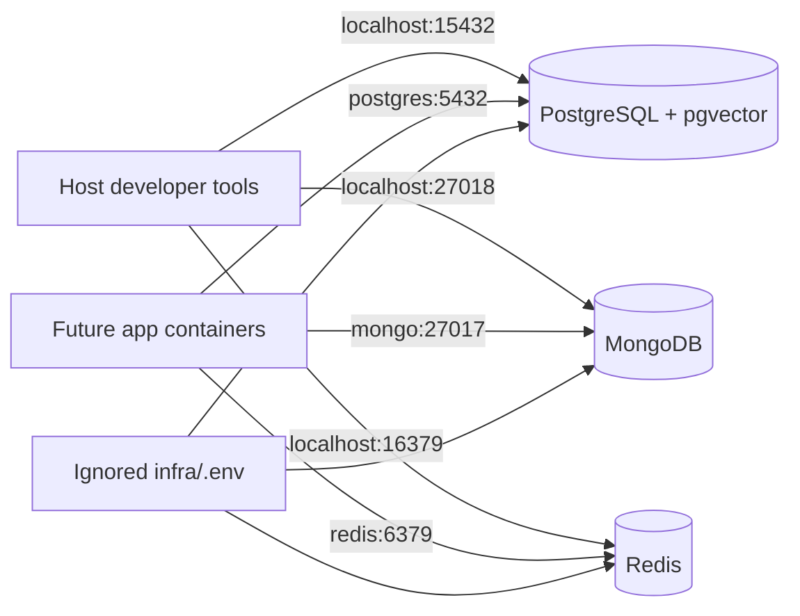
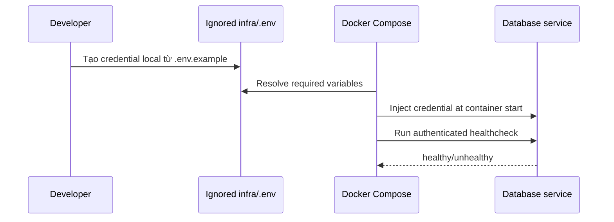

# TASK-INFRA-001 — Local database infrastructure

## Identity and Git context

- Owner/contributor: `loc`.
- Branch: `feature/TASK-INFRA-001`.
- Base/shared plan revision: `PLAN-0017`.
- Feature commit: `5936397`.
- Pull request: `#3`.
- Status: `VERIFIED`, `REVIEW`; chưa merge.

## Objective and write scope

- Objective: Docker Compose local cho PostgreSQL + pgvector, MongoDB, Redis và authenticated health checks.
- Owned paths: `infra/**`, file report này.
- Explicitly excluded: root tooling/app skeleton của `TASK-FOUND-001` và toàn bộ shared status/index/catalog files.

## PLAN_LOCKED

- Compose project: `hcm-museum`.
- PostgreSQL/pgvector: host `15432`, container `5432`, image `pgvector/pgvector:0.8.5-pg17-bookworm`.
- MongoDB: host `27018`, container `27017`, image `mongo:8.0.28-noble`.
- Redis: host `16379`, container `6379`, image `redis:8.8.1-alpine`.
- Named volumes: `postgres_data`, `mongo_data`, `redis_data`.
- Secret thật chỉ ở ignored `infra/.env`; repository chỉ có placeholder `infra/.env.example`.
- Estimate O/E/P: 1/2/3 person-days, confidence MEDIUM; actual effort UNKNOWN.

## Acceptance criteria

- Compose config render hợp lệ.
- Ba service có pinned image, named volume và authenticated healthcheck.
- Không commit secret/default production credential.
- Runbook mô tả start/stop/status/log, endpoints và destructive-volume warning.
- Runtime smoke chứng minh cả ba service healthy.

## System flow

Host processes dùng published ports; container tương lai dùng Compose DNS. `infra/.env` inject credential local và bị Git ignore. Named volumes giữ dữ liệu qua `docker compose down`; `down --volumes` là destructive user action.

## Authentication and secret path

Credential local có thể hiện trong Docker inspection nên không được tái sử dụng cho staging/production. Production phải dùng runtime secret/secret manager.

## Contribution ledger

| Session ID | Contributor | StartedAt | LastActiveAt | EndedAt | Status | Scope/output | Tests/evidence | Next |
|---|---|---|---|---|---|---|---|---|
| `WS-TASK-INFRA-001-20260803-01` | `loc` | `2026-08-03T11:50:45+07:00` | `2026-08-03T12:00:24+07:00` | `2026-08-03T12:00:24+07:00` | CLOSED | Compose, env boundary, volumes, healthchecks và runbook | Config + validation/user-env runtime PASS | PR review/merge |

## Implementation evidence

| Check | Result |
|---|---|
| `docker compose config --quiet` | PASS |
| Rendered services/images/ports/volumes/healthchecks | PASS |
| PostgreSQL readiness | PASS: accepting connections |
| pgvector availability | PASS: `0.8.5` |
| MongoDB readiness | PASS: ping `1` |
| Redis readiness | PASS: `PONG` with authentication |
| Environment boundary | PASS: `infra/.env` ignored; `.env.example` trackable |
| Secret-pattern scan | PASS |
| User verification | `VERIFIED` by `loc` at `2026-08-03T12:00:24+07:00` |

## Files

- `infra/compose.yaml`: three services, volumes, ports and healthchecks.
- `infra/.env.example`: placeholder-only local config.
- `infra/.gitignore`: excludes real local env.
- `infra/README.md`: runbook, endpoints, smoke and destructive-data warning.

## Known limitations and fallback

- Root scripts/root `.env.example`, migrations, app containers, Nginx and MinIO remain outside scope.
- Override occupied ports only through ignored `infra/.env`.
- Shared DevOps owner/index/status promotion waits for merge and Merge Memory Sync.

## Handoff

- Verification status: `VERIFIED`.
- Feature branch/commit: `feature/TASK-INFRA-001` / `5936397`.
- PR: `#3`, open.
- Merge status: not merged.
- Shared-file denylist check: pending cleanup commit that restores shared files to `origin/develop`.
- After merge: update DevOps owner, Implementation Index, Project Status, NEXT_WORK, README and traceability on `develop`.
