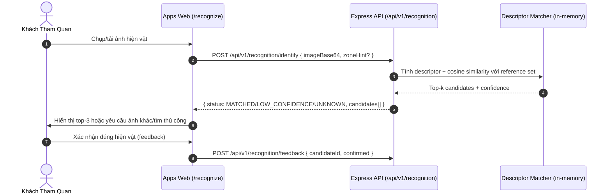
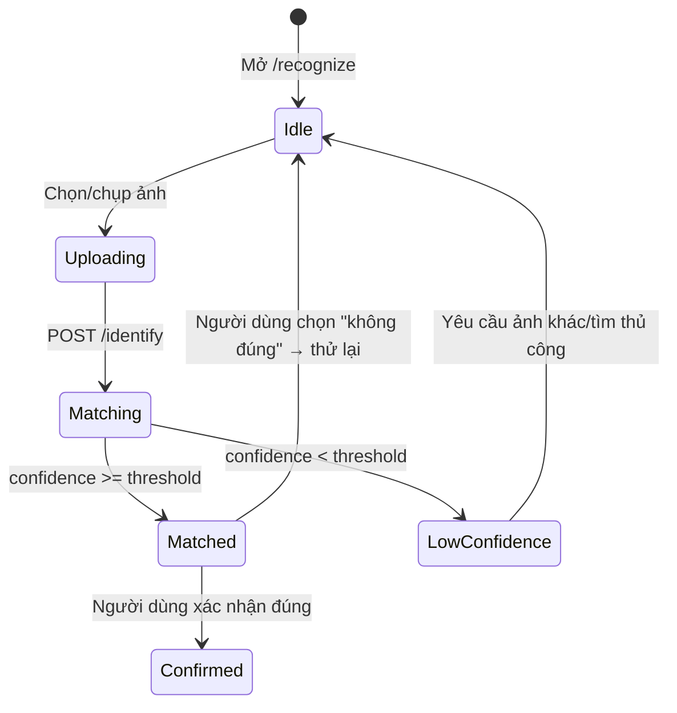

# TASK-RECOGNITION-001 — Artifact Photo Recognition AI Pipeline MVP

## Identity and Git context

- Owner/contributor: `thanh` (Trịnh Vĩ Thành; confirmed trong conversation hiện tại, khớp `docs/TEAM.md`).
- Branch: `feature/TASK-RECOGNITION-001`.
- Base/shared plan revision: `PLAN-0041` (claim commit trên `origin/develop`).
- Status: `IN_PROGRESS`.
- `PRE_CODE_PLAN_SYNC: PASS` — branch được tạo từ `origin/develop` ngay sau claim commit; write scope không overlap task khác đang `IN_PROGRESS` (`TASK-LOCATION-001`, `TASK-CMS-MEDIA-001` vẫn `READY`, chưa ai nhận).

## Objective and write scope

- Objective: Người dùng chụp ảnh hiện vật, hệ thống đề xuất top-k hiện vật phù hợp kèm confidence, theo đặc tả [04-artifact-recognition.md](../03-features/04-artifact-recognition.md) và invariant `INV-AI-002` (confidence thấp phải trả unknown/fallback, không khẳng định chắc chắn), `INV-AI-004` (không dùng ảnh người dùng để huấn luyện nếu chưa có consent).
- Owned paths: `packages/contracts/src/recognition/**`, `services/api/src/recognition/**`, `services/api/src/routes/recognition.ts`, `services/api/test/recognition*.ts`, `packages/ui/src/recognition/**`, `apps/web/src/recognition/**`, `docs/work/TASK-RECOGNITION-001.md`.
- Explicitly excluded: `.github/workflows/**`, shared status/coordination files (`README.md`, `docs/NEXT_WORK.md`, `docs/PLAN_SNAPSHOT.md`, `docs/PROJECT_STATUS.md`, `docs/IMPLEMENTATION_INDEX.md`, `docs/04-design/02-ui-component-registry.md`, `docs/07-delivery/05-traceability-matrix.md`) — chỉ cập nhật qua Merge Memory Sync trên `develop` sau merge.

## PLAN_LOCKED

- Selected Option (`DEC-RECOGNITION-001`): MVP dùng **deterministic visual descriptor + cosine similarity**, không dùng model CLIP/SigLIP thật, không gọi cloud Vision API. Server tính một vector đặc trưng cố định chiều dài trực tiếp từ byte ảnh upload (chunked byte-frequency histogram), so khớp cosine similarity với descriptor đã tính sẵn cho ảnh tham chiếu của từng hiện vật (seed data), rerank theo đúng công thức spec `score = 0.75*visual + 0.15*zonePrior + 0.10*metadataMatch`.
- Lý do chọn (quyết định bởi AI theo ủy quyền rõ ràng của `thanh`: "tự động làm, đừng hỏi lại, khuyến nghị thì làm"):
  - Nhất quán với pattern MVP đã có trong repo: Search dùng in-memory unaccent matching thay vì Meilisearch/OpenSearch thật; AI Guide dùng in-memory citation gating thay vì pgvector RAG thật; Dashboard dùng pre-aggregated metrics thay vì HyperLogLog thật. Tất cả đều hoãn runtime AI/vector thật thành "extension ở pha sau" có ghi rõ.
  - Không cần thư viện decode ảnh native (`sharp`) hay model/GPU — tránh dependency mới chưa được Option Review, tránh chi phí/độ trễ không kiểm chứng được (giống lý do `DEC-VOICE-001` từ chối cloud TTS khi chưa có credential).
  - Vẫn thỏa mãn behavior thật của spec: top-k + confidence threshold, rerank theo zone, fallback `UNKNOWN` khi confidence thấp — không phải stub giả lập kết quả cố định.
  - `pgvector` (đã là baseline tại `docs/01-architecture/02-technology-decisions.md`) là target vector store dài hạn; interface `RecognitionEngine` được thiết kế pluggable để cắm model/embedding thật sau này mà không đổi contract, cùng pattern với `TtsEngine` ở `TASK-VOICE-001`.
- Acceptance criteria: xem mục "Acceptance criteria" bên dưới (sẽ hoàn thiện cùng lúc với implementation).
- Estimate: 5–8 person-days, MEDIUM (theo registry); actual effort ghi sau khi có evidence.

## System sequence

### Flow explanation

1. Client upload ảnh (base64) kèm `zoneHint` tùy chọn (khu vực hiện tại nếu có).
2. Server tính descriptor từ byte ảnh, so khớp cosine similarity với reference descriptor của từng hiện vật đã duyệt, rerank theo zone/metadata.
3. Confidence dưới ngưỡng trả `UNKNOWN` kèm gợi ý chụp lại/tìm thủ công — không khẳng định chắc chắn (`INV-AI-002`).
4. Người dùng xác nhận/sửa kết quả; feedback được ghi nhận (không dùng để tự động huấn luyện lại — `INV-AI-004`).

## Architecture and State Flow

### State explanation

- **Uploading/Matching**: không tính lại descriptor nếu ảnh không đổi trong cùng request; không lưu ảnh gốc lâu dài ở MVP (giới hạn ghi trong Known limitations).
- **Matched/LowConfidence**: rẽ nhánh theo ngưỡng confidence cấu hình được, không cứng số liệu trong UI.
- **Confirmed**: feedback lưu để đánh giá sau, không tự động retrain.

## Technology inventory

| Hạng mục | Công nghệ / Package | Mục đích |
|---|---|---|
| Contracts | Zod (`packages/contracts/src/recognition/schemas.ts`) | Validate identify/feedback request-response |
| Backend | Express.js Router (`services/api/src/routes/recognition.ts`) | Endpoint identify/feedback/admin reference management |
| Descriptor engine | Pure TypeScript, không dependency ngoài (`services/api/src/recognition/descriptor.ts`) | Byte-frequency histogram descriptor + cosine similarity, pluggable `RecognitionEngine` interface |
| UI Component | Vanilla TypeScript/HTML (`packages/ui/src/recognition/renderer.ts`) | Upload widget, top-k result cards, low-confidence retry CTA |
| Web Page | `@hcmc-museum/web` (`apps/web/src/recognition/page.ts`) | Trang `/recognize` |

## Acceptance criteria

1. `POST /identify` trả top-k candidates kèm confidence, sắp xếp giảm dần theo score.
2. Confidence dưới ngưỡng trả `status: UNKNOWN`/`LOW_CONFIDENCE`, không trả candidate như chắc chắn đúng.
3. `zoneHint` khi có làm tăng rank hiện vật cùng khu vực (đúng công thức rerank trong spec).
4. `POST /feedback` ghi nhận xác nhận/sửa của người dùng, không tự động sửa reference descriptor.
5. Không hard-code danh sách hiện vật trong Web/UI — đến từ reference store (Admin-managed theo spec, hiện là in-memory seed).
6. Unit + integration tests PASS 100% trên 4 package liên quan.

## Feature lifecycle and Contribution ledger

| Mốc | Timestamp | Member/Actor | Evidence |
|---|---|---|---|
| Planned | 2026-07-29 | Nhóm | `docs/03-features/04-artifact-recognition.md` baseline |
| Claimed | 2026-09-02T03:39:02+07:00 | `thanh` | Coordination commit trên `origin/develop` (`PLAN-0041`) |
| Implementation started | 2026-09-02 | `thanh` | Session này |
| VERIFIED/Merged/Completed | Chưa có | — | Chờ implementation + xác nhận |

| Session ID | Contributor | Role | Task/Branch | StartedAt | LastActiveAt | EndedAt | Status | Scope/Output | Tests/Evidence | Handoff/Next |
|---|---|---|---|---|---|---|---|---|---|---|
| WS-TASK-RECOGNITION-001-20260902-01 | `thanh` | implement | TASK-RECOGNITION-001 / `feature/TASK-RECOGNITION-001` | 2026-09-02T03:39:02+07:00 | 2026-09-02T03:39:02+07:00 | — | `ACTIVE` | Pre-Code Plan Sync, DEC-RECOGNITION-001, task report skeleton | `NOT RUN` | Implementation tiếp theo trong cùng phiên |

## Testing evidence

Chưa chạy — implementation sẽ theo ngay sau khi mở task report này. Sẽ cập nhật bảng kết quả lint/typecheck/test/prettier thật sau khi code xong (cùng pattern `TASK-VOICE-001`: `npx turbo run lint typecheck test --force` trên 4 package liên quan).

## Handoff

- **Verification status**: Chưa `IMPLEMENTED` — task report này mở tại thời điểm bắt đầu code, sẽ cập nhật đầy đủ khi hoàn tất.
- **Feature branch**: `feature/TASK-RECOGNITION-001`.
- **Merge status**: Chưa merge.

## Change history

| Ngày | Loại | Thay đổi | Test/Bằng chứng |
|---|---|---|---|
| 2026-09-02 | ADDED | Mở task report, khóa `DEC-RECOGNITION-001` (deterministic descriptor MVP, quyết định bởi AI theo ủy quyền của `thanh`) | Chưa có test — implementation tiếp theo |
