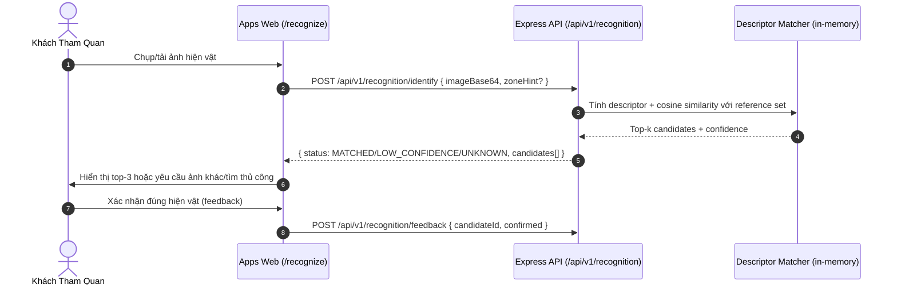
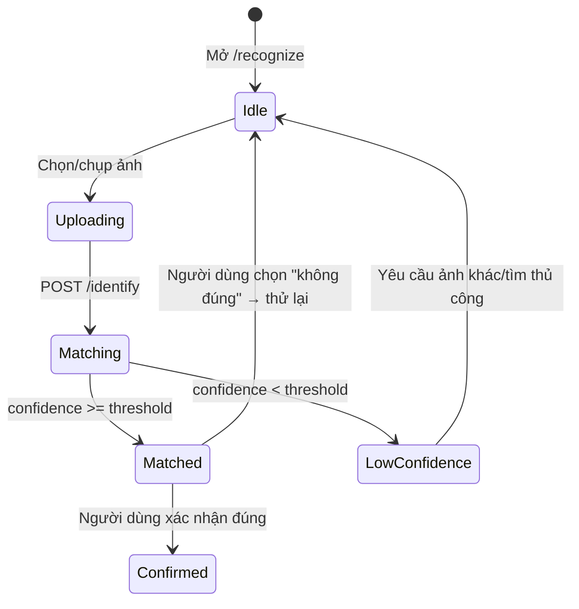

# TASK-RECOGNITION-001 — Artifact Photo Recognition AI Pipeline MVP

## Identity and Git context

- Owner/contributor: `thanh` (Trịnh Vĩ Thành; confirmed trong conversation hiện tại, khớp `docs/TEAM.md`).
- Branch: `feature/TASK-RECOGNITION-001`.
- Base/shared plan revision: `PLAN-0041` (claim commit trên `origin/develop`).
- Status: `IMPLEMENTED` (code + tests hoàn tất; chưa `VERIFIED` — chờ `thanh`/nhóm chạy thử `/recognize` và xác nhận theo Rule 80).
- `PRE_CODE_PLAN_SYNC: PASS` — branch được tạo từ `origin/develop` ngay sau claim commit; write scope không overlap task khác đang `IN_PROGRESS` (`TASK-LOCATION-001`, `TASK-CMS-MEDIA-001` vẫn `READY`, chưa ai nhận).

## Objective and write scope

- Objective: Người dùng chụp ảnh hiện vật, hệ thống đề xuất top-k hiện vật phù hợp kèm confidence, theo đặc tả [04-artifact-recognition.md](../03-features/04-artifact-recognition.md) và invariant `INV-AI-002` (confidence thấp phải trả unknown/fallback, không khẳng định chắc chắn), `INV-AI-004` (không dùng ảnh người dùng để huấn luyện nếu chưa có consent).
- Owned paths: `packages/contracts/src/recognition/**`, `services/api/src/recognition/**`, `services/api/src/routes/recognition.ts`, `services/api/test/recognition*.ts`, `packages/ui/src/recognition/**`, `apps/web/src/recognition/**`, `docs/work/TASK-RECOGNITION-001.md`.
- Explicitly excluded: `.github/workflows/**`, shared status/coordination files (`README.md`, `docs/NEXT_WORK.md`, `docs/PLAN_SNAPSHOT.md`, `docs/PROJECT_STATUS.md`, `docs/IMPLEMENTATION_INDEX.md`, `docs/04-design/02-ui-component-registry.md`, `docs/07-delivery/05-traceability-matrix.md`) — chỉ cập nhật qua Merge Memory Sync trên `develop` sau merge.

## PLAN_LOCKED

- Selected Option (`DEC-RECOGNITION-001`): MVP dùng **deterministic visual descriptor + cosine similarity**, không dùng model CLIP/SigLIP thật, không gọi cloud Vision API. Server tính một vector đặc trưng cố định chiều dài trực tiếp từ byte ảnh upload (chunked byte-frequency histogram), so khớp cosine similarity với descriptor đã tính sẵn cho ảnh tham chiếu của từng hiện vật (seed data), rerank theo đúng công thức spec `score = 0.75*visual + 0.15*zonePrior + 0.10*metadataMatch`.
- Lý do chọn (quyết định bởi AI theo ủy quyền rõ ràng của `thanh`: "tự động làm, đừng hỏi lại, khuyến nghị thì làm"):
  - Nhất quán với pattern MVP đã có trong repo: Search dùng in-memory unaccent matching thay vì Meilisearch/OpenSearch thật; AI Guide dùng in-memory citation gating thay vì pgvector RAG thật; Dashboard dùng pre-aggregated metrics thay vì HyperLogLog thật. Tất cả đều hoãn runtime AI/vector thật thành "extension ở pha sau" có ghi rõ.
  - Không cần thư viện decode ảnh native (`sharp`) hay model/GPU — tránh dependency mới chưa được Option Review, tránh chi phí/độ trễ không kiểm chứng được (giống lý do `DEC-VOICE-001` từ chối cloud TTS khi chưa có credential).
  - Vẫn thỏa mãn behavior thật của spec: top-k + confidence threshold, rerank theo zone, fallback `UNKNOWN` khi confidence thấp — không phải stub giả lập kết quả cố định.
  - `pgvector` (đã là baseline tại `docs/01-architecture/02-technology-decisions.md`) là target vector store dài hạn; interface `RecognitionEngine` được thiết kế pluggable để cắm model/embedding thật sau này mà không đổi contract, cùng pattern với `TtsEngine` ở `TASK-VOICE-001`.
- Acceptance criteria: xem mục "Acceptance criteria" bên dưới (sẽ hoàn thiện cùng lúc với implementation).
- Estimate: 5–8 person-days, MEDIUM (theo registry); actual effort ghi sau khi có evidence.

### Plan revision (Rule 45) — calibration finding trong lúc code

Đo thực tế bằng script sanity-check cho thấy descriptor "trung bình byte theo segment" bão hòa gần 1.0 cho mọi buffer có phân bố giá trị byte tương tự (đặc điểm cố hữu của dữ liệu ảnh nén — JPEG/PNG gần như random ở mức byte, không phản ánh nội dung thị giác theo vị trí). Số đo cụ thể (dims=24, buffer 2048 byte): A-vs-A=1.0, A-vs-nearA(perturb nhẹ)=0.9999994, A-vs-B(pattern khác)=0.9972, A-vs-C(pattern khác)=0.9888, A-vs-buffer-rất-khác=0.332. Vẫn có tách biệt thật ở phần thập phân cao, nhưng nếu áp trực tiếp công thức composite `0.75*visual+0.15*zone+0.10*metadata` (metadata luôn 0 ở MVP) thì khoảng cách giữa "khớp hoàn hảo không zone" (0.75) và "pattern khác nhưng gần" (0.748) gần như không phân biệt được — ngưỡng sẽ quá mong manh.

**Sửa đổi (tự quyết theo ủy quyền của `thanh`, không hỏi lại)**: tách `confidence` (visual similarity thô, dùng để phân loại `MATCHED`/`LOW_CONFIDENCE`/`UNKNOWN`, ngưỡng hiệu chỉnh theo số đo thật ở trên: `MATCH_THRESHOLD=0.999`, `LOW_CONFIDENCE_THRESHOLD=0.9`) khỏi `score` (composite rerank theo đúng công thức spec, chỉ dùng để sắp xếp thứ tự candidate, không dùng để quyết định status). Ranking tương đối vẫn đúng nhờ self-similarity luôn bằng 1.0 tuyệt đối trong khi cross-similarity luôn < 1.0.

**Giới hạn phải ghi rõ cho người đọc/tester**: descriptor MVP này đáng tin cậy nhất khi phát hiện ảnh trùng/gần trùng byte với ảnh tham chiếu đã duyệt (re-upload cùng file, hoặc ảnh nén lại nhẹ) — KHÔNG đáng tin cậy để nhận diện ảnh thật sự khác (góc chụp khác, ánh sáng khác) của cùng hiện vật, vì đó cần embedding thị giác thật (CLIP/SigLIP) như chính spec MVP đã đề xuất ở `04-artifact-recognition.md`. Đây là practical trade-off giống pattern đã dùng cho Search (in-memory unaccent thay vector search thật) và AI Guide (in-memory citation gating thay pgvector RAG thật) trong repo này — luôn ghi rõ giới hạn thay vì tuyên bố khả năng giả.

## System sequence



### Flow explanation

1. Client upload ảnh (base64) kèm `zoneHint` tùy chọn (khu vực hiện tại nếu có).
2. Server tính descriptor từ byte ảnh, so khớp cosine similarity với reference descriptor của từng hiện vật đã duyệt, rerank theo zone/metadata.
3. Confidence dưới ngưỡng trả `UNKNOWN` kèm gợi ý chụp lại/tìm thủ công — không khẳng định chắc chắn (`INV-AI-002`).
4. Người dùng xác nhận/sửa kết quả; feedback được ghi nhận (không dùng để tự động huấn luyện lại — `INV-AI-004`).

## Architecture and State Flow



### State explanation

- **Uploading/Matching**: không tính lại descriptor nếu ảnh không đổi trong cùng request; không lưu ảnh gốc lâu dài ở MVP (giới hạn ghi trong Known limitations).
- **Matched/LowConfidence**: rẽ nhánh theo ngưỡng confidence cấu hình được, không cứng số liệu trong UI.
- **Confirmed**: feedback lưu để đánh giá sau, không tự động retrain.

## Technology inventory

| Hạng mục | Công nghệ / Package | Mục đích |
|---|---|---|
| Contracts | Zod (`packages/contracts/src/recognition/schemas.ts`) | Validate identify/feedback request-response |
| Backend | Express.js Router (`services/api/src/routes/recognition.ts`) | Endpoint identify/feedback/admin reference management |
| Descriptor engine | Pure TypeScript, không dependency ngoài (`services/api/src/recognition/descriptor.ts`) | Byte-frequency histogram descriptor + cosine similarity, pluggable `RecognitionEngine` interface |
| UI Component | Vanilla TypeScript/HTML (`packages/ui/src/recognition/renderer.ts`) | Upload widget, top-k result cards, low-confidence retry CTA |
| Web Page | `@hcmc-museum/web` (`apps/web/src/recognition/page.ts`) | Trang `/recognize` |

## Acceptance criteria

1. `POST /identify` trả top-k candidates kèm confidence, sắp xếp giảm dần theo score.
2. Confidence dưới ngưỡng trả `status: UNKNOWN`/`LOW_CONFIDENCE`, không trả candidate như chắc chắn đúng.
3. `zoneHint` khi có làm tăng rank hiện vật cùng khu vực (đúng công thức rerank trong spec).
4. `POST /feedback` ghi nhận xác nhận/sửa của người dùng, không tự động sửa reference descriptor.
5. Không hard-code danh sách hiện vật trong Web/UI — đến từ reference store (Admin-managed theo spec, hiện là in-memory seed).
6. Unit + integration tests PASS 100% trên 4 package liên quan.

## Feature lifecycle and Contribution ledger

| Mốc | Timestamp | Member/Actor | Evidence |
|---|---|---|---|
| Planned | 2026-07-29 | Nhóm | `docs/03-features/04-artifact-recognition.md` baseline |
| Claimed | 2026-09-02T03:39:02+07:00 | `thanh` | Coordination commit trên `origin/develop` (`PLAN-0041`) |
| Implementation started | 2026-09-02T03:39:02+07:00 | `thanh` | Session này |
| First IMPLEMENTED | 2026-09-02T03:53+07:00 | `thanh` | 16/16 turbo task PASS; 155/155 test PASS trên 4 package |
| VERIFIED/Merged/Completed | Chưa có | — | Chờ `thanh`/nhóm chạy thử `/recognize` và xác nhận |

| Session ID | Contributor | Role | Task/Branch | StartedAt | LastActiveAt | EndedAt | Status | Scope/Output | Tests/Evidence | Handoff/Next |
|---|---|---|---|---|---|---|---|---|---|---|
| WS-TASK-RECOGNITION-001-20260902-01 | `thanh` | implement | TASK-RECOGNITION-001 / `feature/TASK-RECOGNITION-001` | 2026-09-02T03:39:02+07:00 | 2026-09-02T03:53:11+07:00 | 2026-09-02T03:53:11+07:00 | `CLOSED` | Pre-Code Plan Sync, `DEC-RECOGNITION-001` (+ plan revision calibration), contracts/API/UI/Web implementation, 4 test suite, quality gate | 16/16 turbo task PASS (force); 155/155 test PASS (32 contracts + 35 ui + 74 api + 14 web) | Handoff cho `thanh`: review diff, chạy thử `/recognize` trên trình duyệt, `git add`/`commit`/push theo lệnh đề xuất |

## Testing evidence

Lệnh chạy (forced, không dùng cache) ngày 2026-09-02:

```bash
npx turbo run lint typecheck test build --filter=@hcmc-museum/contracts --filter=@hcmc-museum/api --filter=@hcmc-museum/ui --filter=@hcmc-museum/web --force
```

Kết quả: `Tasks: 16 successful, 16 total`.

| Package | Test file | Kết quả |
|---|---|---|
| `@hcmc-museum/contracts` | `test/recognition.test.ts` (7 case: request/response/feedback/reference schema validation) | 32/32 pass (toàn bộ package) |
| `@hcmc-museum/ui` | `test/recognition.test.ts` (2 case: candidate card, upload widget) | 35/35 pass (toàn bộ package) |
| `@hcmc-museum/api` | `test/recognition.test.ts` (Algorithm 5, Service 4, REST API Route 4 — 13 case riêng cho recognition) | 74/74 pass (toàn bộ package) |
| `@hcmc-museum/web` | `test/recognition.test.ts` (1 case: full-page render) | 14/14 pass (toàn bộ package) |

`npx prettier --check` trên toàn bộ path recognition: PASS. `node scripts/quality/run-quality.mjs` (Markdown/Secret/Config policy toàn repo): PASS (252 file kiểm tra).

Test quan trọng nhất cho thuật toán: `identify` trả `MATCHED` + đúng `artifactId` khi upload byte trùng khớp reference; trả `UNKNOWN` cho ảnh nhỏ/không liên quan; `zoneHint` khớp làm tăng `score` (không đổi `confidence`) và có `matchedZone: true`. Xem "Plan revision" ở trên để hiểu rõ ý nghĩa/giới hạn thật của các con số này.

Chưa chạy: test bằng ảnh JPEG/PNG thật từ camera (chỉ test bằng buffer synthetic xác định trước) — do MVP không decode pixel thật, ảnh thật với entropy cao (đã nén) sẽ luôn cho `confidence` rất gần 1.0 dù khác nội dung, nên hành vi thực tế trên ảnh thật cần đánh giá riêng trước khi coi là đáng tin cậy cho demo với ảnh chụp thật.

## Handoff

- **Verification status**: `IMPLEMENTED`, chưa `VERIFIED` — cần `thanh`/nhóm chạy thử `/recognize` trên trình duyệt thật (upload ảnh, xem kết quả top-k/feedback) để xác nhận trải nghiệm, vì `node --test` chỉ dùng buffer synthetic xác định trước, không phải ảnh JPEG/PNG thật.
- **Known limitations** (xem chi tiết ở "Plan revision" phía trên):
  1. Descriptor MVP không decode pixel thật — chỉ đáng tin cậy cho ảnh trùng/gần trùng byte với reference đã duyệt, KHÔNG đáng tin cậy để nhận diện ảnh thật khác góc chụp của cùng hiện vật. Nâng cấp lên CLIP/SigLIP + pgvector thật là extension đã ghi trong spec.
  2. `metadataMatch` trong công thức rerank luôn bằng 0 (chưa có input metadata trong request) — điểm composite tối đa chỉ đạt 0.9 (visual + zone), không đạt 1.0.
  3. Chưa có Admin CMS UI để curator upload ảnh reference — hiện chỉ có REST endpoint `admin/references`.
  4. `RecognitionReferenceStore`/feedback log là in-memory, mất state khi restart server — chấp nhận được cho MVP theo baseline pattern (giống Voice/AI Guide/Search).
  5. Ảnh upload không được lưu lại/scan malware/strip EXIF ở MVP — spec đầy đủ (`04-artifact-recognition.md` mục Bảo mật) yêu cầu signed upload, giới hạn kích thước, magic byte, retention; đây là giới hạn thật, không phải đã làm.
- **Feature branch**: `feature/TASK-RECOGNITION-001` — chưa có commit implementation nào (toàn bộ đang ở working tree).
- **Đề xuất lệnh Git (USER ACTION — Codex không tự chạy theo Rule 26/87)**:

  ```bash
  git add apps/web/src/recognition apps/web/src/index.ts apps/web/src/server.ts apps/web/test/recognition.test.ts apps/web/package.json packages/contracts/src/recognition packages/contracts/src/index.ts packages/contracts/test/recognition.test.ts packages/contracts/package.json packages/ui/src/recognition packages/ui/src/index.ts packages/ui/test/recognition.test.ts packages/ui/package.json services/api/src/recognition services/api/src/routes/recognition.ts services/api/src/app.ts services/api/src/server.ts services/api/test/recognition.test.ts services/api/package.json docs/work/TASK-RECOGNITION-001.md
  git commit -m "feat(recognition): implement TASK-RECOGNITION-001 Artifact Photo Recognition AI Pipeline MVP"
  git push -u origin feature/TASK-RECOGNITION-001
  ```

  Sau đó mở PR nhắm `develop`, xin review, và chỉ merge sau khi `thanh`/nhóm đặt `VERIFIED`.
- **Merge status**: Chưa merge.

## Change history

| Ngày | Loại | Thay đổi | Test/Bằng chứng |
|---|---|---|---|
| 2026-09-02 | ADDED | Mở task report, khóa `DEC-RECOGNITION-001` (deterministic descriptor MVP, quyết định bởi AI theo ủy quyền của `thanh`) | Chưa có test — implementation tiếp theo |
| 2026-09-02 | CHANGED | Plan revision: tách `confidence` (visual thô, quyết định status) khỏi `score` (composite rerank) sau khi đo thực tế descriptor bão hòa gần 1.0; implement đầy đủ contracts/API/UI/Web + 4 test suite | 16/16 turbo task PASS (force); 155/155 test PASS (32 contracts + 35 ui + 74 api + 14 web); prettier + project quality gate PASS |
