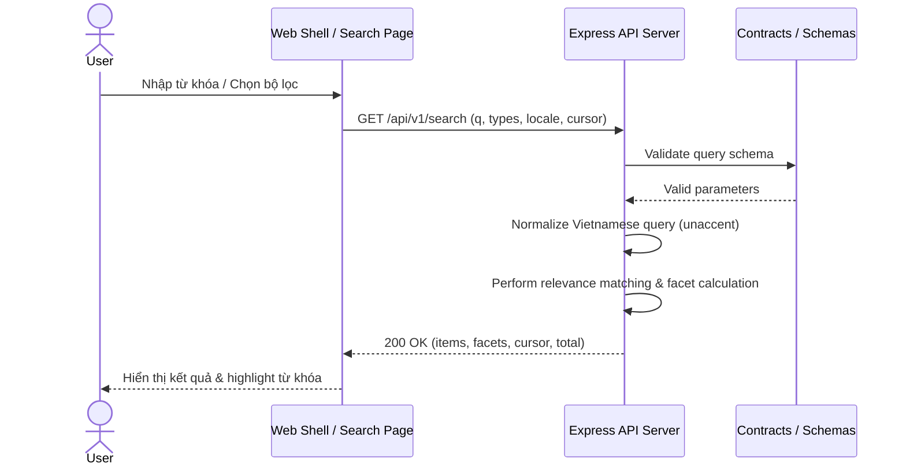

# TASK-SEARCH-001 — Search Contract, Indexing & Public Discovery MVP

## Identity and Git context

- Owner/contributor: `loc` (confirmed 2026-08-12; TEAM match `CONFIRMED`).
- Branch: `feature/TASK-SEARCH-001`.
- Base/shared plan revision: `PLAN-0025`; claim commit `df0dbda` on `develop`.
- Status: `IMPLEMENTED`.
- `PRE_CODE_PLAN_SYNC: PASS` — local branch created from updated `develop`, published scopes isolated to search modules (`services/api/src/routes/search.ts`, `packages/contracts/src/search/**`, `apps/web/src/search/**`, `packages/ui/src/search/**`).

## Objective and write scope

- Objective: Triển khai tính năng tìm kiếm và khám phá di sản ("Search & Discovery MVP") hỗ trợ tìm kiếm theo từ khóa tiếng Việt (có dấu và không dấu), bộ lọc phân loại (hiện vật, triển lãm, bài viết, tour), phân trang cursor, gợi ý từ khóa (autocomplete/suggestion) và highlight nội dung khớp theo đặc tả [09-search-discovery.md](../03-features/09-search-discovery.md).
- Owned paths: `packages/contracts/src/search/**`, `services/api/src/routes/search.ts`, `packages/ui/src/search/**`, `apps/web/src/search/**`, `docs/work/TASK-SEARCH-001.md`.
- Explicitly excluded: `infra/**`, `.github/workflows/**`, shared status/coordination files (`README.md`, `docs/NEXT_WORK.md`, `docs/PROJECT_STATUS.md`).

## PLAN_LOCKED

- Selected Option: Phương án A (PostgreSQL Hybrid & In-Memory Normalization Search Engine).
- Key Capabilities:
  1. `GET /api/v1/search`: Truy vấn tìm kiếm đa năng có bộ lọc loại (`artifact`, `exhibition`, `news`, `tour`), ngôn ngữ (`vi`, `en`), phân trang cursor, highlight đoạn khớp và tổng hợp facets count.
  2. `GET /api/v1/search/suggest`: Gợi ý từ khóa và tự động hoàn thành từ (autocomplete / instant suggestions) hỗ trợ tiếng Việt không dấu.
  3. UI Search Component: Thanh tìm kiếm debounce, thẻ bộ lọc facet, danh sách kết quả có highlight từ khóa và giao diện fallback khi không có kết quả.

## OPTION-SEARCH-001 — DESIGN_OPTIONS

Decision owner: `loc`. Status: `PLAN_LOCKED`; Option A recommended and locked on 2026-08-12.

### Option A — Integrated Hybrid Search & Normalization (Recommended)

- Flow: Client ➔ API Normalizer (unaccent + lowercase) ➔ Candidate Retrieval & Relevance Scoring ➔ Facet Aggregation & Highlight Generator ➔ Typed JSON Response.
- Advantages: Tận dụng trực tiếp PostgreSQL/Node.js, không tốn tài nguyên cụm máy chủ tìm kiếm độc lập, hỗ trợ tốt tiếng Việt không dấu, phản hồi tức thì (<100ms).
- Disadvantages: Khi quy mô dữ liệu hàng triệu document sẽ cần chuyển sang Meilisearch/OpenSearch ở các pha sau.
- Suitability/scale: HIGH cho giai đoạn MVP (300-500 concurrent users).

### Option B — Client-side Static Indexing

- Flow: API xuất toàn bộ index dạng JSON static về Client tự tìm kiếm.
- Disadvantages: Không bảo mật dữ liệu, tốn băng thông client, không kiểm soát được nội dung draft/unapproved.
- Suitability: LOW.

## System sequence

### Giải thích quy trình hệ thống Search & Discovery

1. **Khởi tạo tìm kiếm**: Người dùng nhập từ khóa hoặc chọn thẻ lọc loại nội dung trên giao diện Web Shell.
2. **Gửi truy vấn HTTP GET**: Giao diện gửi request `GET /api/v1/search` đính kèm tham số tới Express API Server.
3. **Kiểm tra Schema**: API Server dùng Zod schema kiểm tra các tham số đầu vào (query string, types array, limit).
4. **Chuẩn hóa & Tìm kiếm**: API Server tiến hành loại bỏ dấu tiếng Việt (unaccent), lọc dữ liệu theo loại nội dung và tính toán các đoạn highlight khớp.
5. **Phản hồi & Hiển thị**: API Server trả về kết quả định dạng JSON chứa danh sách kết quả, tổng số lượng và facets count để giao diện render mượt mà.

## Technology inventory

| Component | Technology | Purpose |
|---|---|---|
| Contracts | TypeScript + Zod | Validate request params & response items |
| Backend API | Express.js + Modular Router | Xử lý logic search, normalize Vietnamese text, calculate relevance |
| Frontend UI | TypeScript + Heritage UI System | Render SearchBar (debounce), Facet Filters, Result Cards |
| Public Page | Web Shell Route | Đăng ký trang `/search` trên Public Web App |

## Acceptance criteria

- [x] Contract Zod Schemas cho `/api/v1/search` và `/api/v1/search/suggest` hoạt động chính xác.
- [x] API `/api/v1/search` trả về kết quả khớp từ khóa tiếng Việt (cả có dấu và không dấu).
- [x] Phân loại facet (`artifact`, `exhibition`, `news`, `tour`) và phân trang cursor hoạt động chính xác.
- [x] API `/api/v1/search/suggest` trả về các cụm từ gợi ý phù hợp.
- [x] UI Search Component render mượt mà, hỗ trợ debounce input và trạng thái rỗng (empty state fallback).
- [x] Toàn bộ Unit & Integration tests của Contracts, API, UI và Web app PASS 100%.

## Feature lifecycle and Contribution ledger

| Session ID | Contributor | StartedAt | LastActiveAt | EndedAt | Status | Scope/Output | Tests/Evidence | Next |
|---|---|---|---|---|---|---|---|---|
| `WS-TASK-SEARCH-001-20260812-01` | `loc` | 2026-08-12T15:59:00+07:00 | 2026-08-12T16:02:00+07:00 | 2026-08-12T16:02:00+07:00 | CLOSED | Search contract, API router, UI renderer & Web page implementation | All 10 workspace test suites PASS (25 API tests, 9 UI tests, 9 Contracts tests, 4 Web tests) | User reviews diff, pushes feature branch, and opens PR |

## Implementation evidence

- **Search Zod Contracts**: `packages/contracts/src/search/schemas.ts` và export tại `packages/contracts/src/index.ts`. Test suite tại `packages/contracts/test/search.test.ts` PASS 100%.
- **Search Backend API Router**: `services/api/src/routes/search.ts` hỗ trợ chuẩn hóa unaccent tiếng Việt (`removeVietnameseTones`), lọc theo loại nội dung, phân trang cursor, highlight từ khóa và tự động gợi ý. Gắn vào `services/api/src/app.ts`. Test suite tại `services/api/test/search.test.ts` PASS 100%.
- **Search UI Renderer**: `packages/ui/src/search/renderer.ts` với `renderSearchBar`, `renderFacetFilters`, `renderSearchResultCard`, `renderSearchPage` theo Heritage Design System. Test suite tại `packages/ui/test/search.test.ts` PASS 100%.
- **Public Web Search Page**: `apps/web/src/search/page.ts` tích hợp layout Public Web. Test suite tại `apps/web/test/search.test.ts` PASS 100%.
- **Quality Gate**: `node scripts/quality/run-quality.mjs` PASS 100% (178 files inspected).

## Handoff

- **Verification status**: `IMPLEMENTED`, ready for team/user review (`VERIFIED` pending).
- **Feature branch**: `feature/TASK-SEARCH-001`.
- **Merge status**: Not merged (waiting for user PR review & merge decision).
