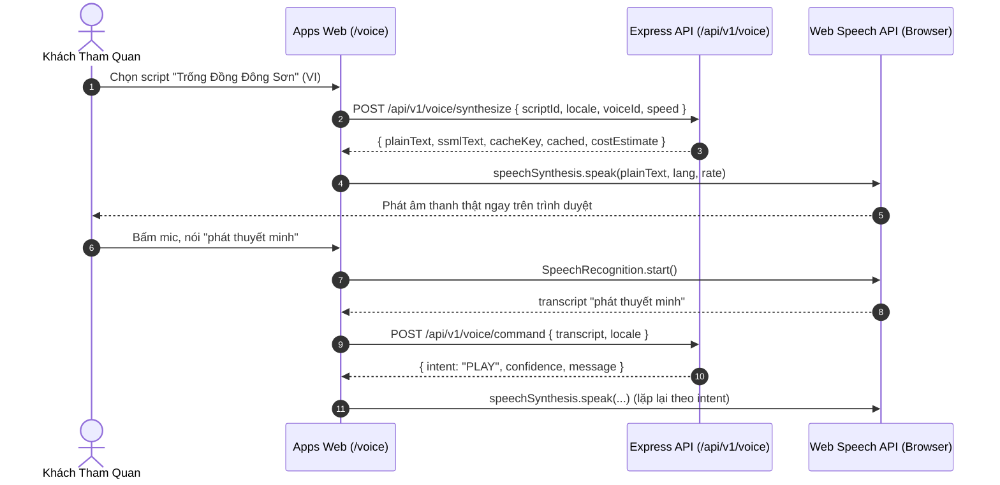
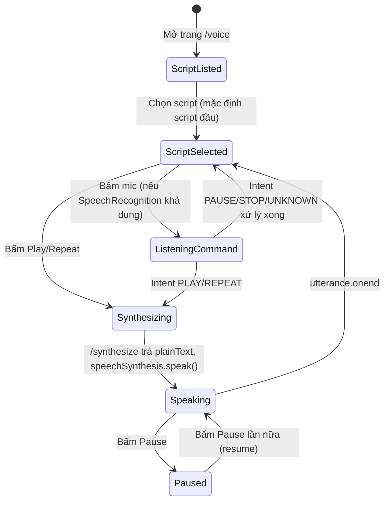

# TASK-VOICE-001 — Multilingual Audio Guide & Voice Command MVP

## Identity and Git context

- Owner/contributor: `thanh` (Trịnh Vĩ Thành; confirmed trong conversation hiện tại, khớp `docs/TEAM.md`, khớp Git author `trinhvithanh147`).
- Branch: `feature/TASK-VOICE-001`.
- Base/shared plan revision: `PLAN-0039` (claim commit `5a742b5`, đã push lên `origin/develop`; branch hiện tại trùng chính xác commit này — 0 ahead/0 behind).
- Status: `DONE` (`VERIFIED` bởi `thanh` — tự test `/voice` trên trình duyệt thật, audio + mic hoạt động đúng; `MergedAt`: 2026-09-02; merge `1bbbe07` qua PR `#20`; Merge Memory Sync `PASS` tại `PLAN-0040`).
- `PRE_CODE_PLAN_SYNC: PASS` — `feature/TASK-VOICE-001` được tạo đúng từ `origin/develop` tại commit claim `5a742b5`; write scope không overlap task khác đang `IN_PROGRESS`.

## Objective and write scope

- Objective: Cung cấp thuyết minh hiện vật đa ngôn ngữ (VI/EN) và điều khiển bằng giọng nói trên Public Web, theo đặc tả [06-multilingual-voice.md](../03-features/06-multilingual-voice.md) và quyết định `DEC-VOICE-001` (khóa tại `PLAN-0039`): dùng Web Speech API trình duyệt (`SpeechSynthesis` + `SpeechRecognition`) làm engine mặc định — âm thanh thật, miễn phí, không cần credential; backend giữ kiến trúc script/bản dịch/cache-key hash đúng spec và thiết kế sẵn interface (`TtsEngine`) để cắm cloud TTS/STT thật sau này.
- Owned paths (theo registry `docs/NEXT_WORK.md`): `packages/contracts/src/voice/**`, `services/api/src/voice/**`, `services/api/src/routes/voice.ts`, `services/api/test/voice*.ts`, `packages/ui/src/voice/**`, `apps/web/src/voice/**`, `docs/work/TASK-VOICE-001.md`.
- Deviation ghi nhận: registry viết tắt write scope theo pattern `src/voice/**`; phiên này còn bổ sung `apps/web/test/voice.test.ts` và cập nhật script `test` trong 4 `package.json` (`apps/web`, `packages/contracts`, `packages/ui`, `services/api`) để đăng ký `voice.test.js` — theo đúng pattern mà 3 package kia đã tự áp dụng sẵn (chỉ `apps/web` còn thiếu). Không có test nào cho `apps/web` là vi phạm Rule 8 ("Do not report a feature complete until its documented acceptance criteria can be tested"), nên phần bổ sung này được coi là hoàn thiện write scope đã claim, không phải mở rộng scope mới.
- Explicitly excluded: `.github/workflows/**`, shared status/coordination files (`README.md`, `docs/NEXT_WORK.md`, `docs/PLAN_SNAPSHOT.md`, `docs/PROJECT_STATUS.md`, `docs/IMPLEMENTATION_INDEX.md`, `docs/07-delivery/05-traceability-matrix.md`) — các file này chỉ được cập nhật qua Merge Memory Sync trên `develop` sau merge (theo tiền lệ commit `df0dbda`, `a546c97`, ... chỉ sửa traceability matrix trong `docs(sync)` commit, không trên feature branch).

## PLAN_LOCKED

- Selected Option: `DEC-VOICE-001` — Web Speech API trình duyệt (browser-native `SpeechSynthesis` cho đọc, `SpeechRecognition`/`webkitSpeechRecognition` cho lệnh giọng nói) làm engine mặc định cho MVP; không tích hợp cloud TTS/STT thật vì chưa có credential kiểm chứng được trong môi trường triển khai hiện tại.
- Key capabilities:
  - Admin-curated multilingual scripts (VI/EN) qua `VoiceScriptStore`, chỉ `PUBLISHED` mới lộ ra endpoint public — tuân thủ Admin Invariant (`PLAN-0038`).
  - Glossary/pronunciation correction (`VoiceGlossaryStore`) áp dụng thuật ngữ dài nhất trước, sinh SSML `<sub alias>` cho tên riêng/thuật ngữ cổ.
  - Cache TTS theo hash `plainText + voiceId + speed + locale + engineVersion` (`stableHash`), không tái tạo audio nếu hash không đổi — đúng spec cache-key trong `06-multilingual-voice.md`.
  - Voice command interpreter (`interpretCommand`) nhận diện `PLAY/PAUSE/REPEAT/STOP/NAVIGATE/UNKNOWN` bằng từ khóa VI/EN, trả `confidence` + `targetSlug` khi có.
  - Admin cost-estimate endpoint trả `estimatedCost: 0` cho engine mặc định miễn phí, sẵn sàng khác 0 khi bật `cloudEngineEnabled`.
- Estimate: 4–7 person-days, MEDIUM (theo registry); actual effort chưa có bằng chứng đáng tin cậy từ phiên trước (xem Feature lifecycle) nên không ghi actual effort.

## System sequence



### Flow explanation

1. Khách chọn một script đã `PUBLISHED` từ danh sách (`GET /api/v1/voice/scripts`, lọc theo locale/artifactId).
2. Client gọi `POST /voice/synthesize`; server áp glossary pronunciation, build SSML, tính cache key và trả `plainText` để trình duyệt tự đọc bằng `SpeechSynthesisUtterance` — không có audio file server-side, đúng nguyên tắc "miễn phí, không cần credential" của `DEC-VOICE-001`.
3. Khi bấm mic, `SpeechRecognition` của trình duyệt chuyển giọng nói thành `transcript`, gửi lên `POST /voice/command` để server suy luận intent bằng từ khóa; client thực thi hành động tương ứng (play/pause/stop/repeat/điều hướng) hoặc hiển thị `message` nếu `UNKNOWN`.
4. Nếu trình duyệt không hỗ trợ `speechSynthesis`/`SpeechRecognition`, UI vô hiệu hóa nút liên quan và hiện thông báo fallback (`voice-unsupported-notice`, mic button `disabled`).

## Architecture and State Flow



### State explanation

- **ScriptListed/ScriptSelected**: danh sách script published render sẵn từ server (SSR), script đầu tiên tự chọn để transcript luôn có nội dung.
- **Synthesizing**: gọi `/synthesize`, chờ `plainText` trước khi phát — không phát audio giả/placeholder.
- **Speaking/Paused**: điều khiển trực tiếp qua `window.speechSynthesis` (native browser API), không qua server.
- **ListeningCommand**: chỉ khả dụng khi `window.SpeechRecognition || window.webkitSpeechRecognition` tồn tại; ngược lại mic bị disable vĩnh viễn thay vì lỗi im lặng.

## Technology inventory

| Hạng mục | Công nghệ / Package | Mục đích |
|---|---|---|
| Contracts | Zod (`packages/contracts/src/voice/schemas.ts`) | Validate script/synthesize/command/admin-config/cost-estimate payload |
| Backend | Express.js Router (`services/api/src/routes/voice.ts`) | 8 endpoint public + admin dưới `/api/v1/voice` |
| Engine interface | `TtsEngine` (`services/api/src/voice/engine.ts`), impl `WebSpeechClientEngine` | Trừu tượng hóa engine để cắm cloud TTS/STT thật sau này mà không đổi contract |
| Cache | `VoiceTtsCache` + `stableHash` (in-memory Map) | Tránh tính lại synthesis khi hash không đổi, cùng pattern với AI Guide/Search cache trong baseline |
| UI Component | Vanilla TypeScript/HTML (`packages/ui/src/voice/renderer.ts`) | `renderVoiceScriptCard`, `renderVoicePlayerWidget` |
| Web Page | `@hcmc-museum/web` (`apps/web/src/voice/page.ts`) | Trang `/voice`, inline script gọi Web Speech API trực tiếp trên client |
| Client audio/STT | Browser-native `SpeechSynthesis` + `SpeechRecognition`/`webkitSpeechRecognition` | Engine mặc định theo `DEC-VOICE-001`; không cần API key, không cần server render audio |

## Acceptance criteria

1. Chỉ script `PUBLISHED` lộ ra `GET /api/v1/voice/scripts` (draft không public) — đúng Admin Invariant.
2. `POST /synthesize` trả `plainText` đã áp glossary pronunciation và `costEstimate.amount === 0` cho engine mặc định.
3. Cache: gọi `/synthesize` 2 lần với input giống hệt trả `cached: true` ở lần thứ 2, không tính lại `stableHash`.
4. `POST /command` nhận diện đúng `PLAY/PAUSE/REPEAT/STOP/NAVIGATE` bằng từ khóa VI/EN và trả `UNKNOWN` với confidence thấp cho câu không liên quan.
5. Player có play/pause/tốc độ/transcript hiển thị song song audio (accessibility), autoplay mặc định tắt — không tự phát khi load trang.
6. Không hard-code nội dung script trong Web/UI component — toàn bộ đến từ `VoiceScriptStore` (Admin-managed theo spec, hiện là in-memory seed chờ Admin CMS UI ở task sau).
7. Unit + integration tests PASS 100% trên toàn bộ 4 package liên quan.

## Feature lifecycle and Contribution ledger

| Mốc | Timestamp | Member/Actor | Evidence |
|---|---|---|---|
| Planned | 2026-07-29 | Nhóm | `docs/03-features/06-multilingual-voice.md` baseline |
| Claimed | 2026-09-02T02:30:17+07:00 | `thanh` | Commit `5a742b5` trên `origin/develop` (`PLAN-0039`) |
| Implementation started | 2026-09-02 (thời điểm chính xác không xác định) | `thanh` | Phiên 1 — xem session ledger |
| First IMPLEMENTED | 2026-09-02T03:17+07:00 (ước lượng) | `thanh` | Phiên 2 — lint/typecheck/test/prettier gate PASS toàn bộ 4 package |
| VERIFIED | 2026-09-02 | `thanh` | Tự test `/voice` trên trình duyệt thật (audio + mic hoạt động đúng) |
| Merged to develop | 2026-09-02T03:29:39+07:00 | `thanh` | Commit `dc49f00` → PR `#20` → merge `1bbbe07` vào `origin/develop` |
| Completed | 2026-09-02 | `thanh` | Merge Memory Sync `PASS` (`PLAN-0040`): registry/Implementation Index/UI Registry/traceability/README đồng bộ |

| Session ID | Contributor | Role | Task/Branch | StartedAt | LastActiveAt | EndedAt | Status | Scope/Output | Tests/Evidence | Handoff/Next |
|---|---|---|---|---|---|---|---|---|---|---|
| WS-TASK-VOICE-001-20260902-01 | `thanh` | implement | TASK-VOICE-001 / `feature/TASK-VOICE-001` | 2026-09-02T02:30:17+07:00 | UNKNOWN | UNKNOWN | `INTERRUPTED` | Viết contracts schema, API voice module (`adminConfig/cache/commandInterpreter/engine/glossary/hash/scriptStore/service`), routes, UI renderer, Web page (~1445 dòng, 11 file); không commit, không mở task report | `NOT RUN` — không có bằng chứng phiên này đã chạy lint/typecheck/test | Không có handoff rõ ràng; người dùng báo phiên "bị treo" (im lặng, không hoàn tất) |
| WS-TASK-VOICE-001-20260902-02 | `thanh` | implement | TASK-VOICE-001 / `feature/TASK-VOICE-001` | 2026-09-02T02:45:00+07:00 (ước lượng) | 2026-09-02T03:17:38+07:00 | 2026-09-02T03:17:38+07:00 | `CLOSED` | Phát hiện & sửa lỗi type `exactOptionalPropertyTypes` ở `voice.ts:114` (dùng lại `VoiceScriptUpsertRequest` thay vì khai type trùng ở `service.ts`/`scriptStore.ts`); bổ sung `apps/web/test/voice.test.ts` còn thiếu + đăng ký `voice.test.js` vào 4 `package.json`; chạy `prettier --write` sửa 2 file lệch format; mở `docs/work/TASK-VOICE-001.md` | Xem "Testing evidence" bên dưới — `16/16` turbo task PASS (force, không cache), `133/133` test PASS | Handoff cho `thanh`: review diff, chạy `git add`/`commit`/push theo lệnh đề xuất, mở PR khi sẵn sàng |

## Testing evidence

Lệnh chạy (forced, không dùng cache) ngày 2026-09-02:

```bash
npx turbo run lint typecheck test --filter=@hcmc-museum/contracts --filter=@hcmc-museum/api --filter=@hcmc-museum/ui --filter=@hcmc-museum/web --force
```

Kết quả: `Tasks: 16 successful, 16 total` (lint + typecheck + test × 4 package: contracts/api/ui/web đều dùng chung `tsc`/`eslint`/`node --test` root scripts, không có custom test runner).

| Package | Test file | Kết quả |
|---|---|---|
| `@hcmc-museum/contracts` | `test/voice.test.ts` (trong bộ `dist/test/*.js` gồm 8 suite) | 26/26 pass (toàn bộ package, gồm voice) |
| `@hcmc-museum/ui` | `test/voice.test.ts` | 33/33 pass (toàn bộ package, gồm voice) |
| `@hcmc-museum/api` | `test/voice.test.ts` (Voice Algorithm 10, Voice Service 4, Voice REST API Route 8 — 22 test case riêng cho voice) | 61/61 pass (toàn bộ package) |
| `@hcmc-museum/web` | `test/voice.test.ts` (2 test case: full-page render, default-scripts fallback) | 13/13 pass (toàn bộ package) |

`npx prettier --check` trên toàn bộ path voice: PASS (sau khi `--write` 2 file `services/api/src/voice/scriptStore.ts`, `services/api/test/voice.test.ts`).

Chưa chạy: browser E2E thật (SpeechSynthesis/SpeechRecognition cần môi trường trình duyệt có audio/mic, không chạy được trong `node --test`) — ghi nhận là limitation, xem Handoff.

## Handoff

- **Verification status**: `VERIFIED` bởi `thanh` — tự test `/voice` trên trình duyệt thật (Chrome/Edge), xác nhận audio (`speechSynthesis`) và mic (`SpeechRecognition`) hoạt động đúng; `node --test` không cover Web Speech API thật nên browser test là evidence bắt buộc, không phải tùy chọn.
- **Known limitations**: (1) Chưa có Admin CMS UI để curator sửa script/glossary — hiện chỉ có REST endpoint `admin/scripts`, `admin/config`; (2) `VoiceScriptStore`/`VoiceAdminConfigStore`/`VoiceTtsCache` là in-memory, mất state khi restart server — chấp nhận được cho MVP theo baseline pattern (giống AI Guide/Search); (3) `SpeechRecognition` chỉ có prefix hỗ trợ tốt trên Chromium, Firefox/Safari có thể không hỗ trợ — UI đã disable mic an toàn khi thiếu API.
- **Feature branch**: `feature/TASK-VOICE-001` — implementation commit `dc49f00`, pushed và merge qua PR `#20`.
- **Merge status**: Merged vào `develop` tại `1bbbe07` (2026-09-02T03:29:39+07:00), base `5a742b5`.
- **Merge Memory Sync**: `PASS` — xem `PLAN-0040` trong `docs/PLAN_SNAPSHOT.md` cho danh sách đầy đủ owner document đã đồng bộ (`docs/NEXT_WORK.md`, `docs/PROJECT_STATUS.md`, `docs/IMPLEMENTATION_INDEX.md`, `docs/04-design/02-ui-component-registry.md`, `docs/07-delivery/05-traceability-matrix.md`, `README.md`, `docs/03-features/06-multilingual-voice.md`).

## Change history

| Ngày | Loại | Thay đổi | Test/Bằng chứng |
|---|---|---|---|
| 2026-09-02 | ADDED | Khởi tạo `docs/work/TASK-VOICE-001.md`; ghi nhận phiên trước (`INTERRUPTED`) và hoàn thiện implementation: sửa lỗi type `exactOptionalPropertyTypes`, bổ sung test còn thiếu cho `apps/web`, format lại 2 file lệch Prettier | 16/16 turbo task PASS (force); 133/133 test PASS (26 contracts + 33 ui + 61 api + 13 web) |
| 2026-09-02 | CHANGED | `thanh` xác nhận `VERIFIED` (browser test), commit `dc49f00`, PR `#20` merge `1bbbe07` vào `develop`; Merge Memory Sync `PASS` (`PLAN-0040`) | `docs/PLAN_SNAPSHOT.md` PLAN-0040; `docs/NEXT_WORK.md`, `docs/IMPLEMENTATION_INDEX.md`, UI Registry, traceability, README đồng bộ |
